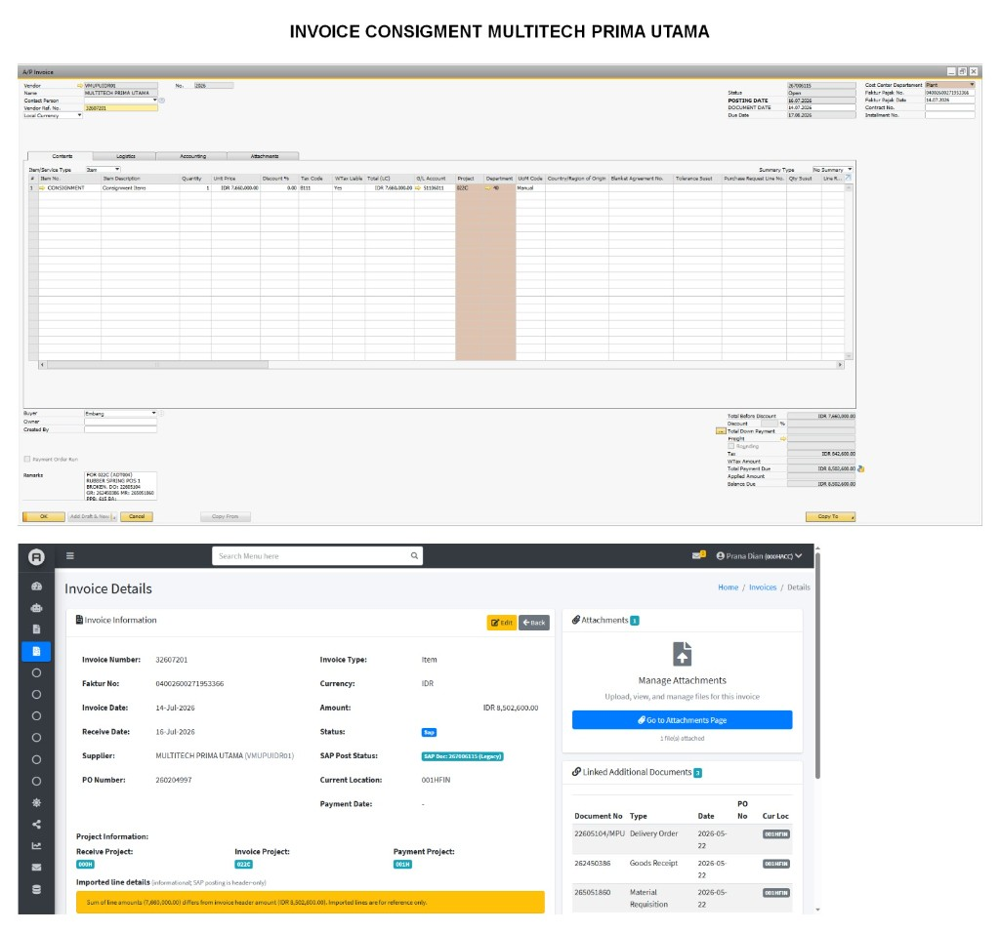
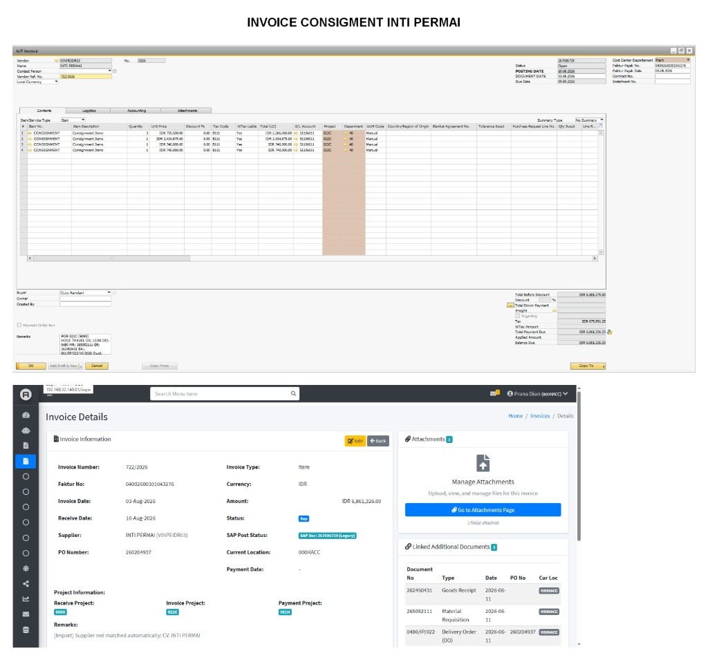

# Consignment Invoice Reference (SAP B1 ↔ DDS)

**Purpose**: Worked examples of real consignment A/P invoices, for use when designing or implementing a new feature.  
**Source**: Three SAP Business One A/P Invoice screens compared with the matching DDS Invoice Details pages.  
**Date captured**: 2026-08  
**Original screenshots**: [`docs/images/consignment-invoices/`](images/consignment-invoices/)

---

## 1. What these examples are

Each screenshot pair is the **same invoice** in two systems:

| Layer | Screen | Role |
| --- | --- | --- |
| **SAP B1** (top) | A/P Invoice | Accounting document. Line item is always item `CONSIGNMENT`. Totals split into pre-tax + PPN. |
| **DDS** (bottom) | Invoice Details | Document-control record. Header amount is **tax-inclusive**. Linked DO / GR / MR are structured rows, not free text. |

These are **legacy SAP** invoices that already exist in DDS (`Status: SAP`, `SAP Post Status: … (Legacy)`). They are not invoices created in DDS and posted to SAP.

Typical business story:

1. Site uses a consignment part (tyre, hose, rubber spring, …).
2. Supporting documents exist: **DO**, **GR**, **MR** (sometimes BA / FPD in remarks).
3. Supplier issues an invoice + Faktur Pajak.
4. Finance posts an A/P Invoice in SAP using a generic **CONSIGNMENT** item (not the real stock item).
5. DDS stores the same header for routing, attachments, and linked additional documents.

---

## 2. Field mapping (SAP → DDS)

Use this table as the contract between the two screens.

| SAP B1 A/P Invoice | DDS Invoice Details | Notes |
| --- | --- | --- |
| Vendor Ref. No. | **Invoice Number** | Supplier’s invoice number. Primary business key in DDS. |
| Vendor + Name | **Supplier** | Shown as `NAME (CARDCODE)`, e.g. `MULTITECH PRIMA UTAMA (VMUPUIDR01)`. |
| Faktur Pajak No. | **Faktur No** | 16-digit Indonesian tax invoice number. Copied as-is. |
| Faktur Pajak Date / Document Date | **Invoice Date** | Supplier document date. |
| Posting Date | **Receive Date** | Date the A/P invoice was posted / received. |
| Due Date | *(not shown on these detail cards)* | Present in SAP; not on the captured DDS header. |
| DocNum / status-bar doc | **SAP Post Status** | `SAP Doc: {n} (Legacy)`. |
| Item/Service Type = Item | **Invoice Type** | `Item` for all three examples. |
| Currency (LC) | **Currency** | `IDR`. |
| **Total Payment Due** (incl. tax) | **Amount** | DDS amount = SAP total due, **not** the pre-tax line total. |
| Line **Project** column | **Invoice Project** | Always `022C` in these examples. |
| *(not on A/P header)* | **Receive Project** / **Payment Project** | DDS workflow fields. Not the SAP line project. |
| *(not on A/P header)* | **PO Number** | DDS / purchase reference (e.g. `260204997`). May also appear in remarks. |
| *(not on A/P header)* | **Current Location** | DDS location of the physical/digital invoice (`001HFIN`, `000HACC`, …). |
| Remarks (free text) | **Linked Additional Documents** | DO / GR / MR numbers parsed out of remarks (see §5). |
| Contents lines | **Imported line details** | Informational only. SAP posting in DDS is header-only. |
| Attachments | **Attachments** card | File count + “Go to Attachments Page”. |

### Amount rule (important)

```
DDS Amount  =  SAP Total Payment Due  =  SAP Total Before Discount + SAP Tax
```

PPN on these examples is **11%**:

| Pre-tax (lines) | Tax (11%) | Total due (DDS Amount) |
| ---: | ---: | ---: |
| 7,660,000.00 | 842,600.00 | 8,502,600.00 |
| 6,181,375.00 | 679,951.25 | 6,861,326.25 |
| 21,000,000.00 | 2,310,000.00 | 23,310,000.00 |

DDS already warns when `sum(line amounts) ≠ header amount`, because imported lines are **pre-tax** and the header is **tax-inclusive**. That warning is expected for consignment invoices, not a data error.

---

## 3. Shared SAP line pattern

Every captured consignment A/P invoice uses the same contents shape:

| Column | Typical value |
| --- | --- |
| Item No. | `CONSIGNMENT` |
| Description | `Consignment Items` |
| Tax Code | `B111` / `I111` / `E111` (PPN 11%) |
| G/L Account | `51106011` or `51116009` / `51136009` |
| Project | `022C` |
| Department | `40` |
| UoM | Manual |

One SAP row can represent **several physical parts** (qty 4 tyres as a single CONSIGNMENT line). Another invoice can split into **several CONSIGNMENT rows** with different unit prices.

A new feature should not assume 1 SAP line = 1 real item, and should not treat `CONSIGNMENT` as a stock SKU.

---

## 4. Worked examples

### Example 1 — MULTITECH PRIMA UTAMA



**What was invoiced**: Rubber spring for project 022C (unit AD7004), POS-1 broken.

#### Header

| Field | SAP | DDS |
| --- | --- | --- |
| Supplier | `VMUPUIDR01` MULTITECH PRIMA UTAMA | MULTITECH PRIMA UTAMA (`VMUPUIDR01`) |
| Invoice number | Vendor Ref. `32607201` | `32607201` |
| Faktur Pajak | `04002600271953366` (14.07.2026) | `04002600271953366` |
| Invoice / document date | 14.07.2026 | 14-Jul-2026 |
| Posting / receive date | 16.07.2026 | 16-Jul-2026 |
| Due date | 17.08.2026 | — |
| PO number | *(in workflow, not A/P header)* | `260204997` |
| SAP document | Status Open | `SAP Doc: 267006115 (Legacy)` |
| Location | — | `001HFIN` |
| Projects | Line project `022C` | Receive `001H` · Invoice `022C` · Payment `001H` |

#### SAP lines

| Item | Qty | Unit price | Tax | Line total (LC) | G/L | Project | Dept |
| --- | ---: | ---: | --- | ---: | --- | --- | --- |
| CONSIGNMENT | 1 | 7,660,000.00 | B111 | 7,660,000.00 | 51106011 | 022C | 40 |

| SAP total before discount | Tax | Total payment due |
| ---: | ---: | ---: |
| 7,660,000.00 | 842,600.00 | **8,502,600.00** |

DDS Amount = **IDR 8,502,600.00**.  
DDS warning: line sum `7,660,000.00` ≠ header `8,502,600.00` (tax).

#### SAP remarks (source text)

`FOR 022C (AD7004) RUBBER SPRING POS-1, DO: 22605104, GR: 262450386, MR: 265051860`

#### Linked additional documents in DDS

| Type | Number | Date | Location |
| --- | --- | --- | --- |
| Delivery Order (DO) | `22605104/MPU` | 2026-05-22 | 001HFIN |
| Goods Receipt (GR) | `262450386` | 2026-05-22 | 001HFIN |
| Material Requisition (MR) | `265051860` | 2026-05-22 | 001HFIN |

Attachments: **1 file**.

---

### Example 2 — INTI PERMAI



**What was invoiced**: Hose travel oil leak for project 022C (unit 8093 / POR 022C).

#### Header

| Field | SAP | DDS |
| --- | --- | --- |
| Supplier | `VINPEIDR03` INTI PERMAI | INTI PERMAI (`VINPEIDR03`) |
| Invoice number | Vendor Ref. `722/2026` | `722/2026` |
| Faktur Pajak | `04002600301043276` | `04002600301043276` |
| Invoice / document date | 03.08.2026 | 03-Aug-2026 |
| Posting / receive date | 10.08.2026 | 10-Aug-2026 |
| Due date | 09.09.2026 | — |
| PO number | *(also on linked DO)* | `260204937` |
| SAP document | Open | `SAP Doc: 267806729 (Legacy)` |
| Location | — | `000HACC` |
| Projects | Line project `022C` | Receive `000H` · Invoice `022C` · Payment `001H` |

DDS remarks: `[Import] Supplier not matched automatically: CV. INTI PERMAI`  
(SAP name is `INTI PERMAI`; import saw `CV. INTI PERMAI`.)

#### SAP lines (4 CONSIGNMENT rows, same G/L / project / dept)

| Qty | Unit price | Tax | Line total (LC) | G/L | Project | Dept |
| ---: | ---: | --- | ---: | --- | --- | --- |
| 3 | 755,500.00 | B111 | 2,266,500.00 | 51106011 | 022C | 40 |
| 1 | 2,434,875.00 | B111 | 2,434,875.00 | 51106011 | 022C | 40 |
| 1 | 740,000.00 | B111 | 740,000.00 | 51106011 | 022C | 40 |
| 1 | 740,000.00 | B111 | 740,000.00 | 51106011 | 022C | 40 |
| **6** | | | **6,181,375.00** | | | |

| SAP total before discount | Tax | Total payment due |
| ---: | ---: | ---: |
| 6,181,375.00 | 679,951.25 | **6,861,326.25** |

DDS Amount = **IDR 6,861,326.00** (sen rounded off vs SAP `.25`).

#### SAP remarks (source text)

`POR 022C (000H) HOSE TRAVEL OIL, LEAK DO: 0480 MR: 265052111 GR: 262450431 BA: 001/IP/322/V/2026 …`

#### Linked additional documents in DDS

| Type | Number | Date | Extra | Location |
| --- | --- | --- | --- | --- |
| Goods Receipt | `262450431` | 2026-06-11 | | 000HACC |
| Material Requisition | `265052111` | 2026-06-11 | | 000HACC |
| Delivery Order (DO) | `0480/IP/022` | 2026-06-11 | PO `260204937` | 000HACC |

Note: SAP remarks only had `DO: 0480`. DDS stores the **full DO number** `0480/IP/022`.  
BA `001/IP/322/V/2026` is in SAP remarks but **not** shown as a linked document on this DDS page.

Attachments: **1 file**.

---

### Example 3 — MITRA DIESEL ENGINEERING


**What was invoiced**: Replace tyre on project 022C (unit T134), four serial numbers on one CONSIGNMENT line.

#### Header

| Field | SAP | DDS |
| --- | --- | --- |
| Supplier | `VMIDEIDR01` MITRA DIESEL ENGINEERING | MITRA DIESEL ENGINEERING (`VMIDEIDR01`) |
| Invoice number | Vendor Ref. `062/INV/MDE/VII/2026` | `062/INV/MDE/VII/2026` |
| Faktur Pajak | `04002600245035604` (01.07.2026) | `04002600245035604` |
| Invoice / document date | 01.07.2026 | 01-Jul-2026 |
| Posting / receive date | 02.07.2026 | 02-Jul-2026 |
| Due date | 01.08.2026 | — |
| PO number | — | `260204311` |
| SAP document | `267005715` Open | `SAP Doc: 267005715 (Legacy)` |
| Location | — | `001HFIN` |
| Projects | Line project `022C` | Receive `000H` · Invoice `022C` · Payment `001H` |

#### SAP lines

| Item | Qty | Unit price | Tax | Line total (LC) | G/L | Project | Dept |
| --- | ---: | ---: | --- | ---: | --- | --- | --- |
| CONSIGNMENT | 4 | 5,250,000.00 | I111 | 21,000,000.00 | 51116009 | 022C | 40 |

Serial numbers live in **remarks**, not as four SAP rows:  
`SN: 25C8089828, 25C8089982, 25C8089302, 25C8089771`

| SAP total before discount | Tax | Total payment due |
| ---: | ---: | ---: |
| 21,000,000.00 | 2,310,000.00 | **23,310,000.00** |

DDS Amount = **IDR 23,310,000.00**.  
DDS warning: line sum `21,000,000.00` ≠ header `23,310,000.00` (tax).

#### SAP remarks (source text)

`FOR 022C (T134) REPLACE TYRE (SN: …) GR: 262450438`  
(DO / MR numbers also appear in the remarks block on the SAP screen.)

#### Linked additional documents in DDS

| Type | Number | Date | Location |
| --- | --- | --- | --- |
| Delivery Order | `074/MDE` | 2026-06-15 | 001HFIN |
| Material Requisition | `265052179` | 2026-06-15 | 001HFIN |
| Goods Receipt | `262450438` | 2026-06-26 | 001HFIN |

GR date (**26 Jun**) is later than DO/MR (**15 Jun**). Linked-doc dates are not always identical.

Attachments: **3 files**.

---

## 5. How remarks become linked documents

SAP stores supporting-doc numbers as **labels in Comments/Remarks**. DDS turns the useful ones into rows.

| Label in SAP remarks | DDS document type | Number pattern in these examples |
| --- | --- | --- |
| `DO:` | Delivery Order | Short (`0480`, `074/MDE`) or numeric (`22605104`) — DDS may expand to a full number (`22605104/MPU`, `0480/IP/022`) |
| `GR:` | Goods Receipt | 9-digit, e.g. `262450386` |
| `MR:` | Material Requisition | 9-digit, e.g. `265051860` |
| `BA:` | *(not linked here)* | e.g. `001/IP/322/V/2026` |
| `FPD:` | *(not linked here)* | e.g. `615` |
| `POR` / `FOR` + project | Narrative only | `FOR 022C (AD7004) …` describes unit/job, not a document type |

Remarks also carry **job context** that DDS does not currently structure:

- Project / unit: `022C (AD7004)`, `022C (T134)`, `POR 022C (000H)`
- Failure / work: `RUBBER SPRING POS-1 BROKEN`, `HOSE TRAVEL OIL, LEAK`, `REPLACE TYRE`
- Serial numbers: `SN: 25C8089828, …`

---

## 6. Project codes — three different meanings

Do not collapse these into one field.

| DDS field | Meaning in these examples | Typical value |
| --- | --- | --- |
| **Invoice Project** | SAP A/P line `Project` (where cost is booked) | `022C` |
| **Receive Project** | Where the invoice entered DDS / was received | `000H` or `001H` |
| **Payment Project** | Where payment is processed | `001H` |

SAP only shows **Invoice Project** on the A/P line. Receive / Payment are DDS workflow.

---

## 7. Checklist for a new feature

Treat the following as constraints unless the feature explicitly changes them.

1. **Header amount is tax-inclusive.** Matching SAP lines (pre-tax) to DDS `amount` will always look “wrong” by PPN 11% unless tax is added.
2. **Imported lines are reference-only.** DDS already states SAP posting is header-only. Do not post generic `CONSIGNMENT` lines as if they were real item masters unless that is the new design.
3. **`CONSIGNMENT` is a bucket item.** Qty/price may be 1×lump, N×unit, or several CONSIGNMENT rows. Real identity is in remarks (unit code, SN, DO/GR/MR).
4. **Invoice Number = Vendor Ref. No.**, not SAP DocNum. SAP DocNum belongs in `SAP Post Status`.
5. **Faktur Pajak** is a separate identifier from the supplier invoice number.
6. **Linked docs** should prefer structured DO / GR / MR records over regex-only remarks. Short DO numbers in remarks are often prefixes of the full DDS number.
7. **Supplier matching** can fail on legal prefix (`CV. INTI PERMAI` vs `INTI PERMAI`) even when CardCode is correct.
8. **Rounding**: SAP can keep `.25` sen; DDS amount may store whole rupiah (`6,861,326.25` → `6,861,326.00`).
9. **Three projects** (receive / invoice / payment) plus **current location** are independent of the SAP line project.
10. **Attachments** live beside the invoice; consignment packets often include the Faktur + supporting scans (1–3 files in these examples).

---

## 8. Quick compare of the three invoices

| | Multitech Prima Utama | Inti Permai | Mitra Diesel Engineering |
| --- | --- | --- | --- |
| Vendor code | `VMUPUIDR01` | `VINPEIDR03` | `VMIDEIDR01` |
| Invoice no. | `32607201` | `722/2026` | `062/INV/MDE/VII/2026` |
| Faktur | `04002600271953366` | `04002600301043276` | `04002600245035604` |
| SAP Doc (legacy) | `267006115` | `267806729` | `267005715` |
| PO | `260204997` | `260204937` | `260204311` |
| SAP line count | 1 | 4 | 1 (qty 4) |
| Pre-tax | 7,660,000.00 | 6,181,375.00 | 21,000,000.00 |
| Tax 11% | 842,600.00 | 679,951.25 | 2,310,000.00 |
| DDS amount | 8,502,600.00 | 6,861,326.00 | 23,310,000.00 |
| Invoice project | 022C | 022C | 022C |
| DDS location | 001HFIN | 000HACC | 001HFIN |
| Linked docs | DO + GR + MR | GR + MR + DO | DO + MR + GR |
| Job in remarks | Rubber spring POS-1 | Hose travel oil leak | Replace tyre (4 SN) |
| Attachments | 1 | 1 | 3 |

---

## 9. Screenshot files

| File | Example |
| --- | --- |
| [`images/consignment-invoices/01-multitech-prima-utama.png`](images/consignment-invoices/01-multitech-prima-utama.png) | SAP + DDS, rubber spring |
| [`images/consignment-invoices/02-inti-permai.png`](images/consignment-invoices/02-inti-permai.png) | SAP + DDS, hose / 4 lines |
| [`images/consignment-invoices/03-mitra-diesel-engineering.png`](images/consignment-invoices/03-mitra-diesel-engineering.png) | SAP + DDS, tyres / serials |
