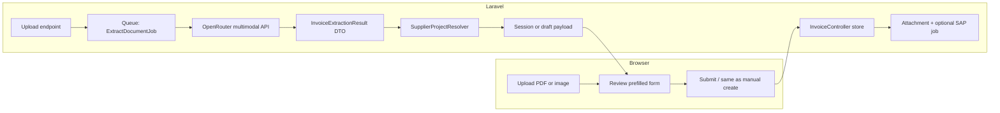

# Invoice from PDF/Image — Concrete Implementation Plan

**Status**: Phase 1–5 implemented (v1) — queue extraction, draft prefill, post-save attachment, `import_extraction` persistence, first-page PDF for OCR, preview modal, extract response status + optional sync extract, attachment result in JSON + logging; **line items** → **`invoice_line_details`** on save; invoice **show** review + optional line edit (see [`docs/architecture.md`](architecture.md), [`docs/decisions.md`](decisions.md) 2026-03-31). **Batch multi-file import** (same extract routes, dedicated review UI, `InvoiceCreatorService`, `InvoiceBatchImportController`) — [`docs/decisions.md`](decisions.md) 2026-05-13.  
**Last updated**: 2026-05-13  
**Related**: `InvoiceController`, `InvoiceCreatorService`, `InvoiceBatchImportController`, `InvoiceAttachment`, `InvoiceImportLineDetailsPersister`, `InvoiceLineDetail`, `CreateSapApInvoiceJob`, `SapApInvoicePayloadBuilder`

## 1. Objective

Let authorized users upload a **PDF** or **image** (supplier invoice, scan, photo). The system **extracts structured fields**, maps them to DDS `invoices` columns and related entities, and presents a **review step** that reuses the existing create-invoice validation and save path. The source file is stored as an **invoice attachment** after successful creation.

**Non-goals for v1**

- Fully automatic posting to SAP without human confirmation  
- Guaranteed accuracy on all document layouts (user review is mandatory)  
- Handwritten-only invoices (can be “best effort” later)

---

## 2. Alignment with current codebase

| Area | Existing behavior to reuse |
|------|---------------------------|
| **Persistence** | `InvoiceController::store()` validation and `Invoice::create()` in [`app/Http/Controllers/InvoiceController.php`](../app/Http/Controllers/InvoiceController.php) (lines ~176–257) |
| **Attachments** | `InvoiceAttachmentController::store` + `InvoiceAttachment` model; categories include “Invoice Copy” |
| **Projects** | `receive_project`, `invoice_project`, `payment_project` must `exists:projects,code` |
| **Supplier** | `supplier_id` required; SAP AP flow requires `supplier.sap_code` ([`CreateSapApInvoiceJob`](../app/Jobs/CreateSapApInvoiceJob.php)) |
| **Location** | `cur_loc` required; same permission patterns as create/edit |
| **Routes** | [`routes/invoice.php`](../routes/invoice.php) — add new routes **before** `Route::resource` if any static paths conflict |

**Important**: Extracted data is **suggestions only** until the user submits the normal create form (or a dedicated POST that calls the same validation rules).

---

## 3. High-level architecture

**Recommended flow (v1)**

1. User uploads file → validate MIME/size → store in **temporary** disk (`storage/app/temp/invoice-imports/{uuid}`) or private disk with TTL.
2. Dispatch **`ExtractInvoiceFromDocumentJob`** (queued) calling **`OpenRouterInvoiceExtractionService`**.
3. **On success**: persist extraction JSON + resolver output in **cache** (`invoice_import:{userId}:{uuid}`) with TTL (e.g. 1–2 hours), or encrypted session if small.
4. **Frontend** redirects to `invoices.create` with query `import=uuid` (or dedicated `invoices.create-from-import`) **pre-filling** fields via Blade/JS from a JSON endpoint `GET /invoices/import-draft/{uuid}`.
5. User edits → **POST** existing `invoices.store` (AJAX or form) — no duplicate business rules.
6. After successful `store`, **move** temp file to permanent attachment path and **`InvoiceAttachment::create`** with category `Invoice Copy`, then **delete** temp + cache.

**Alternative (simpler MVP)**: synchronous extraction in request (only for small images / single-page PDF) — acceptable for pilot but **timeouts** and OpenRouter latency make **queue mandatory** for production PDFs.

---

## 4. Phased delivery

### Phase 0 — Prerequisites (1–2 days)

- [ ] **Composer**: HTTP client is already available (Guzzle); add nothing unless you add PDF rasterization (`spatie/pdf-to-image` requires Imagick/Ghostscript on server — document in ops runbook).
- [ ] **`.env`**: `OPENROUTER_API_KEY`, `OPENROUTER_MODEL` (e.g. vision-capable model), optional `OPENROUTER_BASE_URL` (default `https://openrouter.ai/api/v1`).
- [ ] **`config/services.php`**: `openrouter` key mirroring SAP block style.
- [ ] **Feature flag**: `INVOICE_IMPORT_ENABLED=true` to gate routes and UI.

### Phase 1 — Extraction contract (core, 2–4 days)

1. **`InvoiceExtractionResult`** (DTO/array object): normalized fields matching *suggested* mapping:

   - `invoice_number`, `faktur_no`, `invoice_date`, `receive_date` (often same as invoice date or today — user adjusts)
   - `supplier_name_raw`, `supplier_tax_id` (optional)
   - `po_no`, `currency`, `amount` (numeric string → decimal)
   - `line_items` (optional array: description, quantity/qty, unit_price, amount) — persisted to **`invoice_line_details`** on successful create via **`InvoiceImportLineDetailsPersister`**; SAP posting remains header-only (see architecture doc)
   - `confidence` per field or global
   - `raw_notes` / `warnings[]`

2. **Prompt + JSON schema**: Single system prompt requiring **strict JSON** (no markdown fences). Version the prompt in code (`config` or dedicated class).

3. **`OpenRouterInvoiceExtractionService`**

   - `extractFromImage(string $path, string $mime): InvoiceExtractionResult`
   - `extractFromPdf(string $path): InvoiceExtractionResult`  
     - **Strategy**: If `smalot/pdfparser` returns sufficient text (≥ ~80 chars) → **text-only** request. Else **OpenRouter PDF `file` input** with `file-parser` plugin (`OPEN_ROUTER_PDF_ENGINE`, default `mistral-ocr` for scans). See [`docs/INVOICE-IMPORT-SAMPLE-PDF-TEST-RESULTS.md`](INVOICE-IMPORT-SAMPLE-PDF-TEST-RESULTS.md).

4. **Logging**: Dedicated channel `invoice_import` (no PII in plain logs; truncate payloads in production).

### Phase 2 — Domain resolution (2–3 days)

1. **`SupplierResolver`**

   - Exact match on normalized name → `Supplier::active()`.
   - Fallback: fuzzy match (Levenshtein / `similar_text`) with **minimum score**; if ambiguous, return **candidates** for Select2 on the form.
   - If no match: pre-fill **supplier name in remarks** and leave `supplier_id` empty with validation error on submit (user must pick).

2. **`ProjectResolver`** (optional in v1)

   - Map extracted project codes/strings to `projects.code` where obvious.
   - Otherwise leave blank; user already has project dropdowns.

3. **Defaults** (mirror current create behavior)

   - `receive_date` / `cur_loc` from authenticated user department defaults when missing.
   - `type_id`: default to a configured “General” invoice type or force user selection.

### Phase 3 — HTTP API & jobs (2–3 days)

| Piece | Responsibility |
|--------|----------------|
| `POST /invoices/import-extract` | Auth, `upload` file validation (`mimes:pdf,jpg,jpeg,png,webp`, max size), store temp, dispatch job, return `{ uuid, status: 'queued' }` |
| `GET /invoices/import-status/{uuid}` | Poll job status: `pending`, `processing`, `completed`, `failed` |
| `GET /invoices/import-draft/{uuid}` | Return JSON for form prefill (403 if not owner); clear after attach |
| `ExtractInvoiceFromDocumentJob` | Calls service, runs resolvers, writes cache |
| Cleanup **Artisan** command or scheduled task | Delete temp files older than 24h |

**Authorization**: Same middleware as `invoices.create`; optional Spatie permission `create-invoices-from-document` if you want to restrict.

### Phase 4 — UI (3–5 days)

**Option A (recommended):** Extend [`resources/views/invoices/create.blade.php`](../resources/views/invoices/create.blade.php)

- Add collapsible **“Import from PDF or image”** card at top: dropzone + progress + poll.
- On `completed`, **merge** JSON into existing fields (Select2 for supplier with resolved ID).
- Highlight **low-confidence** fields with CSS (reuse existing validation styles in that file).

**Option B:** New route `invoices.create-from-document` with a two-step wizard; more work, clearer separation.

**UX details**

- Show **thumbnail preview** of uploaded doc (client-side `URL.createObjectURL` or server preview URL).
- Disable submit until user confirms supplier and required fields.
- On failure, show error + **manual entry** link (no dead end).

### Phase 5 — Post-create attachment (0.5–1 day)

- After `Invoice::create`, if `import_uuid` in request, **attach** temp file via same logic as [`InvoiceAttachmentController`](../app/Http/Controllers/InvoiceAttachmentController.php) (reuse private method or service to avoid duplication).

### Phase 6 — SAP (no change to job, optional trigger)

- **Do not** auto-dispatch `CreateSapApInvoiceJob` from import alone.  
- Keep existing rule: user/SAP workflow triggers posting **after** invoice is valid and supplier has `sap_code`.

---

## 5. Security, privacy, compliance

- **Data leaves the app** when calling OpenRouter → document in internal policy; consider **EU region** / model provider terms.
- **Temp files**: private disk, non-guessable UUIDs, automatic cleanup.
- **Rate limiting**: `throttle` on import endpoints per user/IP.
- **Audit**: optional `invoice_imports` table (user_id, file hash, model, timestamps) for debugging without storing full file.

---

## 6. Testing strategy

| Layer | Tests |
|--------|--------|
| **Unit** | `SupplierResolver`, date/amount parsing, PDF text vs image branch |
| **HTTP** | Import with faked OpenRouter response (Http::fake) |
| **Feature** | `tests/Feature/InvoiceImportExtractTest.php`, `tests/Feature/InvoiceBatchImportTest.php`, `tests/Feature/InvoiceCreateLineItemsTest.php` (where applicable) |

Manual QA: real Indonesian tax invoices, USD invoices, multi-page PDF, blurry photo.

---

## 7. Operational checklist

- [ ] Server has **ImageMagick + Ghostscript** only if you add PDF-to-image rasterization (v1 does not require it for OpenRouter PDF + OCR).  
- [x] Queue worker runs `default` queue for `ExtractInvoiceFromDocumentJob` (required when `QUEUE_CONNECTION` is `database` / `redis`).  
- [x] OpenRouter **timeouts** configured (`OPEN_ROUTER_TIMEOUT`, `OPEN_ROUTER_PDF_TIMEOUT`).  
- [ ] Monitor OpenRouter quota and latency; alert on failures (`invoice_import` log channel).  
- [ ] Optional: scheduled `invoice-import:cleanup` for stale temp files under `temp/invoice-imports`.

---

## 8. Documentation updates

- [x] [`docs/architecture.md`](architecture.md) — subsection “Invoice creation from PDF/image” + flow, files, env, UX; **batch import** subsection (2026-05-13).  
- [x] [`docs/decisions.md`](decisions.md) — ADR for invoice import v1 (OpenRouter, first page, sync option); **ADR 2026-05-13** batch multi-file import.  
- [x] [`docs/todo.md`](todo.md) — “Recently Completed” entry for this feature + batch import.  
- [x] [`docs/backlog.md`](backlog.md) — completed **Batch invoice import** under Invoice System Enhancements.  
- [x] [`MEMORY.md`](../MEMORY.md) — short ops note (including batch import pointer).

---

## 8b. Batch multi-file import (implemented 2026-05-13)

- **Flow**: Same **`POST /invoices/import-extract`** + **`import-status`** + **`import-draft`** per file; dedicated **`GET /invoices/import-batch`** UI builds a review table; **`POST /invoices/import-batch`** submits **`invoices[]`** JSON.
- **Create path**: **`InvoiceCreatorService`** shared with **`InvoiceController::store`** — attachment + **`import_extraction`** + line persister unchanged in spirit.
- **Docs**: [`docs/decisions.md`](decisions.md) (2026-05-13), [`tests/Feature/InvoiceBatchImportTest.php`](../tests/Feature/InvoiceBatchImportTest.php).

## 9. Rough effort estimate

| Phase | Estimate |
|--------|----------|
| 0–1 | 3–6 days |
| 2–3 | 4–6 days |
| 4–5 | 3–6 days |
| 6 + tests/docs | 2–3 days |
| **Total** | **~12–21 developer days** (depending on PDF complexity and UI polish) |

---

## 10. Product decisions (resolved)

| # | Decision | Choice |
|---|----------|--------|
| 1 | Multi-page PDF | **First page only for v1** — align OpenRouter `file-parser` / OCR with single-page input (or trim server-side to first page before API). |
| 2 | Who may import | **All invoice creators** — same as create invoice; no extra Spatie permission for v1. |
| 3 | Where to store extraction JSON | **`invoices` table** — add nullable JSON column (e.g. `import_extraction`) populated on successful save when `import_uuid` was used; optional model cast to array. |
| 4 | Line items | **Header-only for v1** — line items may appear in `remarks` as text; no separate line table yet. |

## 11. Current status and what to do next

**Status (2026-05-13)**

- **Shipped in app**: Import card on create invoice (Preview + Extract), temp upload, `ExtractInvoiceFromDocumentJob`, OpenRouter (text PDF + PDF file / OCR for scans), `PdfInvoiceFirstPageService` for multi-page PDFs on OCR path when `OPEN_ROUTER_PDF_FIRST_PAGE_ONLY` is true, supplier fuzzy match, draft prefill, `import_extraction` JSON on `invoices` when save uses import, attachment after save with `import_attachment_saved` in AJAX JSON + warning log on failure, explicit `import_uuid` in `FormData`, **line items** → `invoice_line_details`, show-page line edits + mismatch warning, **`InvoiceImportExtractTest`** + resolver unit test + **`InvoiceBatchImportTest`**, sample PDF results doc.
- **Batch import**: **`/invoices/import-batch`** — multi-file review and **`InvoiceCreatorService`**-backed batch create; see ADR **2026-05-13** in [`docs/decisions.md`](decisions.md).
- **Extract API response**: Returns real job `status` / `error` after dispatch; `INVOICE_IMPORT_EXTRACT_SYNC=true` uses `dispatchSync()` for environments without a queue worker (blocking HTTP — not default for production).
- **Ops**: With `QUEUE_CONNECTION=database` / `redis`, run **`php artisan queue:work`** (or Windows Task Scheduler / NSSM). Alternatively `QUEUE_CONNECTION=sync` or `INVOICE_IMPORT_EXTRACT_SYNC=true` for local testing (see `.env.example`).

**Recommended next work (priority order)**

1. **Later / v2**: Structured line items (not only header + remarks), optional Spatie permission to restrict import, richer SAP line mapping from extraction.
2. **Hardening**: End-to-end feature test upload → store → attachment assert; optional audit table for imports.

**Browser QA note**: Upload + extract needs a **running worker** unless queue is `sync` or `INVOICE_IMPORT_EXTRACT_SYNC=true`; the UI polls immediately on a short interval once upload returns.
