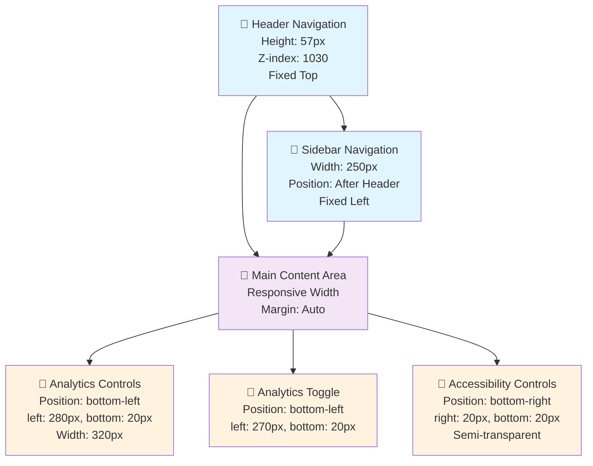
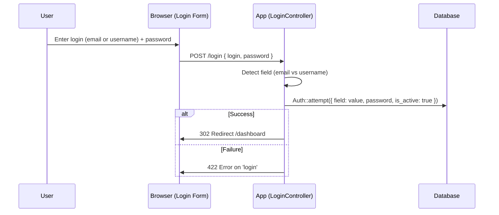

# DDS Laravel Architecture Documentation

## 🏗️ **System Overview**

The DDS (Document Distribution System) is a comprehensive Laravel 11+ application designed for managing document workflows across multiple departments. The system handles invoices, additional documents, and their distribution through a secure, role-based workflow.

## 🎨 **UI/UX Architecture Patterns**

### **Analytics Integration Architecture** ✅ **NEW**

**Pattern**: Comprehensive analytics system with optimized call frequency and real-time dashboards

**Implementation**:

-   **Performance Optimization**: Throttled analytics calls (300-second intervals, 250-second minimum)
-   **Real-time Dashboards**: Live status updates with completion tracking and bottleneck identification
-   **User Behavior Tracking**: Action monitoring, workflow analysis, and efficiency scoring
-   **Document Flow Analytics**: Movement patterns, verification times, and error rate tracking
-   **Predictive Analytics**: Completion time forecasting and error probability calculation
-   **Memory Management**: Cleanup mechanisms and interval clearing on page unload

### **Bulk Operations Architecture** ✅ **NEW**

**Pattern**: Multi-document operation system with progress tracking and selection management

**Implementation**:

-   **Bulk Selection**: Checkbox-based multi-document selection with clear visual feedback
-   **Status Updates**: Batch document status changes with unified confirmation
-   **Bulk Verification**: Simultaneous document verification with progress indicators
-   **Notes Management**: Uniform note application across selected documents
-   **Export/Print**: Batch PDF export and print label generation
-   **API Integration**: Backend controllers for handling bulk operations with validation

### **Accessibility Architecture** ✅ **NEW**

**Pattern**: Comprehensive accessibility system with responsive positioning and visual enhancements

**Implementation**:

-   **Screen Reader Support**: ARIA labels, live regions, and status announcements
-   **Focus Management**: Clear focus indicators and logical tab order navigation
-   **Keyboard Navigation**: Arrow key navigation for tables and form elements
-   **Visual Controls**: Font size adjustment, high contrast mode toggle
-   **Voice Integration**: Framework for voice command recognition
-   **Responsive Positioning**: Mobile-compatible placement with transparency effects

### **UI Layout Architecture** ✅ **NEW**

**Pattern**: Fixed-position control system with responsive overlap prevention

**Layout Structure**:

-   **Header**: Fixed navigation (57px height, 1030 z-index)
-   **Sidebar**: Fixed left navigation (250px width, positioned after header)
-   **Content Area**: Responsive main content with proper margins
-   **Analytics Dashboard**: Bottom-left corner (`bottom: 20px; left: 280px`, 320px width)
-   **Analytics Toggle**: Bottom-left corner (`bottom: 20px; left: 270px`)
-   **Accessibility Controls**: Bottom-right corner (`bottom: 20px; right: 20px`) with semi-transparency

**Responsive Implementation**:

-   **Desktop (>768px)**: Sidebar at 250px width, controls positioned after sidebar
-   **Mobile (<768px)**: Sidebar collapses, controls positioned at edges
-   **Overlap Prevention**: CSS media queries ensure no element conflicts
-   **Visual Transparency**: Semi-transparent backgrounds (`rgba`) with blur effects

#### **UI Layout Diagram**



### **Distribution Creation UX Architecture**

**Pattern**: Enhanced distribution creation with confirmation dialog, linked documents management, and visual location indicators

**Implementation**:

-   **Confirmation Dialog**: Bootstrap modal with dynamic content population before form submission
-   **Linked Documents Detection**: AJAX-based API for finding additional documents linked via PO number
-   **Management Interface**: Modal-based selection/deselection of linked documents
-   **Location Indicators**: Visual badges showing document department location
-   **Form Submission**: AJAX-based submission with proper error handling and success feedback

**Technical Architecture**:

```php
// Distribution Creation Controller Structure
DistributionController
├── create() → Distribution creation form
├── store(Request $request) → Process distribution creation
├── checkLinkedDocuments(Request $request) → AJAX endpoint for linked documents
└── validation → Required fields, document selection, etc.
```

**Frontend Architecture**:

```javascript
// Distribution Creation Flow
Distribution Creation Process
├── Form Validation → Required fields check
├── Confirmation Dialog → Review before submission
├── Linked Documents Check → AJAX call to detect linked documents
├── Linked Documents Management → Modal for document selection
└── Form Submission → AJAX submission with success handling
```

**Database Relationship Architecture**:

```sql
-- Linked Documents Relationship
Invoices (po_no) ←→ Additional Documents (po_no)
├── PO Number Matching → Primary linking mechanism
├── Location Filtering → cur_loc field for department filtering
└── Status Validation → Available documents only
```

**UI Component Architecture**:

```html
<!-- Confirmation Modal Structure -->
Confirmation Modal ├── Distribution Information → Type, destination, document
type, notes ├── Selected Documents → List of chosen documents ├── Linked
Documents Section → Automatically detected additional documents └── Action
Buttons → Cancel, Confirm & Create Distribution

<!-- Linked Documents Management Modal -->
Management Modal ├── Document List → Checkbox interface for each linked document
├── Document Details → Number, type, PO number └── Action Buttons → Cancel, Save
Selection
```

### **Invoice Edit and Update System Architecture**

**Pattern**: Comprehensive invoice editing with dual-field amount system and proper field synchronization

**Implementation**:

-   **Edit Page Access**: Route-based access to `/invoices/{id}/edit` with proper authorization
-   **Form Pre-population**: Automatic form loading with existing invoice data
-   **Dual-Field Amount System**: `amount_display` (user input) and hidden `amount` (submission)
-   **Field Synchronization**: `formatNumber()` function ensures proper field sync
-   **Validation**: `UniqueInvoicePerSupplier` rule with proper exclusion logic
-   **AJAX Submission**: Form submission with loading states and notifications
-   **Database Updates**: Proper field persistence with timestamp tracking

**Technical Architecture**:

```php
// Invoice Edit Controller Structure
InvoiceController
├── edit(Invoice $invoice) → Edit form with pre-populated data
├── update(Request $request, Invoice $invoice) → Process form updates
└── validation rules → UniqueInvoicePerSupplier, required fields, etc.
```

**Form Field Architecture**:

```javascript
// Dual-Field Amount System
Amount Field Structure
├── amount_display (visible input) → User interaction
├── amount (hidden input) → Form submission
└── formatNumber() → Synchronization function
```

**Validation Architecture**:

```php
// Custom Validation Rule
UniqueInvoicePerSupplier
├── validate() → Check for duplicate invoice numbers per supplier
├── excludeId → Exclude current invoice from duplicate check
└── setData() → Access form data for validation
```

**AJAX Submission Flow**:

```javascript
// Form Submission Architecture
Edit Form Submission
├── Form Validation → Client-side validation
├── AJAX Request → Submit form data
├── Loading States → Show progress indicators
├── Success Handling → Display notifications
├── Database Update → Persist changes
└── Redirect → Return to invoices list
```

**Key Technical Patterns**:

-   **Field Synchronization**: Explicit `formatNumber()` calls ensure data integrity
-   **Validation Exclusion**: Current invoice excluded from duplicate checks
-   **Loading States**: Proper user feedback during form submission
-   **Error Handling**: Comprehensive validation and error display
-   **Database Persistence**: All field updates properly tracked with timestamps

**Files Involved**:

-   `resources/views/invoices/edit.blade.php` - Edit form and JavaScript functionality
-   `app/Http/Controllers/InvoiceController.php` - Update method and validation
-   `app/Rules/UniqueInvoicePerSupplier.php` - Custom validation rule
-   `routes/invoice.php` - Resource routes for edit/update

---

### **Additional Documents System Architecture**

**Pattern**: Enhanced document management with advanced search, filtering, permission controls, and standardized UI/UX

**Implementation**:

-   **Enhanced Date Validation**: Smart business day validation with warnings (not errors)
-   **Advanced Search & Filtering**: Multi-criteria search with presets and export functionality
-   **Role-Based Location Selection**: Privileged users can select locations, others auto-assigned
-   **Import Permission Control**: Role-based access to document import functionality
-   **Search Presets**: User-specific saved search configurations
-   **Professional Export**: Excel export with proper formatting and column widths
-   **Standardized UI/UX**: Consistent styling across create and edit pages matching invoice create page

**Technical Architecture**:

```php
// Enhanced Controller Structure
AdditionalDocumentController
├── index() → List view with enhanced search form
├── create() → Create form with role-based location selection
├── store() → Save with location handling for privileged users
├── import() → Import view (permission protected)
├── processImport() → Process import (permission protected)
├── export() → Export filtered results to Excel
├── searchPresetsIndex() → Get user's search presets
├── searchPresetsStore() → Save new search preset
├── searchPresetsShow() → Get specific preset
├── searchPresetsDestroy() → Delete preset
└── applySearchFilters() → Reusable search filter logic
```

**Enhanced Search Features**:

```javascript
// Frontend Search Architecture
Enhanced Search Form
├── Document Number (real-time search)
├── PO Number (real-time search)
├── Vendor Code (real-time search)
├── Project (real-time search)
├── Content Search (remarks/attachments)
├── Document Type Filter
├── Status Filter
├── Project Filter
├── Location Filter
├── Enhanced Date Range Picker
│   ├── Predefined ranges (Today, Yesterday, etc.)
│   └── Custom range selection
├── Date Type Selection
│   ├── Created Date
│   ├── Document Date
│   └── Receive Date
├── Search Presets
│   ├── Save current search
│   ├── Load saved preset
│   └── Delete preset
└── Export Results
    └── Excel download with current filters
```

**Permission Architecture**:

```php
// Role-Based Access Control
Permissions
├── view-additional-documents
├── create-additional-documents
├── edit-additional-documents
├── delete-additional-documents
├── import-additional-documents (NEW)
└── on-the-fly-addoc-feature

Role Assignments
├── superadmin → All permissions
├── admin → All permissions including import
├── accounting → All permissions including import
├── finance → All permissions including import
└── other roles → Limited permissions
```

**UI/UX Standardization Architecture**:

```css
/* Standardized Card Header (matches invoice create page) */
.card-header {
    /* No specific background/gradient, relies on AdminLTE default */
}

.card-header .card-title {
    /* No specific color/font-weight/text-shadow, relies on AdminLTE default */
}

/* Standardized Progress Bar */
.progress {
    width: 300px;
    height: 25px;
}

.progress-bar {
    /* Standard Bootstrap progress bar styling */
}
```

**Form Progress System**:

```javascript
// Standardized progress tracking (matches invoice create page)
function updateFormProgress() {
    const requiredFields = [
        "#type_id",
        "#document_number",
        "#document_date",
        "#receive_date",
        "#cur_loc",
        "#remarks",
        "#attachment",
        "#vendor_code",
    ];

    let filled = 0;
    let total = requiredFields.length;

    requiredFields.forEach(function (field) {
        const element = $(field);
        if (element.length && element.val() && element.val().trim() !== "") {
            filled++;
        }
    });

    var percentage = total > 0 ? Math.round((filled / total) * 100) : 0;

    // Update progress bar with standard Bootstrap classes
    $("#form-progress-bar")
        .css("width", percentage + "%")
        .attr("aria-valuenow", percentage)
        .text(percentage + "%")
        .removeClass("bg-danger bg-warning bg-success")
        .addClass(
            percentage >= 100
                ? "bg-success"
                : percentage >= 75
                ? "bg-info"
                : percentage >= 50
                ? "bg-warning"
                : "bg-danger"
        );
}
```

**Database Schema Enhancements**:

```sql
-- Search Presets Table
CREATE TABLE search_presets (
    id BIGINT PRIMARY KEY,
    user_id BIGINT FOREIGN KEY,
    model_type VARCHAR(255),
    name VARCHAR(255),
    filters TEXT, -- JSON string
    created_at TIMESTAMP,
    updated_at TIMESTAMP,
    INDEX(user_id, model_type)
);

-- Additional Documents Table (Enhanced)
ALTER TABLE additional_documents
ADD COLUMN vendor_code VARCHAR(50) NULL; -- For SAP code matching
```

### **User Messaging System Architecture**

**Pattern**: Internal messaging system with real-time notifications, file attachments, and enhanced user experience

**Implementation**:

-   **Direct Messaging**: User-to-user communication with inbox/sent management
-   **File Attachments**: Support for multiple file uploads with 10MB size validation
-   **Message Threading**: Reply functionality with parent-child message relationships
-   **Real-time Notifications**: AJAX-powered unread count updates and Toastr notifications
-   **Soft Delete**: User-specific message deletion with database cleanup
-   **Enhanced UX**: Select2 recipient selection, send animations, and extended success feedback

**Technical Architecture**:

```php
// Controller Structure
MessageController
├── index() → Inbox view (received messages)
├── sent() → Sent messages view
├── create() → Compose message form
├── store() → Save new message with attachments
├── show() → View message details and mark as read
├── destroy() → Soft delete message
├── unreadCount() → AJAX API for unread count
├── markAsRead() → AJAX API to mark message as read
└── searchUsers() → AJAX API for user search
```

**Route Structure**:

```php
Route::prefix('messages')->name('messages.')->group(function () {
    Route::get('/', [MessageController::class, 'index'])->name('index');
    Route::get('/sent', [MessageController::class, 'sent'])->name('sent');
    Route::get('/create', [MessageController::class, 'create'])->name('create');
    Route::post('/', [MessageController::class, 'store'])->name('store');
    Route::get('/{message}', [MessageController::class, 'show'])->name('show');
    Route::delete('/{message}', [MessageController::class, 'destroy'])->name('destroy');

    // AJAX Routes
    Route::get('/unread-count', [MessageController::class, 'unreadCount'])->name('unread-count');
    Route::post('/{message}/mark-read', [MessageController::class, 'markAsRead'])->name('mark-read');
    Route::get('/search-users', [MessageController::class, 'searchUsers'])->name('search-users');
});
```

**Database Architecture**:

```
messages
├── id (primary key)
├── sender_id (foreign key to users.id)
├── receiver_id (foreign key to users.id)
├── subject (string)
├── body (text)
├── read_at (timestamp, nullable)
├── deleted_by_sender (boolean)
├── deleted_by_receiver (boolean)
├── parent_id (foreign key to messages.id, nullable)
└── timestamps (created_at, updated_at)

message_attachments
├── id (primary key)
├── message_id (foreign key to messages.id)
├── file_path (string)
├── file_name (string)
├── file_original_name (string)
├── mime_type (string)
├── file_size (unsigned big integer)
└── timestamps (created_at, updated_at)
```

**Model Relationships**:

```php
// User Model
public function sentMessages(): HasMany
public function receivedMessages(): HasMany
public function getUnreadMessagesCountAttribute(): int
public function getRecentMessages($limit = 10)

// Message Model
public function sender(): BelongsTo
public function receiver(): BelongsTo
public function parent(): BelongsTo
public function replies(): HasMany
public function attachments(): HasMany
public function markAsRead()
public function isRead(): bool
public function isReply(): bool

// MessageAttachment Model
public function message(): BelongsTo
public function getFileSizeHumanAttribute(): string
```

**Notification System**:

```javascript
// Real-time unread count updates
function updateUnreadMessageCount() {
    $.get("/messages/unread-count", function (data) {
        const count = data.count;
        $("#unread-messages-count").text(count);
        $("#sidebar-unread-count").text(count);

        if (count === 0) {
            $("#unread-messages-count").hide();
            $("#sidebar-unread-count").hide();
        } else {
            $("#unread-messages-count").show();
            $("#sidebar-unread-count").show();
        }
    });
}

// Update every 30 seconds
setInterval(updateUnreadMessageCount, 30000);
```

**UI Components**:

-   **Navbar Integration**: Message dropdown with unread count badge
-   **Sidebar Integration**: Messages menu with sub-navigation (MAIN group placement)
-   **Inbox View**: Table layout with sender info, subject, date, and status
-   **Sent View**: Table layout with recipient info and read status
-   **Compose View**: Form with Select2 recipient selection, subject, body, and file upload
-   **Show View**: Message details with attachments and reply functionality
-   **Enhanced UX**: Send animations, extended success feedback, and responsive design

**Key Enhancements**:

-   **Select2 Integration**: Bootstrap 4 themed recipient selection with search functionality
-   **Send Animation**: AJAX-based submission with loading states and success animations
-   **Extended Feedback**: 3.5s success toast visibility with 2.5s fallback redirect delay
-   **Menu Organization**: Proper placement under MAIN group for better navigation
-   **Real-time Updates**: 30-second interval unread count updates across navbar and sidebar

### **Reconciliation System Architecture**

**Pattern**: AJAX-powered data reconciliation system with Excel import/export and real-time statistics

**Implementation**:

-   **Excel Integration**: Import external invoice data with flexible column name handling
-   **Matching Algorithm**: Fuzzy matching between external data and internal invoices
-   **Real-time Statistics**: Dashboard with total, matched, unmatched records and match rate
-   **User Isolation**: Data is isolated by user to prevent conflicts
-   **Permission-Based Access**: Role-based visibility and functionality control

**Technical Architecture**:

```php
// Controller Structure
ReportsReconcileController
├── index() → Main reconciliation view
├── upload() → Excel file upload and import
├── data() → DataTables API for reconciliation data
├── getSuppliers() → Supplier dropdown data API
├── getStats() → Statistics dashboard data API
├── downloadTemplate() → Excel template download
├── export() → Export reconciliation data to Excel
├── deleteMine() → Delete user's reconciliation data
└── getInvoiceDetails() → Detailed view for specific record
```

**Route Structure**:

```php
Route::prefix('reconcile')->name('reconcile.')->group(function () {
    Route::get('/', [ReportsReconcileController::class, 'index'])->name('index');
    Route::post('/upload', [ReportsReconcileController::class, 'upload'])->name('upload');
    Route::get('/data', [ReportsReconcileController::class, 'data'])->name('data');
    Route::get('/suppliers', [ReportsReconcileController::class, 'getSuppliers'])->name('suppliers');
    Route::get('/stats', [ReportsReconcileController::class, 'getStats'])->name('stats');
    Route::get('/template', [ReportsReconcileController::class, 'downloadTemplate'])->name('template');
    Route::get('/export', [ReportsReconcileController::class, 'export'])->name('export');
    Route::get('/delete', [ReportsReconcileController::class, 'deleteMine'])->name('delete');
    Route::get('/invoice/{id}', [ReportsReconcileController::class, 'getInvoiceDetails'])->name('invoice');
});
```

**Database Architecture**:

```
reconcile_details
├── id (primary key)
├── invoice_no (string, indexed)
├── invoice_date (date, nullable)
├── vendor_id (foreign key to suppliers.id)
├── user_id (foreign key to users.id)
├── flag (string, nullable)
└── timestamps (created_at, updated_at)
```

### **SAP Document Update System Architecture**

**Pattern**: Standalone pages approach for complex DataTables functionality to avoid rendering issues

**Implementation**:

-   **Standalone Pages**: Separate pages for Dashboard, Without SAP Doc, and With SAP Doc views
-   **DataTables Integration**: Each page has its own DataTable initialization without tab switching conflicts
-   **Navigation Cards**: Visual navigation between related pages with active state indicators
-   **Permission-Based Access**: Role-based visibility and functionality control

**Technical Architecture**:

```php
// Controller Structure
SapUpdateController
├── index() → Dashboard view
├── withoutSapPage() → Without SAP Doc view
├── withSapPage() → With SAP Doc view
├── dashboard() → Dashboard data API
├── withoutSap() → Without SAP Doc DataTables API
├── withSap() → With SAP Doc DataTables API
├── updateSapDoc() → Update SAP document number
└── validateSapDoc() → Real-time validation API
```

**Route Structure**:

```php
Route::prefix('sap-update')->name('sap-update.')->group(function () {
    Route::get('/', [SapUpdateController::class, 'index'])->name('index');
    Route::get('/without-sap', [SapUpdateController::class, 'withoutSapPage'])->name('without-sap-page');
    Route::get('/with-sap', [SapUpdateController::class, 'withSapPage'])->name('with-sap-page');
    Route::get('/dashboard-data', [SapUpdateController::class, 'dashboard'])->name('dashboard-data');
    Route::get('/without-sap-data', [SapUpdateController::class, 'withoutSap'])->name('without-sap');
    Route::get('/with-sap-data', [SapUpdateController::class, 'withSap'])->name('with-sap');
    Route::put('/{invoice}/update-sap-doc', [SapUpdateController::class, 'updateSapDoc'])->name('update-sap-doc');
    Route::post('/validate-sap-doc', [SapUpdateController::class, 'validateSapDoc'])->name('validate-sap-doc');
});
```

**Database Architecture**:

```sql
-- Unique constraint allowing multiple NULL values
ALTER TABLE invoices ADD CONSTRAINT unique_sap_doc_non_null
UNIQUE (sap_doc) WHERE sap_doc IS NOT NULL;

-- Department-Invoice relationship
Department (location_code) ←→ Invoice (cur_loc)
```

**View Architecture**:

```
resources/views/invoices/sap-update/
├── dashboard.blade.php → Main dashboard with metrics and charts
├── without-sap.blade.php → Invoices without SAP document numbers
└── with-sap.blade.php → Invoices with SAP document numbers
```

**Key Design Decisions**:

-   **Standalone Pages**: Avoided tab-based interface due to DataTables rendering issues in hidden tabs
-   **Individual Updates**: No bulk operations to maintain SAP document uniqueness
-   **Real-time Validation**: AJAX validation for SAP document uniqueness
-   **Dashboard Integration**: Department-wise completion summary in main dashboard
-   **Permission Control**: `view-sap-update` permission for role-based access

**Benefits**:

-   **Reliable Rendering**: DataTables work correctly without tab switching conflicts
-   **Better Performance**: Each page loads only necessary data and scripts
-   **Clear Navigation**: Visual indicators show current page and related functions
-   **Maintainable Code**: Separate files for each functionality area
-   **Scalable Architecture**: Easy to add new SAP-related features

### **Global Page Title Alignment System**

**Pattern**: Consistent page title alignment across all pages for professional visual hierarchy

**Implementation**:

-   **Global CSS Solution**: Centralized styling in `layouts/partials/head.blade.php`
-   **Precise Alignment**: 27.5px left padding to match card content exactly
-   **Bootstrap Integration**: Works with existing Bootstrap grid system
-   **Future-Proof**: Applied globally to prevent individual page fixes

**Technical Architecture**:

```css
/* Global page title alignment with content */
.content-header {
    padding-left: 27.5px; /* Matches container-fluid (7.5px) + card-body (20px) */
    padding-right: 7.5px;
}

.content-header .col-sm-6:first-child {
    padding-left: 0; /* Remove default column padding for precise alignment */
}
```

**Root Cause Analysis**:

-   **Bootstrap Defaults**: `.content-header` had `padding: 15px .5rem` (8px left)
-   **Container Padding**: `.container-fluid` had `padding-left: 7.5px`
-   **Card Body Padding**: `.card-body` added additional 20px padding
-   **Total Offset**: 27.5px difference between title and content alignment

**Benefits**:

-   **Visual Consistency**: All pages have properly aligned titles and content
-   **Professional Appearance**: Clean visual hierarchy enhances application credibility
-   **User Experience**: Consistent interface reduces user confusion
-   **Maintainability**: Global solution prevents future alignment issues

### **Layout Structure Standardization**

**Pattern**: Consistent layout structure across all pages for maintainability and user experience

**Implementation**:

-   **Standard Sections**: All pages use `@section('title_page')` and `@section('breadcrumb_title')`
-   **Content Structure**: Consistent `section class="content"` with `container-fluid` wrapper
-   **Breadcrumb Integration**: Proper breadcrumb navigation in standard location
-   **Future Development**: New pages automatically get proper structure

**Standard Layout Template**:

```blade
@extends('layouts.main')

@section('title_page')
    Page Title
@endsection

@section('breadcrumb_title')
    <li class="breadcrumb-item"><a href="/dashboard">Dashboard</a></li>
    <li class="breadcrumb-item active">Current Page</li>
@endsection

@section('content')
    <section class="content">
        <div class="container-fluid">
            {{-- Page content here --}}
        </div>
    </section>
@endsection
```

**Benefits**:

-   **Consistent Structure**: All pages follow same layout pattern
-   **Maintainable Code**: Standard structure easier to understand and modify
-   **Future Development**: New pages automatically get proper alignment
-   **User Experience**: Consistent visual hierarchy across entire application

### **Enhanced User Dropdown Menu System**

**Pattern**: Modern dropdown menu with user information display and safety features

**Implementation**:

-   **User Information Display**: Name, department, and email prominently shown
-   **Modern Design**: Gradient background with user avatar and professional styling
-   **Action Buttons**: Change Password and Sign Out with descriptive icons
-   **Safety Features**: SweetAlert2 confirmation for logout to prevent accidents

**Technical Architecture**:

```html
<!-- Enhanced dropdown structure -->
<li class="nav-item dropdown user-menu">
    <a href="#" class="nav-link dropdown-toggle" data-toggle="dropdown">
        <i class="fas fa-user-circle mr-1"></i>
        <span class="d-none d-md-inline">{{ Auth::user()->name }}</span>
        <i class="fas fa-chevron-down ml-1"></i>
    </a>
    <ul class="dropdown-menu dropdown-menu-lg dropdown-menu-right">
        <!-- User header with information -->
        <li class="user-header bg-primary">
            <div class="text-center">
                <div class="user-avatar mb-2">
                    <i class="fas fa-user-circle fa-3x text-white-50"></i>
                </div>
                <h6 class="text-white mb-1">{{ Auth::user()->name }}</h6>
                <small class="text-white-50"
                    >{{ Auth::user()->department_location_code }}</small
                ><br />
                <small class="text-white-50">{{ Auth::user()->email }}</small>
            </div>
        </li>

        <!-- Action buttons -->
        <li class="user-body">
            <div class="row">
                <div class="col-6 text-center">
                    <a
                        href="{{ route('profile.change-password') }}"
                        class="btn btn-link btn-sm"
                    >
                        <i class="fas fa-key text-primary"></i><br />
                        <small>Change Password</small>
                    </a>
                </div>
                <div class="col-6 text-center">
                    <a
                        href="#"
                        class="btn btn-link btn-sm"
                        onclick="confirmLogout()"
                    >
                        <i class="fas fa-sign-out-alt text-danger"></i><br />
                        <small>Sign Out</small>
                    </a>
                </div>
            </div>
        </li>
    </ul>
</li>
```

**CSS Styling**:

```css
/* Enhanced User Dropdown Menu */
.user-menu .dropdown-menu {
    border: none;
    box-shadow: 0 0.5rem 1rem rgba(0, 0, 0, 0.15);
    border-radius: 0.5rem;
    min-width: 280px;
}

.user-menu .user-header {
    background: linear-gradient(135deg, #007bff 0%, #0056b3 100%);
    padding: 1.5rem 1rem;
    border-radius: 0.5rem 0.5rem 0 0;
}

.user-menu .btn-link {
    text-decoration: none;
    padding: 0.5rem;
    border-radius: 0.25rem;
    transition: all 0.2s ease;
}

.user-menu .btn-link:hover {
    background-color: #f8f9fa;
    text-decoration: none;
}
```

**Benefits**:

-   **Professional Appearance**: Modern design enhances application credibility
-   **User Information**: Clear display of user context and department
-   **Safety Features**: Confirmation dialogs prevent accidental actions
-   **Better Navigation**: Intuitive action buttons with descriptive icons

### **SweetAlert2 Confirmation System**

**Pattern**: User confirmation dialogs for destructive actions to prevent accidents

**Implementation**:

-   **Logout Confirmation**: Prevents accidental logouts with professional dialog
-   **SweetAlert2 Integration**: Uses existing SweetAlert2 library for consistent styling
-   **Form Handling**: Hidden form submission after user confirmation
-   **Global Function**: Available on all pages through scripts partial

**Technical Implementation**:

```javascript
// Logout confirmation function
function confirmLogout() {
    Swal.fire({
        title: "Are you sure?",
        text: "You will be logged out of the system.",
        icon: "question",
        showCancelButton: true,
        confirmButtonColor: "#d33",
        cancelButtonColor: "#3085d6",
        confirmButtonText: "Yes, logout!",
        cancelButtonText: "Cancel",
        reverseButtons: true,
    }).then((result) => {
        if (result.isConfirmed) {
            document.getElementById("logout-form").submit();
        }
    });
}
```

**Benefits**:

-   **Accident Prevention**: Confirmation prevents accidental workflow interruption
-   **Professional Dialog**: Clear messaging with proper button styling
-   **User Experience**: Prevents frustration from accidental clicks
-   **Accessibility**: Proper button labeling and keyboard navigation

### **Print Layout Optimization System**

**Pattern**: Comprehensive print layout optimization for professional document output

**Implementation**:

-   **Margin Reduction**: Systematic reduction of excessive margins (20-40px → 10-15px)
-   **Print Media Queries**: Specialized CSS rules for print output optimization
-   **Table Layout**: Optimized cell padding and spacing for better content density
-   **Content Flow**: Eliminated excessive white space between sections

**Technical Architecture**:

```css
/* Print Layout Optimization */
@media print {
    body {
        margin: 0;
        padding: 10px; /* Reduced from 20px */
    }

    .documents-table th,
    .documents-table td {
        padding: 4px; /* Reduced from 6px */
        font-size: 12px; /* Smaller fonts for print */
    }

    .info-section {
        margin-bottom: 10px;
    }
    .info-row {
        margin-bottom: 5px;
    }

    .row {
        margin-bottom: 10px;
    }
    .col-12,
    .col-6 {
        padding: 0 5px;
    }
}
```

**Benefits**:

-   **Professional Output**: Business-standard document appearance
-   **Content Visibility**: Table content no longer cut off at page bottom
-   **Reduced Paper Usage**: More content fits on single page
-   **Better Readability**: Optimized content density and visual hierarchy

### **Document Hierarchy Visualization**

**Pattern**: Visual indentation and hierarchy display for document relationships

**Implementation**:

-   **Indentation System**: 20px left padding for additional document rows
-   **Empty Field Handling**: Proper handling of non-applicable fields (empty vs "N/A")
-   **Visual Hierarchy**: Clear distinction between parent invoices and attached documents
-   **Professional Layout**: Clean table structure suitable for business printing

**Technical Implementation**:

```php
// Visual indentation for additional documents
<td style="padding-left: 20px;">{{ $addDoc->type->type_name ?? 'Additional Document' }}</td>

// Empty amount fields instead of "N/A"
<td class="text-right"></td> // was <td class="text-right">N/A</td>
```

**Benefits**:

-   **Hierarchical Display**: Additional documents clearly indented under parent invoices
-   **Clean Amount Column**: Empty cells instead of "N/A" for documents without monetary values
-   **Better Visual Flow**: Improved table scanability and document relationship clarity
-   **Professional Appearance**: More appropriate for business document printing

### **Table Structure Simplification**

**Pattern**: Remove unnecessary columns to improve visual clarity and user experience

**Implementation**:

-   **Status Column Removal**: Eliminated STATUS columns from partial tables for cleaner layout
-   **Consistent Structure**: Both invoice and additional document tables use identical 8-column layout
-   **Visual Hierarchy**: Reduced visual clutter improves table scanability and user focus

**Files Modified**:

-   `resources/views/distributions/partials/invoice-table.blade.php`
-   `resources/views/distributions/partials/additional-document-table.blade.php`

**Benefits**:

-   **Cleaner Interface**: Reduced visual complexity improves user comprehension
-   **Better Performance**: Fewer columns reduce rendering overhead
-   **Consistent Experience**: Uniform table structure across different views
-   **Mobile Friendly**: Simplified layout works better on smaller screens

### **Document Relationship Visualization**

**Pattern**: Visual indicators to show parent-child relationships between documents

**Implementation**:

-   **CSS Styling**: `.attached-document-row` class with distinctive visual treatment
-   **Visual Hierarchy**: Light gray background with blue left border for attached documents
-   **Arrow Indicators**: "↳" symbol with proper positioning for clear relationship indication
-   **Striped Pattern**: Alternating row colors for better visual distinction

**Technical Implementation**:

```css
.attached-document-row {
    background-color: #f8f9fa !important;
    border-left: 4px solid #007bff !important;
    padding-left: 30px !important;
    position: relative !important;
}

.attached-document-row::before {
    content: "↳" !important;
    position: absolute !important;
    left: 10px !important;
    color: #007bff !important;
    font-weight: bold !important;
}

.attached-document-row:nth-child(even) {
    background-color: #f1f3f4 !important;
}

.attached-document-row:nth-child(odd) {
    background-color: #f8f9fa !important;
}
```

**Benefits**:

-   **Clear Relationships**: Users immediately understand document hierarchy
-   **Logical Grouping**: Related documents visually grouped together
-   **Workflow Clarity**: Better understanding of document dependencies
-   **Professional Appearance**: Modern, clean interface design

### **Pagination System Architecture**

**Pattern**: Comprehensive pagination system with custom styling and enhanced user experience

**Implementation**:

-   **Enhanced Layout**: Result counters and better Bootstrap spacing
-   **CSS Override System**: Modular CSS to override default pagination styling
-   **Text-Based Navigation**: Small, professional text arrows instead of large SVG icons
-   **Responsive Design**: Mobile-friendly pagination that adapts to screen size

**Technical Architecture**:

```css
/* Pagination System Overrides */
.pagination .page-link {
    font-size: 14px !important;
    padding: 0.375rem 0.75rem !important;
    line-height: 1.25 !important;
}

/* Hide large SVG icons */
.pagination .page-link svg {
    display: none !important;
}

/* Text-based navigation arrows */
.pagination .page-item:first-child .page-link::after {
    content: "‹ Previous" !important;
    font-size: 14px !important;
}

.pagination .page-item:last-child .page-link::after {
    content: "Next ›" !important;
    font-size: 14px !important;
}
```

**Laravel Integration**:

```php
// Enhanced pagination with result counters
@if ($invoices->hasPages())
    <div class="card-footer clearfix">
        <div class="d-flex justify-content-between align-items-center">
            <div>
                <small class="text-muted">
                    Showing {{ $invoices->firstItem() }} to {{ $invoices->lastItem() }} of {{ $invoices->total() }} results
                </small>
            </div>
            <div>
                {{ $invoices->appends(request()->query())->links('pagination::bootstrap-4') }}
            </div>
        </div>
    </div>
@endif
```

**Benefits**:

-   **Professional Appearance**: Clean, modern pagination interface
-   **User Context**: Clear result counts and navigation information
-   **Cross-browser Compatibility**: Consistent appearance across different browsers
-   **Performance**: Efficient CSS with minimal rendering overhead

### **Permission-Based UI Components**

**Pattern**: Dynamic UI elements that appear based on user permissions

**Implementation**:

-   **Conditional Rendering**: `@can` directive for permission-based component visibility
-   **Consistent Patterns**: Same permission checking across all UI components
-   **User Experience**: Users only see relevant features and actions
-   **Security**: Frontend protection complements backend permission validation

**Technical Implementation**:

```blade
{{-- Permission-based switch visibility --}}
@if (auth()->user()->can('view-all-records'))
    <div class="form-group">
        <label class="d-block">Show All Records</label>
        <input type="checkbox" id="showAllRecords" data-bootstrap-switch>
    </div>
@endif

{{-- Permission-based button visibility --}}
@if (auth()->user()->can('on-the-fly-addoc-feature'))
    <button type="button" class="btn btn-sm btn-success" id="create-doc-btn">
        <i class="fas fa-plus"></i> Create New Document
    </button>
@endif
```

**Benefits**:

-   **Reduced Confusion**: Users only see features they can use
-   **Consistent Experience**: Same permission logic across all pages
-   **Security Enhancement**: Frontend protection reduces unauthorized access attempts
-   **Training Efficiency**: Simplified interface reduces user training needs

### **DataTable Integration Patterns**

**Pattern**: Consistent DataTable implementation with enhanced functionality

**Implementation**:

-   **Column Management**: Dynamic column addition and configuration
-   **AJAX Integration**: Real-time data loading and filtering
-   **Switch Functionality**: Toggle-based filtering with immediate feedback
-   **Responsive Design**: Mobile-friendly table layouts

**Technical Implementation**:

```javascript
// DataTable with switch integration
$('#showAllRecords').on('change', function() {
    const showAll = $(this).is(':checked');
    table.ajax.reload();
});

// Controller parameter handling
$query->when($request->get('show_all_records') === 'true', function ($query) {
    return $query->whereNotNull('cur_loc');
});
```

**Benefits**:

-   **Flexible Filtering**: Users can toggle between different data views
-   **Real-time Updates**: Instant data refresh without page reload
-   **Consistent Interface**: Same functionality across different pages
-   **Performance**: Efficient data loading and rendering

## 🔄 **Core Workflows**

### **Authentication Flow (Email or Username)**

The system supports logging in using either email or username with a single `login` field. The backend resolves the credential field dynamically and requires `is_active = true`.



Implementation references:

-   Controller: `app/Http/Controllers/Auth/LoginController.php`
-   View: `resources/views/auth/login.blade.php`
-   Tests: `tests/Feature/LoginTest.php`
-   Decision: `docs/decisions.md` (2025-09-06)

#### **Username Uniqueness Validation Pattern** (2025-10-01)

The system enforces username uniqueness while supporting NULL values for email-only users.

**Database Schema**:

```php
// users table
Schema::table('users', function (Blueprint $table) {
    $table->string('username')->nullable()->unique()->change();
});
```

**Key Characteristics**:

-   **Nullable Unique Constraint**: MySQL allows multiple NULL values while enforcing uniqueness on non-NULL values
-   **Database-Level Integrity**: Constraint prevents duplicates even with direct database access
-   **Application-Level Validation**: User-friendly error messages for duplicate username attempts

**Validation Rules**:

```php
// User Creation (UserController::store)
'username' => ['nullable', 'string', 'max:255', 'unique:users']

// User Update (UserController::update)
'username' => ['nullable', 'string', 'max:255', 'unique:users,username,' . $user->id]
```

**Security Pattern**:

-   ✅ Prevents username impersonation
-   ✅ Eliminates login ambiguity
-   ✅ Multi-layer validation (database + application)
-   ✅ Maintains email-only login flexibility

**Implementation References**:

-   Migration: `database/migrations/2025_10_01_060319_add_unique_constraint_to_username_in_users_table.php`
-   Controller: `app/Http/Controllers/Admin/UserController.php`
-   Decision: `docs/decisions.md` (2025-10-01)

### **External API System**

The system provides secure external API access for invoice data with comprehensive security and user accountability:

**API Architecture**:

-   **Authentication**: API key-based authentication using `DDS_API_KEY` environment variable
-   **Rate Limiting**: Multi-tier rate limiting (hourly: 100, minute: 20, daily: 1000 requests)
-   **Security Middleware**: Custom `ApiKeyMiddleware` and `ApiRateLimitMiddleware` for enterprise-grade security
-   **Data Access**: Read-only access to invoice data with complete user accountability

**API Endpoints**:

-   **General Invoices**: `GET /api/v1/departments/{location_code}/invoices` - All invoices with comprehensive data
-   **Wait-Payment Invoices**: `GET /api/v1/departments/{location_code}/wait-payment-invoices` - Invoices pending payment
-   **Paid Invoices**: `GET /api/v1/departments/{location_code}/paid-invoices` - Invoices with completed payments
-   **Payment Updates**: `PUT /api/v1/invoices/{invoice_id}/payment` - Update payment information
-   **Department Reference**: `GET /api/v1/departments` - Available departments for API consumers

**Data Structure**:

-   **Invoice Fields**: Complete invoice data including `paid_by` field for user accountability
-   **Additional Documents**: Nested document information with proper relationships
-   **Distribution Data**: Latest distribution information to requested department
-   **User Accountability**: `paid_by` field shows user who processed payment
-   **Enhanced Filtering**: Project, supplier, date range, and status filtering capabilities

**Security Features**:

-   **API Key Validation**: Secure header-based authentication
-   **Rate Limiting**: Prevents API abuse with configurable limits
-   **Audit Logging**: Complete request logging with IP tracking and timestamps
-   **Error Handling**: Comprehensive error responses with proper HTTP status codes

### **Distribution Workflow**

```
Draft → Verified by Sender → Sent → Received → Verified by Receiver → Completed
  ↓           ↓              ↓        ↓           ↓                    ↓
Create    Sender Verifies  Send to   Receive    Receiver Verifies   Complete
Distribution  Documents   Destination  Documents   Documents        Distribution
```

**Critical Status Management**:

-   **Document Protection**: Documents become `'in_transit'` when distribution is sent, preventing selection in new distributions
-   **Status Isolation**: Documents in transit are completely isolated from new distribution selection
-   **Workflow Integrity**: Complete audit trail of document movement through distribution lifecycle

**Status Transitions**:

1. **Available** (`distribution_status = 'available'`) → Can be selected for distribution
2. **In Transit** (`distribution_status = 'in_transit'`) → Cannot be selected for new distributions ✅
3. **Distributed** (`distribution_status = 'distributed'`) → Cannot be selected for new distributions ✅
4. **Unaccounted For** (`distribution_status = 'unaccounted_for'`) → Cannot be selected for new distributions ✅

### **On-the-Fly Document Creation Workflow**

**Overview**: Real-time additional document creation within invoice workflows

```
Invoice Create/Edit → Click "Create New Document" → Modal Form → Submit → Auto-Select → Continue Invoice
        ↓                        ↓                    ↓           ↓            ↓              ↓
    Permission Check      Open Bootstrap Modal    Fill Form    AJAX Submit   Add to Selection   Attach to Invoice
```

**Architecture Components**:

-   **Frontend**: Bootstrap modal with comprehensive form validation
-   **Backend**: Dedicated route and controller method with permission validation
-   **Integration**: Seamless embedding in invoice create/edit workflows
-   **UX**: Real-time updates without page refreshes

**Key Technical Decisions**:

1. **Modal Placement**: Positioned outside main form to prevent nested form HTML issues
2. **Permission System**: Both backend (`Auth::user()->can()`) and frontend conditional rendering
3. **Auto-Population**: PO number and location defaults for improved UX
4. **Real-time Integration**: AJAX submission with immediate UI updates

**Data Flow**:

```php
// Frontend: Modal form submission
$.ajax({
    url: '/additional-documents/on-the-fly',
    data: formData,
    success: function(response) {
        // Auto-select created document
        selectedDocs[newDoc.id] = newDoc;
        // Refresh table and update UI
        searchAdditionalDocuments();
```

### **Distribution UI/UX Architecture**

**Overview**: Enhanced user interface for distribution management with improved visual hierarchy and document relationship clarity

**Table Structure Simplification**:

-   **Partial Tables**: Removed STATUS columns from both invoice and additional document table partials
-   **Consistent Layout**: 8-column structure across all distribution tables
-   **Cleaner Appearance**: Reduced visual clutter and improved table scanability
-   **Performance**: Lightweight table rendering with minimal overhead

**Document Display Restructuring**:

-   **Logical Grouping**: Invoices displayed first, followed by their attached additional documents
-   **Relationship Visibility**: Clear parent-child hierarchy between invoices and attached documents
-   **Standalone Documents**: Additional documents not attached to any invoice displayed separately
-   **Status Preservation**: All verification status columns maintained for compliance

**Visual Styling System**:

```css
.attached-document-row {
    background-color: #f8f9fa !important;
    border-left: 4px solid #007bff;
}

.attached-document-row:nth-child(even) {
    background-color: #e9ecef !important;
}

.attached-document-row td:first-child {
    padding-left: 30px;
    position: relative;
}

.attached-document-row td:first-child::before {
    content: "↳";
    position: absolute;
    left: 10px;
    color: #007bff;
    font-weight: bold;
}
```

**Key Features**:

-   **Visual Hierarchy**: Light gray background with blue left border for attached documents
-   **Indentation System**: 30px left padding with arrow indicator (↳) for clear relationship
-   **Striped Rows**: Alternating background colors for better row distinction
-   **Hover Management**: Disabled hover effects to maintain striped appearance
-   **Responsive Design**: Mobile-friendly styling across all device sizes

**Workflow Progress Enhancement**:

-   **Complete Timeline**: Enhanced date format from `'d-M'` to `'d-M-Y H:i'` for all workflow steps
-   **Detailed Tracking**: Full date and time information for audit and compliance purposes
-   **Consistent Formatting**: Uniform date/time display across all 5 workflow steps
-   **Workflow Analysis**: Better understanding of workflow efficiency and bottlenecks

**Technical Implementation**:

```php
// Document grouping logic
$invoiceDocuments = $distribution->documents->filter(function ($doc) {
    return $doc->document_type === 'App\Models\Invoice';
});

$additionalDocumentDocuments = $distribution->documents->filter(function ($doc) {
    return $doc->document_type === 'App\Models\AdditionalDocument';
});

// Attached documents grouping
$attachedAdditionalDocs = collect();
foreach ($invoiceDocuments as $invoiceDoc) {
    $invoice = $invoiceDoc->document;
    if ($invoice->additionalDocuments && $invoice->additionalDocuments->count() > 0) {
        // Group attached documents with parent invoice
    }
}

// Standalone documents
$standaloneAdditionalDocs = $additionalDocumentDocuments->filter(function ($doc) use ($attachedAdditionalDocs) {
    return !$attachedAdditionalDocs->contains('distribution_doc.id', $doc->id);
});
```

**User Experience Benefits**:

-   **Visual Clarity**: Clear distinction between invoices and attached documents
-   **Logical Organization**: Related documents grouped together for easier understanding
-   **Workflow Efficiency**: Users can quickly identify and manage document relationships
-   **Professional Appearance**: Modern, clean interface design with proper visual hierarchy
-   **Reduced Training**: Intuitive interface reduces user confusion and training needs
    renderSelectedTable();
    }
    });

// Backend: Document creation with validation
public function createOnTheFly(Request $request) {
// Permission check
if (!Auth::user()->can('on-the-fly-addoc-feature')) {
return response()->json(['success' => false, 'message' => 'Unauthorized']);
}

    // Validation and creation
    $validated = $request->validate([...]);
    $document = AdditionalDocument::create([...]);

    return response()->json(['success' => true, 'document' => $document]);

}

````

**Permission Integration**:

-   **Role-Based Access**: `on-the-fly-addoc-feature` permission required
-   **Assigned Roles**: admin, superadmin, logistic, accounting, finance
-   **Frontend Rendering**: Conditional button display based on permissions
-   **Backend Validation**: Server-side permission verification
-   **Permission System**: Uses `$user->can('permission-name')` instead of hardcoded role checks
-   **Cache Management**: Permission cache cleared after changes to ensure immediate effect

### **Invoice Payment Management System**

**System Architecture**:

The Invoice Payment Management System provides comprehensive tracking and management of invoice payment statuses across departments, with days calculation and overdue alerts for workflow optimization.

**Core Components**:

1. **Database Schema**:

    ```sql
    ALTER TABLE invoices ADD COLUMN payment_status ENUM('pending', 'paid') DEFAULT 'pending';
    ALTER TABLE invoices ADD COLUMN paid_by BIGINT UNSIGNED NULL REFERENCES users(id);
    ALTER TABLE invoices ADD COLUMN paid_at TIMESTAMP NULL;
    ```

2. **Permission System**:

    - `view-invoice-payment`: Access to payment dashboard and lists
    - `update-invoice-payment`: Ability to update payment statuses
    - Role assignments: admin, superadmin, accounting, finance

3. **Controller Architecture**:
    ```php
    class InvoicePaymentController extends Controller
    {
        public function dashboard()           // Payment metrics and overview
        public function waitingPayment()      // Invoices for payment management
        public function paidInvoices()        // Historical payment records
        public function updatePayment()       // Individual status updates
        public function updatePaidInvoice()   // Update paid invoice details
        public function bulkUpdatePayment()   // Batch status updates
    }
    ```

**Days Calculation System**:

```php
public function getDaysSinceReceivedAttribute()
{
    // Use receive_date as primary, fallback to created_at
    $dateToUse = $this->receive_date ?: $this->created_at;

    if (!$dateToUse) {
        return null;
    }

    // Calculate days and ensure whole numbers
    $days = $dateToUse->diffInDays(now());
    return (int) round($days);
}
````

**User Interface Architecture**:

-   **Three-Tab System**: Dashboard, Waiting Payment, Paid Invoices
-   **Responsive Design**: AdminLTE integration with mobile-friendly layout
-   **Real-time Updates**: AJAX-based operations with immediate feedback
-   **Bulk Operations**: Checkbox selection with select-all functionality

**Table Structure & Data Display**:

-   **Invoice Project Column**: Added after Amount column for better categorization
-   **Enhanced Supplier Display**: Shows supplier name + SAP code instead of department location
-   **Clean Amount Display**: Removed duplicate currency since it's already shown as prefix
-   **Information Hierarchy**: Logical column placement improves user experience and readability
-   **Visual Indicators**: Project codes displayed as blue badges, status badges for workflow states

**Data Flow**:

```
User Action → Frontend Validation → AJAX Request → Backend Validation → Database Update → Response → UI Refresh
     ↓              ↓                    ↓              ↓                ↓              ↓          ↓
Select Invoices → Check Required → Send Form Data → Validate Fields → Update Records → Success/Error → Show Result
```

**Paid Invoice Update Capabilities**:

-   **Update Payment Details**: Modify payment dates and remarks for paid invoices
-   **Revert to Pending**: Change paid invoices back to pending payment status
-   **Comprehensive Management**: Single interface for all payment operations
-   **Audit Trail**: Complete tracking of payment status changes and reversals

**Security & Access Control**:

-   **Department Isolation**: Users can only update invoices in their department
-   **Permission Validation**: Middleware-based access control
-   **Input Validation**: Comprehensive frontend and backend validation
-   **Audit Trail**: Complete tracking of payment status changes

**Configuration Management**:

```php
// config/invoice.php
return [
    'payment_overdue_days' => env('INVOICE_PAYMENT_OVERDUE_DAYS', 30),
    'default_payment_date' => now()->format('Y-m-d'),
    'payment_statuses' => ['pending', 'paid'],
    'statuses' => ['open', 'verify', 'return', 'sap', 'close', 'cancel'],
];
```

### **Document Status Management**

**System Architecture**:

The Document Status Management system provides comprehensive control over document distribution statuses through a tabbed interface with separate pages for invoices and additional documents, featuring bulk operations and Toastr notifications.

**Page Structure**:

```
Document Status Management
├── Main Overview Page (index.blade.php)
│   ├── Combined Status Cards
│   ├── Navigation Tabs
│   └── Quick Access Buttons
├── Invoice Status Management (invoices.blade.php)
│   ├── Invoice-specific Status Cards
│   ├── Filter & Search Interface
│   ├── Invoice Table with Pagination
│   ├── Individual Status Reset Modal
│   └── Bulk Reset Modal
└── Additional Document Status Management (additional-documents.blade.php)
    ├── Document-specific Status Cards
    ├── Filter & Search Interface
    ├── Document Table with Pagination
    ├── Individual Status Reset Modal
    └── Bulk Reset Modal
```

**Controller Architecture**:

```php
DocumentStatusController
├── index() - Main overview with combined status counts
├── invoices() - Invoice-specific management with filtering
├── additionalDocuments() - Additional document management with filtering
├── resetStatus() - Individual status reset with audit logging
├── bulkResetStatus() - Bulk operations with security filtering
├── getStatusCounts() - Combined counts for overview
├── getInvoiceStatusCounts() - Invoice-specific counts
└── getAdditionalDocumentStatusCounts() - Document-specific counts
```

**Status Management Features**:

-   **Individual Reset**: Single document status changes with reason logging
-   **Bulk Operations**: Mass status reset (unaccounted_for → available only)
-   **Security Filtering**: Department-based access control for non-admin users
-   **Audit Trail**: Complete logging of all status changes with reasons
-   **Toastr Notifications**: Professional notification system with fallback support

**Notification System**:

```javascript
// Toastr Configuration
toastr.options = {
    closeButton: true,
    progressBar: true,
    positionClass: "toast-top-right",
    timeOut: 5000,
    extendedTimeOut: 1000,
    preventDuplicates: true,
};

// Notification Types
toastr.success("Status updated successfully");
toastr.warning("Please select documents and provide a reason.");
toastr.error("Error performing bulk reset. Please try again.");
```

**Security Architecture**:

-   **Permission Control**: `reset-document-status` permission required
-   **Department Filtering**: Non-admin users restricted to their department/location
-   **Bulk Operation Security**: Enhanced filtering for bulk operations
-   **Audit Compliance**: Complete audit trail for regulatory compliance

**User Experience Flow**:

1. **Overview Access**: Users see combined status counts and navigation tabs
2. **Type Selection**: Click tabs to access specific document type management
3. **Filtering**: Apply status filters and search for specific documents
4. **Operations**: Perform individual or bulk status resets with reason logging
5. **Feedback**: Receive immediate Toastr notifications for all operations
6. **Audit**: All changes logged with user, timestamp, and reason

### **File Upload System**

**System Architecture**:

The File Upload System provides comprehensive file handling capabilities across all document types, supporting large file uploads up to 50MB with consistent validation and user experience.

**File Size Limits & Validation**:

```
Current System Limits:
├── Invoice Attachments: 50MB (max:51200)
├── Additional Document Attachments: 50MB (max:51200)
├── Excel Import Files: 50MB (max:51200)
└── All File Types: PDF, Images, Excel, Word documents
```

**Validation Architecture**:

**Backend Validation (Laravel)**:

```php
// Invoice Attachments
'files.*' => ['required', 'file', 'max:51200', 'mimes:pdf,jpg,jpeg,png,gif,webp']

// Excel Imports
'file' => 'required|file|mimes:xlsx,xls|max:51200'

// Document Attachments
'attachment' => 'nullable|file|mimes:pdf,doc,docx,jpg,jpeg,png|max:51200'
```

**Frontend Validation (JavaScript)**:

```javascript
// Client-side file size validation
var maxPerFile = 50 * 1024 * 1024; // 50MB
var maxSize = 50 * 1024 * 1024; // 50MB

// Real-time validation on file selection
$("#files").on("change", function () {
    var files = this.files;
    for (var i = 0; i < files.length; i++) {
        if (files[i].size > maxPerFile) {
            alert("Each file must be 50MB or less.");
            $(this).val("");
            break;
        }
    }
});
```

**File Storage Architecture**:

**Storage Strategy**:

-   **Local Storage**: Files stored in `storage/app/private/` for security
-   **Organized Structure**: Year/month-based folder organization
-   **Unique Naming**: Random 40-character filenames with original extensions
-   **Metadata Storage**: File information stored in database with relationships

**File Processing Flow**:

```
File Upload → Validation → Storage → Database Record → User Feedback
     ↓            ↓         ↓          ↓              ↓
  Form Submit  Size/Type  Local Disk  Attachment    Success/Error
               Check      Storage     Model         Message
```

**Controllers & Routes**:

**Primary Controllers**:

1. **InvoiceAttachmentController**: Handles invoice file attachments
2. **AdditionalDocumentController**: Manages document attachments and Excel imports
3. **InvoiceController**: Processes bulk invoice Excel imports

**Key Routes**:

-   `POST /invoices/{invoice}/attachments` - Upload invoice attachments
-   `POST /additional-documents/import` - Import Excel files
-   `POST /invoices/import` - Bulk invoice import

**User Experience Features**:

**Consistent Interface**:

-   **Help Text**: Clear file size limits displayed on all upload forms
-   **Real-time Validation**: Immediate feedback on file selection
-   **Error Handling**: User-friendly error messages for validation failures
-   **Progress Feedback**: Loading states and success notifications

**File Type Support**:

-   **Documents**: PDF, DOC, DOCX
-   **Images**: JPG, JPEG, PNG, GIF, WebP
-   **Spreadsheets**: XLS, XLSX
-   **Validation**: MIME type checking for security

**Performance & Security**:

**Performance Optimizations**:

-   **Efficient Validation**: Single-pass validation with clear error messages
-   **Storage Optimization**: Organized folder structure for easy management
-   **Memory Management**: Laravel's built-in file handling for large files
-   **Database Efficiency**: Optimized queries for file metadata

**Security Features**:

-   **File Type Validation**: Strict MIME type checking
-   **Size Limits**: Server-side validation prevents abuse
-   **Permission Control**: Role-based access to upload functionality
-   **Secure Storage**: Files stored outside web-accessible directories
-   **Unique Naming**: Prevents filename conflicts and security issues

**Business Impact**:

**Immediate Benefits**:

-   **Larger Documents**: Support for comprehensive business documents up to 50MB
-   **Bulk Operations**: Enhanced Excel import capabilities for large datasets
-   **User Productivity**: Reduced need to split or compress large files
-   **Process Efficiency**: Streamlined document upload workflows

**Long-term Benefits**:

-   **System Scalability**: Support for growing document size requirements
-   **User Adoption**: Better experience leads to increased system usage
-   **Business Process**: Improved support for real-world document sizes
-   **Data Integrity**: Complete documents uploaded without compression

**Controller Architecture**:

```php
class DocumentStatusController extends Controller
{
    public function __construct()
    {
        $this->middleware('permission:reset-document-status');
    }

    // Main listing with filtering and search
    public function index(Request $request)

    // Individual status reset with full flexibility
    public function resetStatus(Request $request): JsonResponse

    // Bulk reset (limited to unaccounted_for → available)
    public function bulkResetStatus(Request $request): JsonResponse
}
```

**Permission System**:

-   **Permission**: `reset-document-status` required for all operations
-   **Role Assignment**: Limited to admin and superadmin roles
-   **Access Control**: Middleware-based protection at route level
-   **Frontend Control**: Conditional rendering using `@can('reset-document-status')`

**Data Relationships**:

```php
// Invoice eager loading
->with(['supplier', 'invoiceProjectInfo', 'creator.department'])

// Additional Document eager loading
->with(['type', 'creator.department'])

// Project relationship access
$invoice->invoiceProjectInfo->code ?? $invoice->invoice_project ?? 'N/A'
```

**Status Management Logic**:

1. **Individual Operations**: Full status flexibility (any → any)
2. **Bulk Operations**: Safety-restricted (`unaccounted_for` → `available` only)
3. **Department Filtering**: Non-admin users see only their department documents
4. **Audit Logging**: Complete tracking via DistributionHistory model

**Audit Trail Integration**:

```php
DistributionHistory::create([
    'distribution_id' => null, // Not tied to specific distribution
    'user_id' => $user->id,
    'action' => 'status_reset',
    'metadata' => [
        'document_type' => get_class($document),
        'document_id' => $document->id,
        'old_status' => $oldStatus,
        'new_status' => $newStatus,
        'reason' => $reason,
        'operation_type' => $operationType,
        'timestamp' => now()->toISOString()
    ],
    'action_performed_at' => now()
]);
```

**Critical Implementation**:

```php
private function updateDocumentDistributionStatuses(Distribution $distribution, string $status): void
{
    foreach ($distribution->documents as $distributionDocument) {
        if ($distributionDocument->document_type === Invoice::class) {
            if ($status === 'in_transit') {
                // ✅ When SENT: Update ALL documents to 'in_transit' (prevent selection in new distributions)
                Invoice::where('id', $distributionDocument->document_id)
                    ->update(['distribution_status' => $status]);

                // Also update attached additional documents
                $invoice->additionalDocuments()->update(['distribution_status' => $status]);
            } elseif ($status === 'distributed') {
                // ✅ When RECEIVED: Only update verified documents
                if ($distributionDocument->receiver_verification_status === 'verified') {
                    // Update status...
                }
            }
        }
        // Similar logic for AdditionalDocument...
    }
}
```

**Business Logic Flow**:

-   **When SENT**: ALL documents become `'in_transit'` (preventing selection in new distributions)
-   **When RECEIVED**: Only `'verified'` documents become `'distributed'`
-   **Missing/Damaged**: Keep original status for audit trail integrity

**Layout Architecture**:

-   **View Extension**: Uses `layouts.main` for consistent application structure
-   **Section Organization**: Proper `@section('title_page')`, `@section('breadcrumb_title')`, `@section('content')`
-   **Content Structure**: `<section class="content">` with `<div class="container-fluid">` wrapper
-   **Script Organization**: JavaScript organized in `@section('scripts')` with proper DataTables integration

**Database Architecture**:

-   **Migration Strategy**: Created migration to make `distribution_id` nullable in `distribution_histories` table
-   **Constraint Management**: Proper foreign key constraints with nullable support for standalone operations
-   **Audit Trail**: Complete status change tracking with required fields (`action`, `action_type`, `metadata`)

**Audit Logging Architecture**:

```php
// Complete audit trail creation
DistributionHistory::create([
    'distribution_id' => null, // Nullable for standalone operations
    'user_id' => $user->id,
    'action' => 'status_reset',
    'action_type' => 'status_management', // Required field for categorization
    'metadata' => [
        'document_type' => get_class($document),
        'document_id' => $document->id,
        'old_status' => $oldStatus,
        'new_status' => $newStatus,
        'reason' => $reason,
        'operation_type' => $operationType,
        'timestamp' => now()->toISOString()
    ],
    'action_performed_at' => now()
]);
```

## 🔐 **Security & Permissions**

### **Role-Based Access Control**

**Permission Checking Pattern**:

```php
// Consistent pattern used throughout the codebase
if (!array_intersect($user->roles->pluck('name')->toArray(), ['superadmin', 'admin'])) {
    // Regular user restrictions
    $query->where('destination_department_id', $user->department->id)
          ->where('status', 'sent');
}
```

**Benefits**:

-   **Performance**: Uses PHP array operations instead of method calls
-   **Consistency**: Same pattern across all permission checks
-   **Maintainability**: Easy to understand and modify permission logic

### **Department Isolation**

**Access Control**:

-   **Regular Users**: Can only see distributions related to their department
-   **Admin/Superadmin**: Can access all distributions across departments
-   **Data Filtering**: All queries respect user's department location

## 🗄️ **Database Architecture**

### **Database Overview**

**Current Database Status**:

-   **Database Name**: `dds_laravel`
-   **Total Tables**: 101 tables
-   **Database Size**: 30.36 MB
-   **Connection**: MySQL 9.2.0 on 127.0.0.1:3306
-   **Access Methods**: Laravel Eloquent, MCP MySQL (configuration issues), Direct SQL

### **Core Tables**

**Distributions**:

-   `distributions`: Main distribution records with workflow status
-   `distribution_documents`: Polymorphic pivot table linking documents to distributions
-   `distribution_histories`: Complete audit trail of all workflow actions

**Documents**:

-   `invoices`: Financial documents with supplier and project information
-   `additional_documents`: Supporting documents linked to invoices
-   `distribution_status` enum: `available`, `in_transit`, `distributed`, `unaccounted_for`

**Document Status Management**:

-   `DocumentStatusController`: Admin interface for status management and reset operations
-   `reset-document-status` permission: Controls access to status management features
-   `DistributionHistory`: Audit trail for all status changes with reason tracking
-   **View Architecture**: Proper layout structure with `layouts.main` extension and section organization

**Users & Departments**:

-   `users`: System users with role assignments and project associations
-   `departments`: Department locations with location codes
-   `roles`: User roles (superadmin, admin, user)
-   `projects`: Project definitions with unique codes

### **User-Project Relationship**

**Users Table Structure**:

```sql
users: id, name, nik, username, email, password, project, department_id, is_active, timestamps
```

**Projects Table Structure**:

```sql
projects: id, code, owner, location, is_active, timestamps
```

**Relationship Pattern**:

-   **Users.project** → **Projects.code** (many-to-one relationship)
-   **Project Codes**: Unique identifiers like '000H' for specific projects
-   **Department Association**: Users also belong to departments via `department_id`

**Query Pattern for Project Users**:

```sql
SELECT u.name, u.email, u.project, d.name as department_name
FROM users u
LEFT JOIN departments d ON u.department_id = d.id
WHERE u.project = '000H'
```

**Laravel Model Relationships**:

```php
// User model relationship
public function projectInfo()
{
    return $this->belongsTo(Project::class, 'project', 'code');
}

// Project model
class Project extends Model
{
    protected $fillable = ['code', 'owner', 'location', 'is_active'];
}
```

### **Key Relationships**

**Polymorphic Document Linking**:

```php
// Distribution can contain both invoices and additional documents
$distribution->documents() // Returns DistributionDocument collection
$distribution->invoices() // Returns Invoice collection
$distribution->additionalDocuments() // Returns AdditionalDocument collection
```

**Document Status Synchronization**:

-   **Primary Documents**: Invoices and additional documents maintain `distribution_status`
-   **Related Documents**: Additional documents attached to invoices are automatically synchronized
-   **Status Isolation**: Documents in transit cannot be selected for new distributions

## 🚀 **Performance Optimizations**

### **Query Optimization**

**Eager Loading**:

```php
// Prevent N+1 queries in distribution views
$distribution->load(['documents.document', 'originDepartment', 'destinationDepartment']);
```

**Scope Usage**:

```php
// Efficient filtering for available documents
Invoice::availableForDistribution()->get();
AdditionalDocument::availableForDistribution()->get();
```

### **Permission Checking**

**Array Operations**:

```php
// Fast permission validation using PHP array operations
array_intersect($user->roles->pluck('name')->toArray(), ['superadmin', 'admin'])
```

## 🔧 **Technical Implementation**

### **Controller Architecture**

**DistributionController**:

-   **Workflow Methods**: `send()`, `receive()`, `complete()` with proper status management
-   **Document Management**: Automatic status updates and location tracking
-   **Error Handling**: Comprehensive error handling with database transactions
-   **Audit Logging**: Complete workflow history tracking

**Key Methods**:

-   `updateDocumentDistributionStatuses()`: Conditional status updates based on workflow stage
-   `updateDocumentLocations()`: Location updates for verified documents only
-   `handleMissingOrDamagedDocuments()`: Proper handling of discrepancies

**DocumentStatusController**:

-   **Status Management**: Individual and bulk status reset operations
-   **Permission Control**: Middleware-based access control for admin operations
-   **Audit Logging**: Comprehensive logging of all status changes with reasons
-   **Bulk Operations**: Safe bulk processing with status transition restrictions

**Key Methods**:

-   `resetStatus()`: Individual document status reset with full flexibility
-   `bulkResetStatus()`: Bulk reset limited to `unaccounted_for` → `available`
-   `logStatusChange()`: Detailed audit logging for compliance purposes

**View Architecture**:

-   **Layout Extension**: All views extend `layouts.main` for consistency
-   **Section Organization**: Proper use of `title_page`, `breadcrumb_title`, `content`, `styles`, and `scripts`
-   **Content Structure**: `<section class="content">` with `<div class="container-fluid">` pattern
-   **DataTables Integration**: Proper table IDs and script organization for enhanced functionality

### **Model Relationships**

**Distribution Model**:

```php
// Workflow state management
public function canSend(): bool
public function canReceive(): bool
public function canVerifyByReceiver(): bool

// Status transition methods
public function markAsSent(): bool
public function markAsReceived(): bool
public function markAsVerifiedByReceiver(): bool
```

**Document Models**:

```php
// Status scopes for filtering
public function scopeAvailableForDistribution($query)
public function scopeInTransit($query)
public function scopeDistributed($query)
public function scopeUnaccountedFor($query)
```

## 📊 **Data Integrity & Validation**

### **Business Rule Enforcement**

**Document Protection**:

-   **Single Distribution**: Documents cannot be in multiple distributions simultaneously
-   **Status Validation**: All status transitions follow business workflow rules
-   **Location Accuracy**: Physical document location always matches system records

**Audit Trail**:

-   **Complete History**: Every workflow action is logged with user and timestamp
-   **Status Changes**: All document status changes are tracked
-   **Discrepancy Reporting**: Missing/damaged documents are properly logged

### **Error Prevention**

**Frontend Protection**:

-   **Form Validation**: Required fields and business rule validation
-   **Submission Guards**: Prevention of multiple AJAX requests
-   **User Feedback**: Clear error messages and validation feedback

**Backend Protection**:

-   **Database Transactions**: Atomic operations for data consistency
-   **Status Validation**: Workflow state validation before actions
-   **Permission Checking**: Role and department-based access control

## 📚 **Documentation Architecture**

### **API Documentation Structure**

**External API Documentation**:

-   **Location**: `docs/API_DOCUMENTATION.md` - Comprehensive API reference for external developers
-   **Content**: Complete endpoint documentation, authentication, rate limiting, and error handling
-   **Examples**: Curl, PowerShell, and JavaScript examples for all endpoints
-   **Error Scenarios**: Comprehensive error response documentation with troubleshooting

**API Testing Documentation**:

-   **Location**: `docs/API_TEST_SCRIPT.md` - Complete testing guide for API validation
-   **Content**: Test cases for all endpoints, authentication, rate limiting, and edge cases
-   **Platform Support**: Windows PowerShell and Unix/Linux command examples
-   **Validation**: Expected responses and verification points for each test

**Documentation Organization**:

-   **Centralized Location**: All documentation now resides in `docs/` folder
-   **Consistent Structure**: Follows .cursorrules guidelines for documentation organization
-   **Maintainability**: Easier to find, update, and maintain documentation
-   **Version Control**: Documentation changes tracked alongside code changes

### **System Documentation**

**Architecture Documentation**:

-   **Location**: `docs/architecture.md` - System architecture and technical decisions
-   **Content**: Workflow diagrams, component relationships, and implementation details
-   **Decisions**: Architectural decisions and their rationale documented
-   **Maintenance**: Regular updates to reflect current system state

**User Documentation**:

-   **Location**: `docs/User-Operating-Guide.md` - End-user operating instructions
-   **Content**: Step-by-step workflows, screenshots, and troubleshooting
-   **Updates**: Synchronized with system changes and new features

## 🔮 **Future Enhancements**

### **Scalability Considerations**

**Performance**:

-   **Caching Strategy**: Redis caching for frequently accessed data
-   **Database Optimization**: Query optimization and indexing strategies
-   **Load Balancing**: Horizontal scaling for high-volume usage

**Features**:

-   **Real-time Updates**: WebSocket integration for live workflow updates
-   **Advanced Analytics**: Business intelligence and predictive insights
-   **Mobile Integration**: Native mobile experience for field operations

---

**Last Updated**: 2025-09-06  
**Version**: 4.4  
**Status**: ✅ **Production Ready** - Auth flow now supports email or username login
