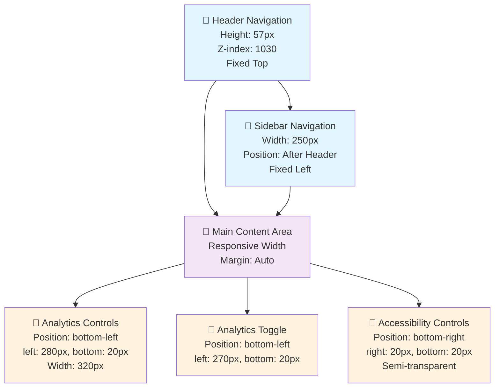
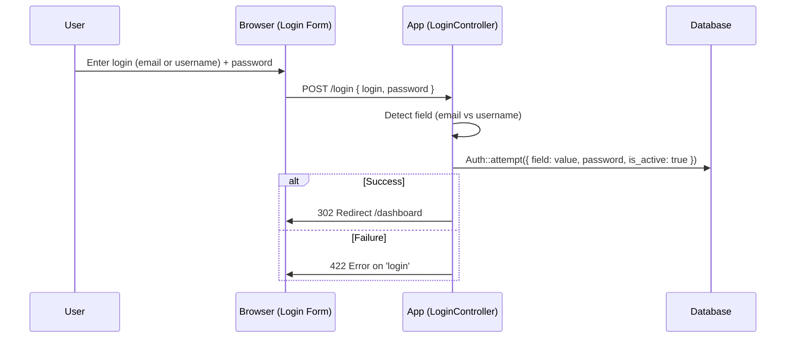
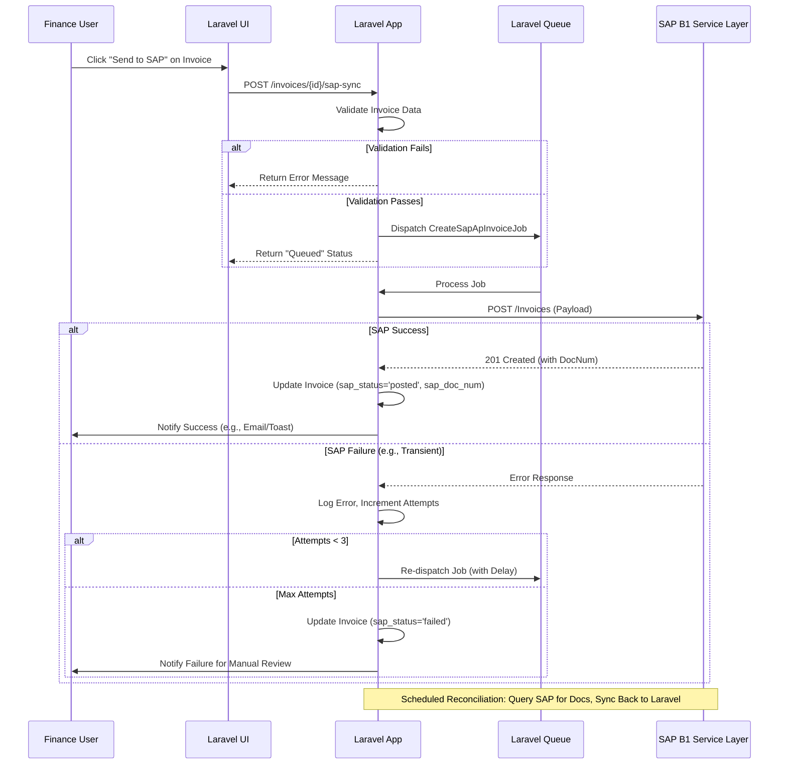
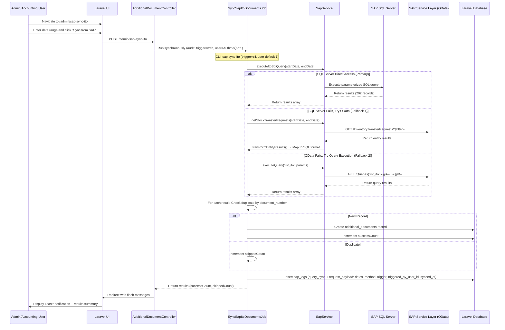
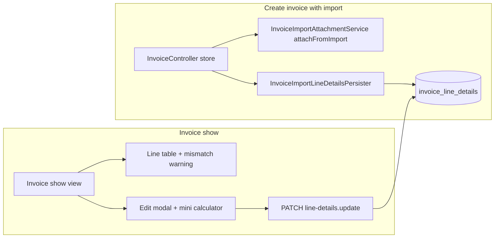
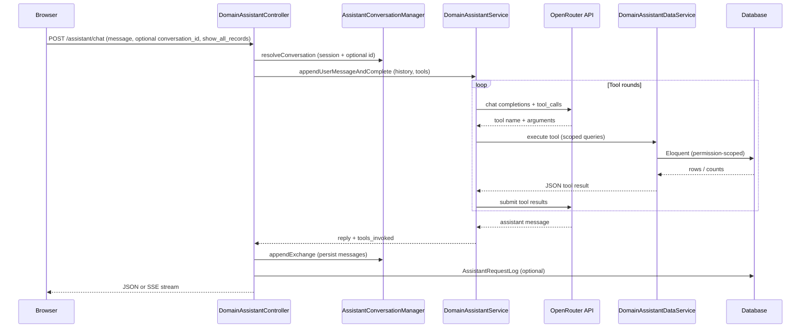

# DDS Laravel Architecture Documentation

## 🏗️ **System Overview**

The DDS (Document Distribution System) is a comprehensive Laravel 11+ application designed for managing document workflows across multiple departments. The system handles invoices, additional documents, and their distribution through a secure, role-based workflow.

## 🎨 **UI/UX Architecture Patterns**

### **Attachment Preview Architecture** ✅ **IMPLEMENTED** (2025-10-15)

**Pattern**: Inline file preview system for attachment viewing without downloads

**Business Context**: Users frequently need to view attachment files (PDFs, images, documents) but downloading every file creates storage clutter and slows down workflow. The system needed inline preview capability to improve user experience.

**Architecture**:

```
Attachment Preview System
├── Controller Methods (AdditionalDocumentController)
│   ├── downloadAttachment() - Legacy download method (preserved)
│   └── previewAttachment() - New inline preview method
│       ├── Same permission checks as download
│       ├── Uses response()->file() with Content-Disposition: inline
│       ├── Detects MIME type for proper Content-Type headers
│       └── Serves file for browser inline viewing
│
├── Route Configuration (routes/additional-docs.php)
│   ├── GET {additionalDocument}/download - Legacy download route
│   └── GET {additionalDocument}/preview - New preview route
│
├── Frontend Implementation
│   ├── Document Show Page (show.blade.php)
│   │   ├── "Download Attachment" → "Preview Attachment"
│   │   ├── Download icon (📥) → Eye icon (👁️)
│   │   └── target="_blank" for new tab opening
│   │
│   └── Document Edit Page (edit.blade.php)
│       ├── "Download Current" → "Preview Current"
│       ├── Download icon (📥) → Eye icon (👁️)
│       └── target="_blank" for new tab opening
│
└── Browser Integration
    ├── PDF files: Opens in browser's built-in PDF viewer
    ├── Images: Displays inline using browser's image viewer
    ├── Documents: Uses browser's document preview capabilities
    └── New tab: Maintains workflow continuity
```

**Implementation Details**:

```php
// Controller: app/Http/Controllers/AdditionalDocumentController.php
public function previewAttachment(AdditionalDocument $additionalDocument)
{
    // Same permission checks as download method
    $user = Auth::user();
    if (!array_intersect($user->roles->pluck('name')->toArray(), ['admin', 'superadmin'])) {
        $userLocationCode = $user->department_location_code;
        if ($userLocationCode) {
            if ($additionalDocument->cur_loc !== $userLocationCode) {
                abort(403, 'You do not have permission to preview this attachment.');
            }
        } else {
            if ($additionalDocument->cur_loc && $additionalDocument->cur_loc !== 'DEFAULT') {
                abort(403, 'You do not have permission to preview this attachment.');
            }
        }
    }

    if (!$additionalDocument->attachment) {
        abort(404, 'No attachment found for this document.');
    }

    $filePath = storage_path('app/public/' . $additionalDocument->attachment);
    if (!file_exists($filePath)) {
        abort(404, 'Attachment file not found.');
    }

    $mimeType = mime_content_type($filePath);
    $fileName = basename($additionalDocument->attachment);

    return response()->file($filePath, [
        'Content-Type' => $mimeType,
        'Content-Disposition' => 'inline; filename="' . $fileName . '"'
    ]);
}
```

**Key Differences from Download**:

-   **Response Method**: `response()->file()` instead of `response()->download()`
-   **Content Disposition**: `inline` instead of `attachment`
-   **User Experience**: Browser preview instead of forced download
-   **Workflow**: New tab opening with `target="_blank"`

**Frontend Implementation**:

```blade
{{-- Before: Download Button --}}
<a href="{{ route('additional-documents.download', $additionalDocument) }}"
   class="btn btn-info" target="_blank">
    <i class="fas fa-download"></i> Download Attachment
</a>

{{-- After: Preview Button --}}
<a href="{{ route('additional-documents.preview', $additionalDocument) }}"
   class="btn btn-info" target="_blank">
    <i class="fas fa-eye"></i> Preview Attachment
</a>
```

**Key Benefits**:

-   ✅ **Improved UX**: Users can quickly preview files without downloading
-   ✅ **Reduced Storage**: No unnecessary local file downloads
-   ✅ **Faster Access**: Leverages browser's built-in file viewers
-   ✅ **Same Security**: Maintains all existing permission controls
-   ✅ **Better Workflow**: Preview opens in new tab without interrupting current work
-   ✅ **Browser Integration**: Uses native PDF/image viewing capabilities

**Files**:

-   `app/Http/Controllers/AdditionalDocumentController.php` - Added previewAttachment() method
-   `routes/additional-docs.php` - Added preview route
-   `resources/views/additional_documents/show.blade.php` - Updated to preview button
-   `resources/views/additional_documents/edit.blade.php` - Updated to preview button

---

### **Separate Print Template Architecture** ✅ **IMPLEMENTED** (2025-10-11)

**Pattern**: Document type-specific print templates for optimized transmittal advice generation

**Business Context**: Invoice distributions and additional document distributions have fundamentally different data needs. Invoices require financial information (amounts, suppliers), while additional documents need tracking information (receive dates, locations, related invoices).

**Architecture**:

```
Distribution Print System
├── Controller Routing (DistributionController::print)
│   ├── Loads relationships based on document type
│   │   ├── Invoices: Load supplier, additionalDocuments.type
│   │   └── Additional Documents: Load invoices (belongsToMany)
│   └── Routes to appropriate view
│       ├── document_type === 'invoice' → print-invoice.blade.php
│       └── document_type === 'additional_document' → print-additional-document.blade.php
│
├── Invoice Print Template (print-invoice.blade.php)
│   ├── Title: "Invoice Transmittal Advice"
│   ├── Columns: NO | INVOICE TYPE | SUPPLIER | INVOICE NO. | INVOICE DATE | AMOUNT | PO NO | PROJECT
│   └── Features:
│       ├── Shows invoice amounts (critical financial data)
│       ├── Displays supplier names from relationship
│       └── Attached documents in compact single-line format
│
└── Additional Document Print Template (print-additional-document.blade.php)
    ├── Title: "Document Transmittal Advice"
    ├── Columns: NO. (right) | DOC NO. | DOC DATE | DOC TYPE | PO NO | INV NO | PROJECT
    └── Features:
        ├── Removed AMOUNT column (always N/A)
        ├── Added INV NO column (shows related invoices)
        ├── Simplified 7-column layout
        └── Right-aligned NO. column for better readability
```

**Implementation Details**:

```php
// Controller: app/Http/Controllers/DistributionController.php
public function print(Distribution $distribution): View
{
    // Load relationships based on document type
    foreach ($distribution->documents as $distributionDocument) {
        if ($distributionDocument->document_type === Invoice::class) {
            $invoice = $distributionDocument->document;
            if ($invoice) {
                $invoice->load(['additionalDocuments.type', 'supplier']);
            }
        } elseif ($distributionDocument->document_type === AdditionalDocument::class) {
            $additionalDoc = $distributionDocument->document;
            if ($additionalDoc) {
                $additionalDoc->load('invoices');
            }
        }
    }

    // Route to appropriate view
    if ($distribution->document_type === 'invoice') {
        return view('distributions.print-invoice', compact('distribution'));
    } else {
        return view('distributions.print-additional-document', compact('distribution'));
    }
}
```

**Key Benefits**:

-   ✅ **Optimized Columns**: Each template shows only relevant fields
-   ✅ **No Wasted Space**: Removed irrelevant columns (e.g., AMOUNT for additional documents)
-   ✅ **Better Clarity**: Distinct titles and layouts for each document type
-   ✅ **Future Flexibility**: Templates can evolve independently
-   ✅ **Professional Output**: Tailored to specific business needs

**Files**:

-   `resources/views/distributions/print-invoice.blade.php`
-   `resources/views/distributions/print-additional-document.blade.php`
-   `app/Http/Controllers/DistributionController.php`

---

### **Table Column Organization Pattern** ✅ **IMPLEMENTED** (2025-10-11)

**Pattern**: Strategic column organization with dedicated columns for related entity data

**Business Context**: Users need to quickly identify relationships between documents (e.g., which invoices are linked to additional documents, which supplier an invoice belongs to) without clicking through multiple pages.

**Implementation Examples**:

**1. Distribution View - Supplier as Dedicated Column**:

```
Before: Document column contained everything (number, type, supplier, date)
After:  Separate columns for better scannability

| Document | Supplier | Type | Sender Status | Receiver Status | Overall Status |
|----------|----------|------|---------------|-----------------|----------------|
| Invoice# | Supplier | Type | Status        | Status          | Status         |
| Type     | Name     |      |               |                 |                |
| Date     |          |      |               |                 |                |
```

**2. Additional Documents Index - Invoice Number Column**:

```
Column Order: No | Doc No | DocDate | Type | PO No | VendorCode | Inv No | RecDate | CurLoc | Days | Action

- "Inv No" column shows belongsToMany relationship
- Displays comma-separated invoice numbers if multiple
- Shows "-" if no related invoices
- Enables quick identification of invoice-document relationships
```

**3. Additional Document Print - Invoice Relationship**:

```
Simplified Columns: NO. | DOC NO. | DOC DATE | DOC TYPE | PO NO | INV NO | PROJECT

- NO. right-aligned for better readability
- INV NO shows related invoice numbers
- Focused on essential information only
```

**Implementation Pattern**:

```php
// Backend: Eager load relationships to prevent N+1 queries
$query = AdditionalDocument::with(['type', 'creator', 'invoices']);

// DataTables: Add computed column
->addColumn('invoice_numbers', function ($document) {
    if ($document->invoices && $document->invoices->count() > 0) {
        $invoiceNumbers = $document->invoices->pluck('invoice_number')->toArray();
        return '<small class="text-muted">' . implode(', ', $invoiceNumbers) . '</small>';
    }
    return '<span class="text-muted">-</span>';
})
->rawColumns(['invoice_numbers', 'days_difference', 'actions'])
```

**Key Principles**:

-   ✅ **Relationship Visibility**: Related entity data in dedicated columns
-   ✅ **Eager Loading**: Prevent N+1 query issues
-   ✅ **Conditional Display**: Show appropriate data based on document type
-   ✅ **Null Safety**: Use `??` operators and null checks
-   ✅ **Column Alignment**: Right-align numbers, center dates, left-align text

**Files**:

-   `app/Http/Controllers/AdditionalDocumentController.php`
-   `app/Http/Controllers/DistributionController.php`
-   `resources/views/distributions/show.blade.php`
-   `resources/views/additional_documents/index.blade.php`
-   `resources/views/distributions/print-additional-document.blade.php`

---

### **Floating Action Buttons Pattern** ✅ **IMPLEMENTED** (2025-10-13)

**Pattern**: Fixed-position floating action buttons for forms with long scrollable content

**Business Context**: When forms contain long lists (e.g., 200+ documents to select from), users should not have to scroll to the bottom to access primary action buttons. This pattern keeps critical actions accessible at all times.

**Use Cases**:

-   Distribution create page with 200+ available documents
-   Any form with long dynamic content lists
-   Pages where primary actions should always be visible

**Architecture**:

```
Floating Button System
├── Visual Design
│   ├── Position: Fixed bottom-right (20px from edges)
│   ├── Container: White background with shadow
│   ├── Z-index: 1000 (above all content)
│   └── Responsive: Adapts for mobile screens
│
├── Button Hierarchy
│   ├── Primary: Gradient styled (main action)
│   └── Secondary: Gray styled (cancel/back)
│
└── Layout Integration
    ├── Form continues in page flow
    ├── Buttons float outside form
    └── Bottom padding prevents content overlap
```

**Implementation Details**:

```css
/* Core floating button styles */
.floating-actions {
    position: fixed;
    bottom: 20px;
    right: 20px;
    z-index: 1000;
    display: flex;
    gap: 10px;
    box-shadow: 0 4px 12px rgba(0, 0, 0, 0.15);
    border-radius: 6px;
    background: white;
    padding: 12px;
}

.floating-actions .btn {
    font-size: 16px;
    padding: 12px 24px;
    border-radius: 6px;
    font-weight: 500;
    box-shadow: 0 2px 4px rgba(0, 0, 0, 0.1);
}

/* Hover animation */
.floating-actions .btn:hover {
    transform: translateY(-2px);
    box-shadow: 0 4px 8px rgba(0, 0, 0, 0.15);
    transition: all 0.2s ease;
}

/* Primary button gradient */
.floating-actions .btn-primary {
    background: linear-gradient(135deg, #667eea 0%, #764ba2 100%);
    border: none;
}

/* Content padding to prevent overlap */
.card-body {
    padding-bottom: 100px !important;
}

/* Responsive mobile design */
@media (max-width: 768px) {
    .floating-actions {
        bottom: 10px;
        right: 10px;
        left: 10px;
        justify-content: center;
    }

    .floating-actions .btn {
        flex: 1;
    }
}
```

**HTML Structure**:

```html
<!-- Form continues normally -->
<form id="distributionForm" action="..." method="POST">
    @csrf

    <!-- Long content list -->
    <div class="document-selection">
        <!-- 200+ document checkboxes -->
    </div>
</form>

<!-- Floating buttons outside form -->
<div class="floating-actions">
    <button type="submit" form="distributionForm" class="btn btn-primary">
        <i class="fas fa-save"></i> Create Distribution
    </button>
    <a href="..." class="btn btn-secondary">
        <i class="fas fa-times"></i> Cancel
    </a>
</div>
```

**Key Technical Points**:

1. **Form Attribute**: Use `form="formId"` on button to submit form even when button is outside form tag
2. **Z-index Management**: High enough (1000) to float above modals and content
3. **Bottom Padding**: Add sufficient padding to page content to prevent overlap with floating buttons
4. **Responsive Breakpoints**: Adapt layout for mobile devices
5. **Hover States**: Provide visual feedback for interactive elements

**Benefits**:

-   ✅ **Always Accessible**: Action buttons visible regardless of scroll position
-   ✅ **Reduced Scrolling**: Users don't need to scroll to find action buttons
-   ✅ **Better UX**: Especially important for pages with 100+ items
-   ✅ **Modern Design**: Professional appearance with gradient and animations
-   ✅ **Responsive**: Works on desktop, tablet, and mobile
-   ✅ **No Functionality Loss**: Form submission works identically

**When to Use**:

✅ Use floating buttons when:

-   Form has long scrollable content (100+ items)
-   Primary actions should always be accessible
-   Content length is dynamic/unpredictable
-   User might select from large lists

❌ Don't use floating buttons when:

-   Form is short and actions are already visible
-   Page has minimal scrolling
-   Multiple competing floating elements exist
-   Mobile-first design requires different approach

**Files**:

-   `resources/views/distributions/create.blade.php` (lines 92-150, 495-505)

**Example Usage**: Distribution Create Page

-   221 available documents to scroll through
-   User may only need to select 2-3 documents
-   Floating "Create Distribution" and "Cancel" buttons always visible
-   No need to scroll to bottom to submit form

---

### **Document Location Change Validation System** ✅ **COMPLETED** (2025-10-09)

**Pattern**: Multi-layer validation system to prevent manual location changes for documents with distribution history

**Business Rule**: Once a document (invoice or additional document) enters the distribution workflow, its location can ONLY be changed through the distribution process itself, not through manual editing.

**Implementation**:

-   **Model Layer**: Added `canChangeLocationManually()` method to both `AdditionalDocument` and `Invoice` models
-   **Controller Validation**: Pre-validation checks in update methods before processing form data
-   **View Layer**: Disabled location dropdown with visual indicators when document has distribution history
-   **Data Integrity**: Hidden input preserves original location value when field is disabled

**Technical Architecture**:

```
Location Change Validation System
├── Model Layer (Business Logic)
│   ├── AdditionalDocument::canChangeLocationManually()
│   │   └── Returns !hasBeenDistributed()
│   ├── Invoice::canChangeLocationManually()
│   │   └── Returns !hasBeenDistributed()
│   ├── hasBeenDistributed()
│   │   └── Checks if distributions()->exists()
│   └── distributions() - Relationship to distribution history
├── Controller Layer (Backend Validation)
│   ├── AdditionalDocumentController::update()
│   │   ├── Checks if cur_loc is being changed
│   │   ├── Validates canChangeLocationManually()
│   │   └── Returns error if location change attempted on distributed document
│   └── InvoiceController::update()
│       ├── Same validation logic as AdditionalDocumentController
│       └── Works alongside existing role-based access control
└── View Layer (Frontend Prevention)
    ├── additional_documents/edit.blade.php
    │   ├── @php checks: hasBeenDistributed() & canChangeLocationManually()
    │   ├── Disabled dropdown when document has distributions
    │   ├── Hidden input to preserve location value
    │   └── Warning message with lock icon
    └── invoices/edit.blade.php
        ├── Combined distribution + role-based disabling logic
        ├── Disabled when: has distributions OR insufficient role
        └── Context-specific warning messages
```

**Validation Flow**:

```php
// 1. Model Method - Business Logic
public function canChangeLocationManually(): bool
{
    return !$this->hasBeenDistributed();
}

// 2. Controller Validation - Pre-check before update
if ($request->has('cur_loc') && $request->cur_loc !== $additionalDocument->cur_loc) {
    if (!$additionalDocument->canChangeLocationManually()) {
        return redirect()->back()
            ->withErrors([
                'cur_loc' => 'Cannot change location manually. This document has distribution history.
                              Location can only be changed through the distribution process.'
            ])
            ->withInput();
    }
}

// 3. View Layer - Frontend Prevention
@php
    $hasDistributions = $additionalDocument->hasBeenDistributed();
    $canChangeLocation = $additionalDocument->canChangeLocationManually();
@endphp

<select id="cur_loc" name="cur_loc" {{ !$canChangeLocation ? 'disabled' : '' }}>
    <!-- options -->
</select>

@if (!$canChangeLocation)
    <input type="hidden" name="cur_loc" value="{{ $additionalDocument->cur_loc }}">
    <small class="text-warning">
        <i class="fas fa-lock"></i> Location locked - This document has distribution history.
    </small>
@endif
```

**Key Features**:

-   **Multi-Layer Security**: Frontend disabled + Backend validation + Database consistency
-   **Bypass Prevention**: Even if frontend is circumvented, backend blocks the change
-   **User-Friendly Messages**: Clear explanations with lock icons for locked fields
-   **Data Preservation**: Hidden input ensures original location is submitted when disabled
-   **Audit Trail**: Location changes only through documented distribution process
-   **Consistent Logic**: Same validation pattern across invoices and additional documents

**Security Benefits**:

-   ✅ **Data Integrity**: Distribution workflow is single source of truth for location tracking
-   ✅ **Audit Compliance**: All location changes are tracked through distribution system
-   ✅ **Workflow Enforcement**: Prevents circumvention of business process
-   ✅ **Historical Accuracy**: Maintains accurate distribution history and location timeline
-   ✅ **User Education**: Warning messages explain why field is locked

**Test Scenarios**:

| Scenario             | Document ID     | Has Distributions | Location Field   | Backend    | Result                               |
| -------------------- | --------------- | ----------------- | ---------------- | ---------- | ------------------------------------ |
| Edit with history    | 222 (251006202) | ✅ Yes (1)        | 🔒 Disabled      | ❌ Blocked | Location unchanged                   |
| Edit without history | 129 (251006149) | ❌ No (0)         | ✅ Enabled       | ✅ Allowed | Location changed successfully        |
| Bypass attempt       | 222 (251006202) | ✅ Yes (1)        | 🕵️ Forced via JS | ❌ Blocked | Validation error, location unchanged |

---

### **Invoice Table Sorting & Dashboard Enhancements** ✅ **COMPLETED** (2025-10-08)

**Pattern**: Age-based sorting and comprehensive department-specific aging analysis for invoices and additional documents

**Implementation**:

-   **Table Sorting Enhancement**: Implemented server-side sorting by document age (oldest first) for both Invoice and Additional Documents tables
-   **Dashboard Data Fixes**: Resolved Invoice Types Breakdown chart data display issues
-   **Age Analysis Section**: Added comprehensive "Invoice Age in Current Department" section matching Additional Documents functionality
-   **Visual Redesign**: Enhanced age breakdown section with modern design and animations
-   **Department-Specific Aging**: Accurate tracking based on arrival at current department, not original creation date

**Technical Architecture**:

```
Invoice Aging & Sorting System
├── Table Sorting Layer
│   ├── AdditionalDocumentController::data() - sortByDesc(days_in_current_location)
│   ├── AdditionalDocumentController::export() - Same sorting for exports
│   ├── InvoiceController::data() - sortByDesc(days_in_current_location)
│   └── DataTable configuration - Disabled client-side sorting (order: [])
├── Age Calculation Layer (Model Accessors)
│   ├── current_location_arrival_date - When document arrived at current dept
│   │   ├── For available: uses receive_date or created_at
│   │   └── For distributed: uses received_at from latest verified distribution
│   ├── days_in_current_location - Days since arrival at current dept
│   └── current_location_age_category - Categorizes into 0-7, 8-14, 15-30, 30+ days
├── Dashboard Controller Enhancement
│   ├── InvoiceDashboardController::getInvoiceAgeAndStatusMetrics()
│   ├── Age breakdown by 4 categories
│   ├── Status breakdown by age (available, in_transit, distributed, unaccounted_for)
│   └── Fixed getInvoiceTypeBreakdown() - Use type_name instead of name
└── Dashboard View Enhancement
    ├── Invoice Age in Current Department section
    │   ├── 4 age category cards with progress bars
    │   ├── Status Breakdown by Age table
    │   ├── Clickable badges for filtering
    │   ├── "View Invoices" action buttons
    │   └── "How Aging is Calculated" info box
    ├── Fixed Chart.js loading (@push('js') instead of @push('scripts'))
    └── Removed redundant age breakdown from Distribution Status
```

**Key Features**:

-   **Oldest-First Sorting**: Documents with highest days in current location appear first
-   **Department-Specific Aging**: Calculates age from arrival at current department
-   **4 Age Categories**: 0-7 days (Recent), 8-14 days (Needs Attention), 15-30 days, 30+ days (Urgent)
-   **Status Cross-Reference**: Shows distribution status breakdown for each age group
-   **Interactive Filtering**: Clickable badges and buttons to view filtered invoices
-   **Visual Indicators**: Color coding (green/orange/cyan/red) and urgency badges
-   **Chart Fixes**: Invoice Types Breakdown now displays correctly with all 7 types

**Code Examples**:

```php
// Controller Sorting Logic (InvoiceController.php)
$invoices = $query->get()->sortByDesc(function ($invoice) {
    if ($invoice->distribution_status === 'available' && !$invoice->hasBeenDistributed()) {
        $dateToUse = $invoice->receive_date;
    } else {
        $dateToUse = $invoice->current_location_arrival_date;
    }
    return $dateToUse ? $dateToUse->diffInDays(now()) : 0;
})->values();

// Age Categorization (Invoice Model)
public function getCurrentLocationAgeCategoryAttribute()
{
    $days = $this->days_in_current_location;

    if ($days <= 7) return '0-7_days';
    elseif ($days <= 14) return '8-14_days';
    elseif ($days <= 30) return '15-30_days';
    else return '30_plus_days';
}
```

**Benefits**:

-   ✅ Priority management - Oldest invoices prominently displayed
-   ✅ Workflow efficiency - Quick identification of aged invoices
-   ✅ Accurate tracking - Department-specific aging calculation
-   ✅ Consistency - Same logic across invoices and additional documents
-   ✅ Actionable insights - Direct links to filtered views

---

### **Dashboard Integration and Chart Persistence System** ✅ **COMPLETED**

**Pattern**: Robust dashboard integration with department-specific aging and persistent chart rendering

**Implementation**:

-   **Critical Problem Solved**: Dashboard 1 was using outdated aging calculations and charts were disappearing on page refresh
-   **Department-Specific Integration**: Complete integration with department-specific aging system for accurate data display
-   **Chart Persistence**: Fixed script loading order to ensure charts persist across page refreshes
-   **Interactive Elements**: Enhanced charts with clickable navigation and smart auto-refresh
-   **Alert System**: Critical aging alerts banner with action buttons for immediate attention

**Technical Architecture**:

```
Dashboard Integration System
├── Dashboard Controller Enhancement
│   ├── getDocumentAgeBreakdown() - Department-specific aging
│   ├── categorizeDocumentsByDepartmentSpecificAge()
│   ├── getDepartmentSpecificAgingAlerts()
│   └── Enhanced workflow metrics
├── Chart Persistence Layer
│   ├── @push('js') instead of @push('scripts')
│   ├── Dynamic Chart.js loading with Promise-based initialization
│   ├── Multiple initialization triggers for different DOM states
│   └── Error handling for Chart.js loading failures
├── Enhanced Dashboard View
│   ├── Department-specific aging alerts banner
│   ├── Enhanced Document Status Distribution chart (doughnut)
│   ├── Updated Document Age Trend chart (line)
│   ├── Interactive chart elements with click navigation
│   └── Smart auto-refresh based on alert levels
└── AdminLTE Integration
    ├── Proper script loading order
    ├── Chart.js from local AdminLTE assets
    └── Consistent layout integration
```

**Key Features**:

-   **Department-Specific Aging Alerts**: Critical and warning banners for overdue documents
-   **Interactive Charts**: Clickable chart elements that navigate to filtered views
-   **Smart Auto-Refresh**: Different refresh intervals based on alert levels
-   **Robust Initialization**: Multiple fallback mechanisms for chart loading
-   **Performance Optimization**: Efficient chart rendering with proper error handling

### **Department-Specific Document Aging System** ✅ **COMPLETED**

**Pattern**: Accurate document aging calculation based on department-specific arrival dates for distributed documents

**Implementation**:

-   **Critical Problem Solved**: Original aging calculation using `receive_date` was inaccurate for documents distributed between departments
-   **Department-Specific Aging**: New system calculates aging based on when document arrived at current department
-   **Model Accessors**: Added `current_location_arrival_date`, `days_in_current_location`, `current_location_age_category` to both Invoice and AdditionalDocument models
-   **Enhanced Dashboard**: Critical alerts banner with action buttons for overdue documents
-   **Performance Optimization**: Database indexes added for aging-related queries
-   **Timeline Integration**: Document Journey Tracking now uses department-specific processing days

**Technical Architecture**:

```
Document Aging System
├── Model Accessors (Invoice.php, AdditionalDocument.php)
│   ├── getCurrentLocationArrivalDateAttribute()
│   ├── getDaysInCurrentLocationAttribute()
│   ├── getCurrentLocationAgeCategoryAttribute()
│   └── hasBeenDistributed()
├── Enhanced Dashboard Controller
│   ├── getDepartmentSpecificAgingAlerts()
│   ├── Critical alerts banner
│   └── Action buttons for overdue documents
├── Database Performance
│   └── Migration: add_document_aging_indexes.php
└── Document Journey Integration
    └── ProcessingAnalyticsService enhancement
```

### **Data Formatting and UI Consistency** ✅ **COMPLETED**

**Pattern**: Consistent data presentation with right-aligned numeric values, standardized date formatting, and decimal precision

**Implementation**:

-   **Right-Alignment**: Amount and days columns in DataTables now properly right-aligned for better readability
-   **Date Formatting**: All dates in Document Journey Tracking display as "DD-MMM-YYYY" format (e.g., "02-Oct-2025")
-   **Decimal Precision**: Days values consistently rounded to 1 decimal place across all displays
-   **Controller Integration**: Enhanced controllers with proper rounding functions
-   **JavaScript Enhancement**: Updated timeline display functions for consistent formatting

**Technical Architecture**:

```
Data Formatting System
├── DataTable Enhancements
│   ├── className: 'text-right' for numeric columns
│   └── Consistent column styling
├── JavaScript Date Formatting
│   ├── toLocaleDateString('en-GB') with custom separators
│   └── Math.round(value * 10) / 10 for decimal precision
├── Controller Rounding
│   └── round($value, 1) for consistent decimal places
└── CSS Styling
    └── text-right class for right-aligned numeric displays
```

### **Simplified Attachment Management** ✅ **COMPLETED**

**Pattern**: Clean separation of concerns with dedicated attachment pages and simplified invoice detail views

**Implementation**:

-   **Removed Complex UI**: Eliminated full attachment management from invoice show pages
-   **Simple Navigation**: Clean, professional link to dedicated attachments page
-   **Performance Improvement**: Removed unnecessary JavaScript and modal components
-   **Better UX**: Users get dedicated, full-featured attachments page with better functionality
-   **Code Cleanup**: Simplified invoice show page with cleaner, less cluttered interface

**Technical Architecture**:

```
Attachment Management Simplification
├── Invoice Show Page Cleanup
│   ├── Removed attachment list display
│   ├── Removed upload form
│   ├── Removed attachment action buttons
│   └── Removed attachment-related JavaScript
├── Simple Link Implementation
│   ├── Clean card design with upload icon
│   ├── "Manage Attachments" heading
│   ├── Descriptive text
│   └── "Go to Attachments Page" button
└── Dedicated Attachment Page
    └── Full-featured attachment management
```

### **Enhanced Processing Analytics Architecture** ✅ **COMPLETED**

**Pattern**: Advanced document processing analytics with accurate calculations, individual document tracking, and comprehensive department efficiency analysis

**Implementation**:

-   **Accurate Processing Calculations**: Uses `DATEDIFF(distribution.sent_at, receive_date)` for precise processing time based on actual distribution workflow
-   **Dual Analysis Modes**: Basic Analysis (current time) and Accurate Analysis (distribution-based) for comprehensive insights
-   **Individual Document Tracking**: Complete document journey visualization with step-by-step timeline
-   **Processing Bottlenecks Detection**: Identifies departments with longest processing times for optimization
-   **Slow Processing Documents**: Lists documents exceeding processing thresholds with direct links to journey tracking
-   **Department Efficiency Scoring**: 4-tier scoring system (Excellent/Good/Average/Needs Improvement) based on actual processing times
-   **Real-time Data Visualization**: ECharts integration with interactive charts, tables, and enhanced analytics
-   **API-first Design**: Comprehensive service layer with RESTful endpoints for all analytics features
-   **Contextual Help System**: Integrated help modal with comprehensive user guidance
-   **Responsive Layout**: Fixed layout issues with responsive column system for optimal user experience

**Service Architecture**:

```
ProcessingAnalyticsController
├── ProcessingAnalyticsService
│   ├── getAccurateProcessingDays()
│   ├── getDocumentProcessingTimeline()
│   ├── getDepartmentProcessingEfficiency()
│   ├── getProcessingBottlenecks()
│   ├── getSlowProcessingDocuments()
│   └── getDepartmentMonthlyPerformance() ✅ NEW
├── API Endpoints (/api/v1/processing-analytics/*)
│   ├── /accurate-processing-days
│   ├── /document-timeline
│   ├── /department-efficiency-accurate
│   ├── /processing-bottlenecks
│   ├── /slow-processing-documents
│   └── /department-monthly-performance ✅ NEW
├── Dashboard View (/processing-analytics)
├── Document Journey Integration
│   ├── Invoice Show Page Integration
│   └── Additional Document Show Page Integration
├── Department Monthly Performance Chart ✅ NEW
│   ├── Department Selection Dropdown
│   ├── Year Selection (2022-2025)
│   ├── Document Type Filtering
│   ├── Monthly Line Chart (ECharts)
│   └── Summary Cards (Total Docs, Avg Days, Best/Worst Month)
└── ECharts Integration with Enhanced Analytics
```

**Database Integration**:

-   **Primary Tables**: `invoices`, `additional_documents`, `distributions`, `distribution_documents`
-   **Key Relationships**: Documents → Distribution Documents → Distributions → Departments
-   **Processing Calculation**: `DATEDIFF(distribution.sent_at, invoice.receive_date)` for accurate timing
-   **Timeline Tracking**: Complete document journey with department steps and processing durations

### **Department Monthly Performance Chart Architecture** ✅ **NEW**

**Pattern**: Department-specific monthly performance analysis with comprehensive filtering and trend visualization

**Implementation**:

-   **Department Selection**: Dropdown with correct department IDs (Accounting=15, Logistic=9)
-   **Year Range**: 2022-2025 selection for historical analysis
-   **Document Type Filtering**: Both Documents, Invoices Only, Additional Documents Only
-   **Monthly Data Aggregation**: Complete 12-month breakdown with statistics per month
-   **Multi-Series Visualization**: Three data series (Invoices, Additional Documents, Overall Average)
-   **Summary Metrics**: Total documents, average processing days, best/worst performing months
-   **Interactive Tooltips**: Detailed month-by-month breakdown with document counts and averages

**Technical Architecture**:

```
Department Monthly Performance API
├── Controller: ProcessingAnalyticsController@getDepartmentMonthlyPerformance
├── Service: ProcessingAnalyticsService@getDepartmentMonthlyPerformance
├── Parameters: year, department_id, document_type
├── Data Processing:
│   ├── Monthly Loop (1-12 months)
│   ├── Invoice Statistics (count, avg_days, min_days, max_days)
│   ├── Additional Document Statistics (count, avg_days, min_days, max_days)
│   ├── Total Calculations (combined counts and weighted averages)
│   └── Summary Generation (total_docs, avg_days, best_month, worst_month)
├── Frontend Integration:
│   ├── Department Selection Dropdown
│   ├── Year Selection Dropdown
│   ├── Document Type Filter Dropdown
│   ├── ECharts Line Chart (3 series)
│   ├── Summary Cards (4 metrics)
│   └── Loading States & Error Handling
└── Database Queries:
    ├── Invoice Monthly Stats (JOIN users for department mapping)
    ├── Additional Document Monthly Stats (JOIN users for department mapping)
    └── Department Information Lookup
```

**Key Features**:

-   **Accurate Department Mapping**: Fixed department ID mapping issue (was using wrong IDs)
-   **Comprehensive Filtering**: Year, department, and document type filtering
-   **Visual Data Representation**: Line chart with distinct colors and styles for each series
-   **Performance Metrics**: Best/worst month identification for performance optimization
-   **Responsive Design**: Chart resizing and mobile compatibility
-   **Error Handling**: Validation for department selection and API error management

### **Analytics Integration Architecture** ✅ **NEW**

**Pattern**: Comprehensive analytics system with optimized call frequency and real-time dashboards

**Implementation**:

-   **Performance Optimization**: Throttled analytics calls (300-second intervals, 250-second minimum)
-   **Real-time Dashboards**: Live status updates with completion tracking and bottleneck identification
-   **User Behavior Tracking**: Action monitoring, workflow analysis, and efficiency scoring
-   **Document Flow Analytics**: Movement patterns, verification times, and error rate tracking
-   **Predictive Analytics**: Completion time forecasting and error probability calculation
-   **Memory Management**: Cleanup mechanisms and interval clearing on page unload

### **Bulk Operations Architecture** ✅ **NEW**

**Pattern**: Multi-document operation system with progress tracking and selection management

**Implementation**:

-   **Bulk Selection**: Checkbox-based multi-document selection with clear visual feedback
-   **Status Updates**: Batch document status changes with unified confirmation
-   **Bulk Verification**: Simultaneous document verification with progress indicators
-   **Notes Management**: Uniform note application across selected documents
-   **Export/Print**: Batch PDF export and print label generation
-   **API Integration**: Backend controllers for handling bulk operations with validation

### **Accessibility Architecture** ✅ **NEW**

**Pattern**: Comprehensive accessibility system with responsive positioning and visual enhancements

**Implementation**:

-   **Screen Reader Support**: ARIA labels, live regions, and status announcements
-   **Focus Management**: Clear focus indicators and logical tab order navigation
-   **Keyboard Navigation**: Arrow key navigation for tables and form elements
-   **Visual Controls**: Font size adjustment, high contrast mode toggle
-   **Voice Integration**: Framework for voice command recognition
-   **Responsive Positioning**: Mobile-compatible placement with transparency effects

### **UI Layout Architecture** ✅ **NEW**

**Pattern**: Fixed-position control system with responsive overlap prevention

**Layout Structure**:

-   **Header**: Fixed navigation (57px height, 1030 z-index)
-   **Sidebar**: Fixed left navigation (250px width, positioned after header)
-   **Content Area**: Responsive main content with proper margins
-   **Analytics Dashboard**: Bottom-left corner (`bottom: 20px; left: 280px`, 320px width)
-   **Analytics Toggle**: Bottom-left corner (`bottom: 20px; left: 270px`)
-   **Accessibility Controls**: Bottom-right corner (`bottom: 20px; right: 20px`) with semi-transparency

**Responsive Implementation**:

-   **Desktop (>768px)**: Sidebar at 250px width, controls positioned after sidebar
-   **Mobile (<768px)**: Sidebar collapses, controls positioned at edges
-   **Overlap Prevention**: CSS media queries ensure no element conflicts
-   **Visual Transparency**: Semi-transparent backgrounds (`rgba`) with blur effects

#### **UI Layout Diagram**


```mermaid
graph TB
    HEADER["📍 Header Navigation<br/>Height: 57px<br/>Z-index: 1030<br/>Fixed Top"]
    SIDEBAR["📍 Sidebar Navigation<br/>Width: 250px<br/>Position: After Header<br/>Fixed Left"]
    CONTENT["📍 Main Content Area<br/>Responsive Width<br/>Margin: Auto"]

    ANALYTICS_CTRLS["📍 Analytics Controls<br/>Position: bottom-left<br/>left: 280px, bottom: 20px<br/>Width: 320px"]
    ANALYTICS_TOGGLE["📍 Analytics Toggle<br/>Position: bottom-left<br/>left: 270px, bottom: 20px"]
    ACCESSIBILITY_CTRLS["📍 Accessibility Controls<br/>Position: bottom-right<br/>right: 20px, bottom: 20px<br/>Semi-transparent"]

    HEADER --> SIDEBAR
    HEADER --> CONTENT
    SIDEBAR --> CONTENT

    CONTENT --> ANALYTICS_CTRLS
    CONTENT --> ANALYTICS_TOGGLE
    CONTENT --> ACCESSIBILITY_CTRLS

    classDef fixedElement fill:#e1f5fe
    classDef contentArea fill:#f3e5f5
    classDef controls fill:#fff3e0

    class HEADER,SIDEBAR fixedElement
    class CONTENT contentArea
    class ANALYTICS_CTRLS,ANALYTICS_TOGGLE,ACCESSIBILITY_CTRLS controls
```

### **Distribution Creation UX Architecture**

**Pattern**: Enhanced distribution creation with confirmation dialog, linked documents management, and visual location indicators

**Implementation**:

-   **Confirmation Dialog**: Bootstrap modal with dynamic content population before form submission
-   **Linked Documents Detection**: AJAX-based API for finding additional documents linked via PO number
-   **Management Interface**: Modal-based selection/deselection of linked documents
-   **Location Indicators**: Visual badges showing document department location
-   **Form Submission**: AJAX-based submission with proper error handling and success feedback

**Technical Architecture**:

```php
// Distribution Creation Controller Structure
DistributionController
├── create() → Distribution creation form
├── store(Request $request) → Process distribution creation
├── checkLinkedDocuments(Request $request) → AJAX endpoint for linked documents
└── validation → Required fields, document selection, etc.
```

**Frontend Architecture**:

```javascript
// Distribution Creation Flow
Distribution Creation Process
├── Form Validation → Required fields check
├── Confirmation Dialog → Review before submission
├── Linked Documents Check → AJAX call to detect linked documents
├── Linked Documents Management → Modal for document selection
└── Form Submission → AJAX submission with success handling
```

**Database Relationship Architecture**:

```sql
-- Linked Documents Relationship
Invoices (po_no) ←→ Additional Documents (po_no)
├── PO Number Matching → Primary linking mechanism
├── Location Filtering → cur_loc field for department filtering
└── Status Validation → Available documents only
```

**UI Component Architecture**:

```html
<!-- Confirmation Modal Structure -->
Confirmation Modal ├── Distribution Information → Type, destination, document
type, notes ├── Selected Documents → List of chosen documents ├── Linked
Documents Section → Automatically detected additional documents └── Action
Buttons → Cancel, Confirm & Create Distribution

<!-- Linked Documents Management Modal -->
Management Modal ├── Document List → Checkbox interface for each linked document
├── Document Details → Number, type, PO number └── Action Buttons → Cancel, Save
Selection
```

### **Invoice Edit and Update System Architecture**

**Pattern**: Comprehensive invoice editing with dual-field amount system and proper field synchronization

**Implementation**:

-   **Edit Page Access**: Route-based access to `/invoices/{id}/edit` with proper authorization
-   **Form Pre-population**: Automatic form loading with existing invoice data
-   **Dual-Field Amount System**: `amount_display` (user input) and hidden `amount` (submission)
-   **Field Synchronization**: `formatNumber()` function ensures proper field sync
-   **Validation**: `UniqueInvoicePerSupplier` rule with proper exclusion logic
-   **AJAX Submission**: Form submission with loading states and notifications
-   **Database Updates**: Proper field persistence with timestamp tracking

**Technical Architecture**:

```php
// Invoice Edit Controller Structure
InvoiceController
├── edit(Invoice $invoice) → Edit form with pre-populated data
├── update(Request $request, Invoice $invoice) → Process form updates
└── validation rules → UniqueInvoicePerSupplier, required fields, etc.
```

**Form Field Architecture**:

```javascript
// Dual-Field Amount System
Amount Field Structure
├── amount_display (visible input) → User interaction
├── amount (hidden input) → Form submission
└── formatNumber() → Synchronization function
```

**Validation Architecture**:

```php
// Custom Validation Rule
UniqueInvoicePerSupplier
├── validate() → Check for duplicate invoice numbers per supplier
├── excludeId → Exclude current invoice from duplicate check
└── setData() → Access form data for validation
```

**AJAX Submission Flow**:

```javascript
// Form Submission Architecture
Edit Form Submission
├── Form Validation → Client-side validation
├── AJAX Request → Submit form data
├── Loading States → Show progress indicators
├── Success Handling → Display notifications
├── Database Update → Persist changes
└── Redirect → Return to invoices list
```

**Key Technical Patterns**:

-   **Field Synchronization**: Explicit `formatNumber()` calls ensure data integrity
-   **Validation Exclusion**: Current invoice excluded from duplicate checks
-   **Loading States**: Proper user feedback during form submission
-   **Error Handling**: Comprehensive validation and error display
-   **Database Persistence**: All field updates properly tracked with timestamps

**Files Involved**:

-   `resources/views/invoices/edit.blade.php` - Edit form and JavaScript functionality
-   `app/Http/Controllers/InvoiceController.php` - Update method and validation
-   `app/Rules/UniqueInvoicePerSupplier.php` - Custom validation rule
-   `routes/invoice.php` - Resource routes for edit/update

---

### **Additional Documents System Architecture**

**Pattern**: Enhanced document management with advanced search, filtering, permission controls, and standardized UI/UX

**Implementation**:

-   **Enhanced Date Validation**: Smart business day validation with warnings (not errors)
-   **Advanced Search & Filtering**: Multi-criteria search with presets and export functionality
-   **Role-Based Location Selection**: Privileged users can select locations, others auto-assigned
-   **Import Permission Control**: Role-based access to document import functionality
-   **Search Presets**: User-specific saved search configurations
-   **Professional Export**: Excel export with proper formatting and column widths
-   **Standardized UI/UX**: Consistent styling across create and edit pages matching invoice create page

**Technical Architecture**:

```php
// Enhanced Controller Structure
AdditionalDocumentController
├── index() → List view with enhanced search form
├── create() → Create form with role-based location selection
├── store() → Save with location handling for privileged users
├── import() → Import view (permission protected)
├── processImport() → Process import (permission protected)
├── export() → Export filtered results to Excel
├── searchPresetsIndex() → Get user's search presets
├── searchPresetsStore() → Save new search preset
├── searchPresetsShow() → Get specific preset
├── searchPresetsDestroy() → Delete preset
└── applySearchFilters() → Reusable search filter logic
```

**Enhanced Search Features**:

```javascript
// Frontend Search Architecture
Enhanced Search Form
├── Document Number (real-time search)
├── PO Number (real-time search)
├── Vendor Code (real-time search)
├── Project (real-time search)
├── Content Search (remarks/attachments)
├── Document Type Filter
├── Status Filter
├── Project Filter
├── Location Filter
├── Enhanced Date Range Picker
│   ├── Predefined ranges (Today, Yesterday, etc.)
│   └── Custom range selection
├── Date Type Selection
│   ├── Created Date
│   ├── Document Date
│   └── Receive Date
├── Search Presets
│   ├── Save current search
│   ├── Load saved preset
│   └── Delete preset
└── Export Results
    └── Excel download with current filters
```

**Permission Architecture**:

```php
// Role-Based Access Control
Permissions
├── view-additional-documents
├── create-additional-documents
├── edit-additional-documents
├── delete-additional-documents
├── import-additional-documents (NEW)
└── on-the-fly-addoc-feature

Role Assignments
├── superadmin → All permissions
├── admin → All permissions including import
├── accounting → All permissions including import
├── finance → All permissions including import
└── other roles → Limited permissions
```

**UI/UX Standardization Architecture**:

```css
/* Standardized Card Header (matches invoice create page) */
.card-header {
    /* No specific background/gradient, relies on AdminLTE default */
}

.card-header .card-title {
    /* No specific color/font-weight/text-shadow, relies on AdminLTE default */
}

/* Standardized Progress Bar */
.progress {
    width: 300px;
    height: 25px;
}

.progress-bar {
    /* Standard Bootstrap progress bar styling */
}
```

**Form Progress System**:

```javascript
// Standardized progress tracking (matches invoice create page)
function updateFormProgress() {
    const requiredFields = [
        "#type_id",
        "#document_number",
        "#document_date",
        "#receive_date",
        "#cur_loc",
        "#remarks",
        "#attachment",
        "#vendor_code",
    ];

    let filled = 0;
    let total = requiredFields.length;

    requiredFields.forEach(function (field) {
        const element = $(field);
        if (element.length && element.val() && element.val().trim() !== "") {
            filled++;
        }
    });

    var percentage = total > 0 ? Math.round((filled / total) * 100) : 0;

    // Update progress bar with standard Bootstrap classes
    $("#form-progress-bar")
        .css("width", percentage + "%")
        .attr("aria-valuenow", percentage)
        .text(percentage + "%")
        .removeClass("bg-danger bg-warning bg-success")
        .addClass(
            percentage >= 100
                ? "bg-success"
                : percentage >= 75
                ? "bg-info"
                : percentage >= 50
                ? "bg-warning"
                : "bg-danger"
        );
}
```

**Database Schema Enhancements**:

```sql
-- Search Presets Table
CREATE TABLE search_presets (
    id BIGINT PRIMARY KEY,
    user_id BIGINT FOREIGN KEY,
    model_type VARCHAR(255),
    name VARCHAR(255),
    filters TEXT, -- JSON string
    created_at TIMESTAMP,
    updated_at TIMESTAMP,
    INDEX(user_id, model_type)
);

-- Additional Documents Table (Enhanced)
ALTER TABLE additional_documents
ADD COLUMN vendor_code VARCHAR(50) NULL; -- For SAP code matching
```

### **User Messaging System Architecture**

**Pattern**: Internal messaging system with real-time notifications, file attachments, and enhanced user experience

**Implementation**:

-   **Direct Messaging**: User-to-user communication with inbox/sent management
-   **File Attachments**: Support for multiple file uploads with 10MB size validation
-   **Message Threading**: Reply functionality with parent-child message relationships
-   **Real-time Notifications**: AJAX-powered unread count updates and Toastr notifications
-   **Soft Delete**: User-specific message deletion with database cleanup
-   **Enhanced UX**: Select2 recipient selection, send animations, and extended success feedback

**Technical Architecture**:

```php
// Controller Structure
MessageController
├── index() → Inbox view (received messages)
├── sent() → Sent messages view
├── create() → Compose message form
├── store() → Save new message with attachments
├── show() → View message details and mark as read
├── destroy() → Soft delete message
├── unreadCount() → AJAX API for unread count
├── markAsRead() → AJAX API to mark message as read
└── searchUsers() → AJAX API for user search
```

**Route Structure**:

```php
Route::prefix('messages')->name('messages.')->group(function () {
    Route::get('/', [MessageController::class, 'index'])->name('index');
    Route::get('/sent', [MessageController::class, 'sent'])->name('sent');
    Route::get('/create', [MessageController::class, 'create'])->name('create');
    Route::post('/', [MessageController::class, 'store'])->name('store');
    Route::get('/{message}', [MessageController::class, 'show'])->name('show');
    Route::delete('/{message}', [MessageController::class, 'destroy'])->name('destroy');

    // AJAX Routes
    Route::get('/unread-count', [MessageController::class, 'unreadCount'])->name('unread-count');
    Route::post('/{message}/mark-read', [MessageController::class, 'markAsRead'])->name('mark-read');
    Route::get('/search-users', [MessageController::class, 'searchUsers'])->name('search-users');
});
```

**Database Architecture**:

```
messages
├── id (primary key)
├── sender_id (foreign key to users.id)
├── receiver_id (foreign key to users.id)
├── subject (string)
├── body (text)
├── read_at (timestamp, nullable)
├── deleted_by_sender (boolean)
├── deleted_by_receiver (boolean)
├── parent_id (foreign key to messages.id, nullable)
└── timestamps (created_at, updated_at)

message_attachments
├── id (primary key)
├── message_id (foreign key to messages.id)
├── file_path (string)
├── file_name (string)
├── file_original_name (string)
├── mime_type (string)
├── file_size (unsigned big integer)
└── timestamps (created_at, updated_at)
```

**Model Relationships**:

```php
// User Model
public function sentMessages(): HasMany
public function receivedMessages(): HasMany
public function getUnreadMessagesCountAttribute(): int
public function getRecentMessages($limit = 10)

// Message Model
public function sender(): BelongsTo
public function receiver(): BelongsTo
public function parent(): BelongsTo
public function replies(): HasMany
public function attachments(): HasMany
public function markAsRead()
public function isRead(): bool
public function isReply(): bool

// MessageAttachment Model
public function message(): BelongsTo
public function getFileSizeHumanAttribute(): string
```

**Notification System**:

```javascript
// Real-time unread count updates
function updateUnreadMessageCount() {
    $.get("/messages/unread-count", function (data) {
        const count = data.count;
        $("#unread-messages-count").text(count);
        $("#sidebar-unread-count").text(count);

        if (count === 0) {
            $("#unread-messages-count").hide();
            $("#sidebar-unread-count").hide();
        } else {
            $("#unread-messages-count").show();
            $("#sidebar-unread-count").show();
        }
    });
}

// Update every 30 seconds
setInterval(updateUnreadMessageCount, 30000);
```

**UI Components**:

-   **Navbar Integration**: Message dropdown with unread count badge
-   **Sidebar Integration**: Messages menu with sub-navigation (MAIN group placement)
-   **Inbox View**: Table layout with sender info, subject, date, and status
-   **Sent View**: Table layout with recipient info and read status
-   **Compose View**: Form with Select2 recipient selection, subject, body, and file upload
-   **Show View**: Message details with attachments and reply functionality
-   **Enhanced UX**: Send animations, extended success feedback, and responsive design

**Key Enhancements**:

-   **Select2 Integration**: Bootstrap 4 themed recipient selection with search functionality
-   **Send Animation**: AJAX-based submission with loading states and success animations
-   **Extended Feedback**: 3.5s success toast visibility with 2.5s fallback redirect delay
-   **Menu Organization**: Proper placement under MAIN group for better navigation
-   **Real-time Updates**: 30-second interval unread count updates across navbar and sidebar

### **Reconciliation System Architecture**

**Pattern**: AJAX-powered data reconciliation system with Excel import/export and real-time statistics

**Implementation**:

-   **Excel Integration**: Import external invoice data with flexible column name handling
-   **Matching Algorithm**: Fuzzy matching between external data and internal invoices
-   **Real-time Statistics**: Dashboard with total, matched, unmatched records and match rate
-   **User Isolation**: Data is isolated by user to prevent conflicts
-   **Permission-Based Access**: Role-based visibility and functionality control

**Technical Architecture**:

```php
// Controller Structure
ReportsReconcileController
├── index() → Main reconciliation view
├── upload() → Excel file upload and import
├── data() → DataTables API for reconciliation data
├── getSuppliers() → Supplier dropdown data API
├── getStats() → Statistics dashboard data API
├── downloadTemplate() → Excel template download
├── export() → Export reconciliation data to Excel
├── deleteMine() → Delete user's reconciliation data
└── getInvoiceDetails() → Detailed view for specific record
```

**Route Structure**:

```php
Route::prefix('reconcile')->name('reconcile.')->group(function () {
    Route::get('/', [ReportsReconcileController::class, 'index'])->name('index');
    Route::post('/upload', [ReportsReconcileController::class, 'upload'])->name('upload');
    Route::get('/data', [ReportsReconcileController::class, 'data'])->name('data');
    Route::get('/suppliers', [ReportsReconcileController::class, 'getSuppliers'])->name('suppliers');
    Route::get('/stats', [ReportsReconcileController::class, 'getStats'])->name('stats');
    Route::get('/template', [ReportsReconcileController::class, 'downloadTemplate'])->name('template');
    Route::get('/export', [ReportsReconcileController::class, 'export'])->name('export');
    Route::get('/delete', [ReportsReconcileController::class, 'deleteMine'])->name('delete');
    Route::get('/invoice/{id}', [ReportsReconcileController::class, 'getInvoiceDetails'])->name('invoice');
});
```

**Database Architecture**:

```
reconcile_details
├── id (primary key)
├── invoice_no (string, indexed)
├── invoice_date (date, nullable)
├── vendor_id (foreign key to suppliers.id)
├── user_id (foreign key to users.id)
├── flag (string, nullable)
└── timestamps (created_at, updated_at)
```

### **SAP Document Update System Architecture**

**Pattern**: Standalone pages approach for complex DataTables functionality to avoid rendering issues

**Implementation**:

-   **Standalone Pages**: Separate pages for Dashboard, Without SAP Doc, and With SAP Doc views
-   **DataTables Integration**: Each page has its own DataTable initialization without tab switching conflicts
-   **Navigation Cards**: Visual navigation between related pages with active state indicators
-   **Permission-Based Access**: Role-based visibility and functionality control

**Technical Architecture**:

```php
// Controller Structure
SapUpdateController
├── index() → Dashboard view
├── withoutSapPage() → Without SAP Doc view
├── withSapPage() → With SAP Doc view
├── dashboard() → Dashboard data API
├── withoutSap() → Without SAP Doc DataTables API
├── withSap() → With SAP Doc DataTables API
├── updateSapDoc() → Update SAP document number
└── validateSapDoc() → Real-time validation API
```

**Route Structure**:

```php
Route::prefix('sap-update')->name('sap-update.')->group(function () {
    Route::get('/', [SapUpdateController::class, 'index'])->name('index');
    Route::get('/without-sap', [SapUpdateController::class, 'withoutSapPage'])->name('without-sap-page');
    Route::get('/with-sap', [SapUpdateController::class, 'withSapPage'])->name('with-sap-page');
    Route::get('/dashboard-data', [SapUpdateController::class, 'dashboard'])->name('dashboard-data');
    Route::get('/without-sap-data', [SapUpdateController::class, 'withoutSap'])->name('without-sap');
    Route::get('/with-sap-data', [SapUpdateController::class, 'withSap'])->name('with-sap');
    Route::put('/{invoice}/update-sap-doc', [SapUpdateController::class, 'updateSapDoc'])->name('update-sap-doc');
    Route::post('/validate-sap-doc', [SapUpdateController::class, 'validateSapDoc'])->name('validate-sap-doc');
});
```

**Database Architecture**:

```sql
-- Unique constraint allowing multiple NULL values
ALTER TABLE invoices ADD CONSTRAINT unique_sap_doc_non_null
UNIQUE (sap_doc) WHERE sap_doc IS NOT NULL;

-- Department-Invoice relationship
Department (location_code) ←→ Invoice (cur_loc)
```

**View Architecture**:

```
resources/views/invoices/sap-update/
├── dashboard.blade.php → Main dashboard with metrics and charts
├── without-sap.blade.php → Invoices without SAP document numbers
└── with-sap.blade.php → Invoices with SAP document numbers
```

**Key Design Decisions**:

-   **Standalone Pages**: Avoided tab-based interface due to DataTables rendering issues in hidden tabs
-   **Individual Updates**: No bulk operations to maintain SAP document uniqueness
-   **Real-time Validation**: AJAX validation for SAP document uniqueness
-   **Dashboard Integration**: Department-wise completion summary in main dashboard
-   **Permission Control**: `view-sap-update` permission for role-based access

**Benefits**:

-   **Reliable Rendering**: DataTables work correctly without tab switching conflicts
-   **Better Performance**: Each page loads only necessary data and scripts
-   **Clear Navigation**: Visual indicators show current page and related functions
-   **Maintainable Code**: Separate files for each functionality area
-   **Scalable Architecture**: Easy to add new SAP-related features

### **Global Page Title Alignment System**

**Pattern**: Consistent page title alignment across all pages for professional visual hierarchy

**Implementation**:

-   **Global CSS Solution**: Centralized styling in `layouts/partials/head.blade.php`
-   **Precise Alignment**: 27.5px left padding to match card content exactly
-   **Bootstrap Integration**: Works with existing Bootstrap grid system
-   **Future-Proof**: Applied globally to prevent individual page fixes

**Technical Architecture**:

```css
/* Global page title alignment with content */
.content-header {
    padding-left: 27.5px; /* Matches container-fluid (7.5px) + card-body (20px) */
    padding-right: 7.5px;
}

.content-header .col-sm-6:first-child {
    padding-left: 0; /* Remove default column padding for precise alignment */
}
```

**Root Cause Analysis**:

-   **Bootstrap Defaults**: `.content-header` had `padding: 15px .5rem` (8px left)
-   **Container Padding**: `.container-fluid` had `padding-left: 7.5px`
-   **Card Body Padding**: `.card-body` added additional 20px padding
-   **Total Offset**: 27.5px difference between title and content alignment

**Benefits**:

-   **Visual Consistency**: All pages have properly aligned titles and content
-   **Professional Appearance**: Clean visual hierarchy enhances application credibility
-   **User Experience**: Consistent interface reduces user confusion
-   **Maintainability**: Global solution prevents future alignment issues

### **Layout Structure Standardization**

**Pattern**: Consistent layout structure across all pages for maintainability and user experience

**Implementation**:

-   **Standard Sections**: All pages use `@section('title_page')` and `@section('breadcrumb_title')`
-   **Content Structure**: Consistent `section class="content"` with `container-fluid` wrapper
-   **Breadcrumb Integration**: Proper breadcrumb navigation in standard location
-   **Future Development**: New pages automatically get proper structure

**Standard Layout Template**:

```blade
@extends('layouts.main')

@section('title_page')
    Page Title
@endsection

@section('breadcrumb_title')
    <li class="breadcrumb-item"><a href="/dashboard">Dashboard</a></li>
    <li class="breadcrumb-item active">Current Page</li>
@endsection

@section('content')
    <section class="content">
        <div class="container-fluid">
            {{-- Page content here --}}
        </div>
    </section>
@endsection
```

**Benefits**:

-   **Consistent Structure**: All pages follow same layout pattern
-   **Maintainable Code**: Standard structure easier to understand and modify
-   **Future Development**: New pages automatically get proper alignment
-   **User Experience**: Consistent visual hierarchy across entire application

### **Enhanced User Dropdown Menu System**

**Pattern**: Modern dropdown menu with user information display and safety features

**Implementation**:

-   **User Information Display**: Name, department, and email prominently shown
-   **Modern Design**: Gradient background with user avatar and professional styling
-   **Action Buttons**: Change Password and Sign Out with descriptive icons
-   **Safety Features**: SweetAlert2 confirmation for logout to prevent accidents

**Technical Architecture**:

```html
<!-- Enhanced dropdown structure -->
<li class="nav-item dropdown user-menu">
    <a href="#" class="nav-link dropdown-toggle" data-toggle="dropdown">
        <i class="fas fa-user-circle mr-1"></i>
        <span class="d-none d-md-inline">{{ Auth::user()->name }}</span>
        <i class="fas fa-chevron-down ml-1"></i>
    </a>
    <ul class="dropdown-menu dropdown-menu-lg dropdown-menu-right">
        <!-- User header with information -->
        <li class="user-header bg-primary">
            <div class="text-center">
                <div class="user-avatar mb-2">
                    <i class="fas fa-user-circle fa-3x text-white-50"></i>
                </div>
                <h6 class="text-white mb-1">{{ Auth::user()->name }}</h6>
                <small class="text-white-50"
                    >{{ Auth::user()->department_location_code }}</small
                ><br />
                <small class="text-white-50">{{ Auth::user()->email }}</small>
            </div>
        </li>

        <!-- Action buttons -->
        <li class="user-body">
            <div class="row">
                <div class="col-6 text-center">
                    <a
                        href="{{ route('profile.change-password') }}"
                        class="btn btn-link btn-sm"
                    >
                        <i class="fas fa-key text-primary"></i><br />
                        <small>Change Password</small>
                    </a>
                </div>
                <div class="col-6 text-center">
                    <a
                        href="#"
                        class="btn btn-link btn-sm"
                        onclick="confirmLogout()"
                    >
                        <i class="fas fa-sign-out-alt text-danger"></i><br />
                        <small>Sign Out</small>
                    </a>
                </div>
            </div>
        </li>
    </ul>
</li>
```

**CSS Styling**:

```css
/* Enhanced User Dropdown Menu */
.user-menu .dropdown-menu {
    border: none;
    box-shadow: 0 0.5rem 1rem rgba(0, 0, 0, 0.15);
    border-radius: 0.5rem;
    min-width: 280px;
}

.user-menu .user-header {
    background: linear-gradient(135deg, #007bff 0%, #0056b3 100%);
    padding: 1.5rem 1rem;
    border-radius: 0.5rem 0.5rem 0 0;
}

.user-menu .btn-link {
    text-decoration: none;
    padding: 0.5rem;
    border-radius: 0.25rem;
    transition: all 0.2s ease;
}

.user-menu .btn-link:hover {
    background-color: #f8f9fa;
    text-decoration: none;
}
```

**Benefits**:

-   **Professional Appearance**: Modern design enhances application credibility
-   **User Information**: Clear display of user context and department
-   **Safety Features**: Confirmation dialogs prevent accidental actions
-   **Better Navigation**: Intuitive action buttons with descriptive icons

### **SweetAlert2 Confirmation System**

**Pattern**: User confirmation dialogs for destructive actions to prevent accidents

**Implementation**:

-   **Logout Confirmation**: Prevents accidental logouts with professional dialog
-   **SweetAlert2 Integration**: Uses existing SweetAlert2 library for consistent styling
-   **Form Handling**: Hidden form submission after user confirmation
-   **Global Function**: Available on all pages through scripts partial

**Technical Implementation**:

```javascript
// Logout confirmation function
function confirmLogout() {
    Swal.fire({
        title: "Are you sure?",
        text: "You will be logged out of the system.",
        icon: "question",
        showCancelButton: true,
        confirmButtonColor: "#d33",
        cancelButtonColor: "#3085d6",
        confirmButtonText: "Yes, logout!",
        cancelButtonText: "Cancel",
        reverseButtons: true,
    }).then((result) => {
        if (result.isConfirmed) {
            document.getElementById("logout-form").submit();
        }
    });
}
```

**Benefits**:

-   **Accident Prevention**: Confirmation prevents accidental workflow interruption
-   **Professional Dialog**: Clear messaging with proper button styling
-   **User Experience**: Prevents frustration from accidental clicks
-   **Accessibility**: Proper button labeling and keyboard navigation

### **Print Layout Optimization System**

**Pattern**: Comprehensive print layout optimization for professional document output

**Implementation**:

-   **Margin Reduction**: Systematic reduction of excessive margins (20-40px → 10-15px)
-   **Print Media Queries**: Specialized CSS rules for print output optimization
-   **Table Layout**: Optimized cell padding and spacing for better content density
-   **Content Flow**: Eliminated excessive white space between sections

**Technical Architecture**:

```css
/* Print Layout Optimization */
@media print {
    body {
        margin: 0;
        padding: 10px; /* Reduced from 20px */
    }

    .documents-table th,
    .documents-table td {
        padding: 4px; /* Reduced from 6px */
        font-size: 12px; /* Smaller fonts for print */
    }

    .info-section {
        margin-bottom: 10px;
    }
    .info-row {
        margin-bottom: 5px;
    }

    .row {
        margin-bottom: 10px;
    }
    .col-12,
    .col-6 {
        padding: 0 5px;
    }
}
```

**Benefits**:

-   **Professional Output**: Business-standard document appearance
-   **Content Visibility**: Table content no longer cut off at page bottom
-   **Reduced Paper Usage**: More content fits on single page
-   **Better Readability**: Optimized content density and visual hierarchy

### **Document Hierarchy Visualization**

**Pattern**: Visual indentation and hierarchy display for document relationships

**Implementation**:

-   **Indentation System**: 20px left padding for additional document rows
-   **Empty Field Handling**: Proper handling of non-applicable fields (empty vs "N/A")
-   **Visual Hierarchy**: Clear distinction between parent invoices and attached documents
-   **Professional Layout**: Clean table structure suitable for business printing

**Technical Implementation**:

```php
// Visual indentation for additional documents
<td style="padding-left: 20px;">{{ $addDoc->type->type_name ?? 'Additional Document' }}</td>

// Empty amount fields instead of "N/A"
<td class="text-right"></td> // was <td class="text-right">N/A</td>
```

**Benefits**:

-   **Hierarchical Display**: Additional documents clearly indented under parent invoices
-   **Clean Amount Column**: Empty cells instead of "N/A" for documents without monetary values
-   **Better Visual Flow**: Improved table scanability and document relationship clarity
-   **Professional Appearance**: More appropriate for business document printing

### **Table Structure Simplification**

**Pattern**: Remove unnecessary columns to improve visual clarity and user experience

**Implementation**:

-   **Status Column Removal**: Eliminated STATUS columns from partial tables for cleaner layout
-   **Consistent Structure**: Both invoice and additional document tables use identical 8-column layout
-   **Visual Hierarchy**: Reduced visual clutter improves table scanability and user focus

**Files Modified**:

-   `resources/views/distributions/partials/invoice-table.blade.php`
-   `resources/views/distributions/partials/additional-document-table.blade.php`

**Benefits**:

-   **Cleaner Interface**: Reduced visual complexity improves user comprehension
-   **Better Performance**: Fewer columns reduce rendering overhead
-   **Consistent Experience**: Uniform table structure across different views
-   **Mobile Friendly**: Simplified layout works better on smaller screens

### **Document Relationship Visualization**

**Pattern**: Visual indicators to show parent-child relationships between documents

**Implementation**:

-   **CSS Styling**: `.attached-document-row` class with distinctive visual treatment
-   **Visual Hierarchy**: Light gray background with blue left border for attached documents
-   **Arrow Indicators**: "↳" symbol with proper positioning for clear relationship indication
-   **Striped Pattern**: Alternating row colors for better visual distinction

**Technical Implementation**:

```css
.attached-document-row {
    background-color: #f8f9fa !important;
    border-left: 4px solid #007bff !important;
    padding-left: 30px !important;
    position: relative !important;
}

.attached-document-row::before {
    content: "↳" !important;
    position: absolute !important;
    left: 10px !important;
    color: #007bff !important;
    font-weight: bold !important;
}

.attached-document-row:nth-child(even) {
    background-color: #f1f3f4 !important;
}

.attached-document-row:nth-child(odd) {
    background-color: #f8f9fa !important;
}
```

**Benefits**:

-   **Clear Relationships**: Users immediately understand document hierarchy
-   **Logical Grouping**: Related documents visually grouped together
-   **Workflow Clarity**: Better understanding of document dependencies
-   **Professional Appearance**: Modern, clean interface design

### **Pagination System Architecture**

**Pattern**: Comprehensive pagination system with custom styling and enhanced user experience

**Implementation**:

-   **Enhanced Layout**: Result counters and better Bootstrap spacing
-   **CSS Override System**: Modular CSS to override default pagination styling
-   **Text-Based Navigation**: Small, professional text arrows instead of large SVG icons
-   **Responsive Design**: Mobile-friendly pagination that adapts to screen size

**Technical Architecture**:

```css
/* Pagination System Overrides */
.pagination .page-link {
    font-size: 14px !important;
    padding: 0.375rem 0.75rem !important;
    line-height: 1.25 !important;
}

/* Hide large SVG icons */
.pagination .page-link svg {
    display: none !important;
}

/* Text-based navigation arrows */
.pagination .page-item:first-child .page-link::after {
    content: "‹ Previous" !important;
    font-size: 14px !important;
}

.pagination .page-item:last-child .page-link::after {
    content: "Next ›" !important;
    font-size: 14px !important;
}
```

**Laravel Integration**:

```php
// Enhanced pagination with result counters
@if ($invoices->hasPages())
    <div class="card-footer clearfix">
        <div class="d-flex justify-content-between align-items-center">
            <div>
                <small class="text-muted">
                    Showing {{ $invoices->firstItem() }} to {{ $invoices->lastItem() }} of {{ $invoices->total() }} results
                </small>
            </div>
            <div>
                {{ $invoices->appends(request()->query())->links('pagination::bootstrap-4') }}
            </div>
        </div>
    </div>
@endif
```

**Benefits**:

-   **Professional Appearance**: Clean, modern pagination interface
-   **User Context**: Clear result counts and navigation information
-   **Cross-browser Compatibility**: Consistent appearance across different browsers
-   **Performance**: Efficient CSS with minimal rendering overhead

### **Permission-Based UI Components**

**Pattern**: Dynamic UI elements that appear based on user permissions

**Implementation**:

-   **Conditional Rendering**: `@can` directive for permission-based component visibility
-   **Consistent Patterns**: Same permission checking across all UI components
-   **User Experience**: Users only see relevant features and actions
-   **Security**: Frontend protection complements backend permission validation

**Technical Implementation**:

```blade
{{-- Permission-based switch visibility --}}
@if (auth()->user()->can('view-all-records'))
    <div class="form-group">
        <label class="d-block">Show All Records</label>
        <input type="checkbox" id="showAllRecords" data-bootstrap-switch>
    </div>
@endif

{{-- Permission-based button visibility --}}
@if (auth()->user()->can('on-the-fly-addoc-feature'))
    <button type="button" class="btn btn-sm btn-success" id="create-doc-btn">
        <i class="fas fa-plus"></i> Create New Document
    </button>
@endif
```

**Benefits**:

-   **Reduced Confusion**: Users only see features they can use
-   **Consistent Experience**: Same permission logic across all pages
-   **Security Enhancement**: Frontend protection reduces unauthorized access attempts
-   **Training Efficiency**: Simplified interface reduces user training needs

### **DataTable Integration Patterns**

**Pattern**: Consistent DataTable implementation with enhanced functionality

**Implementation**:

-   **Column Management**: Dynamic column addition and configuration
-   **AJAX Integration**: Real-time data loading and filtering
-   **Switch Functionality**: Toggle-based filtering with immediate feedback
-   **Responsive Design**: Mobile-friendly table layouts

**Technical Implementation**:

```javascript
// DataTable with switch integration
$('#showAllRecords').on('change', function() {
    const showAll = $(this).is(':checked');
    table.ajax.reload();
});

// Controller parameter handling
$query->when($request->get('show_all_records') === 'true', function ($query) {
    return $query->whereNotNull('cur_loc');
});
```

**Benefits**:

-   **Flexible Filtering**: Users can toggle between different data views
-   **Real-time Updates**: Instant data refresh without page reload
-   **Consistent Interface**: Same functionality across different pages
-   **Performance**: Efficient data loading and rendering

## 🔄 **Core Workflows**

### **Authentication Flow (Email or Username)**

The system supports logging in using either email or username with a single `login` field. The backend resolves the credential field dynamically and requires `is_active = true`.


```mermaid
sequenceDiagram
    participant U as User
    participant B as Browser (Login Form)
    participant A as App (LoginController)
    participant DB as Database

    U->>B: Enter login (email or username) + password
    B->>A: POST /login { login, password }
    A->>A: Detect field (email vs username)
    A->>DB: Auth::attempt({ field: value, password, is_active: true })
    alt Success
        A->>B: 302 Redirect /dashboard
    else Failure
        A->>B: 422 Error on 'login'
    end
```

Implementation references:

-   Controller: `app/Http/Controllers/Auth/LoginController.php`
-   View: `resources/views/auth/login.blade.php`
-   Tests: `tests/Feature/LoginTest.php`
-   Decision: `docs/decisions.md` (2025-09-06)

#### **Username Uniqueness Validation Pattern** (2025-10-01)

The system enforces username uniqueness while supporting NULL values for email-only users.

**Database Schema**:

```php
// users table
Schema::table('users', function (Blueprint $table) {
    $table->string('username')->nullable()->unique()->change();
});
```

**Key Characteristics**:

-   **Nullable Unique Constraint**: MySQL allows multiple NULL values while enforcing uniqueness on non-NULL values
-   **Database-Level Integrity**: Constraint prevents duplicates even with direct database access
-   **Application-Level Validation**: User-friendly error messages for duplicate username attempts

**Validation Rules**:

```php
// User Creation (UserController::store)
'username' => ['nullable', 'string', 'max:255', 'unique:users']

// User Update (UserController::update)
'username' => ['nullable', 'string', 'max:255', 'unique:users,username,' . $user->id]
```

**Security Pattern**:

-   ✅ Prevents username impersonation
-   ✅ Eliminates login ambiguity
-   ✅ Multi-layer validation (database + application)
-   ✅ Maintains email-only login flexibility

**Implementation References**:

-   Migration: `database/migrations/2025_10_01_060319_add_unique_constraint_to_username_in_users_table.php`
-   Controller: `app/Http/Controllers/Admin/UserController.php`
-   Decision: `docs/decisions.md` (2025-10-01)

### **External API System**

The system provides secure external API access for invoice data with comprehensive security and user accountability:

**API Architecture**:

-   **Authentication**: API key-based authentication using `DDS_API_KEY` environment variable
-   **Rate Limiting**: Multi-tier rate limiting (hourly: 100, minute: 20, daily: 1000 requests)
-   **Security Middleware**: Custom `ApiKeyMiddleware` and `ApiRateLimitMiddleware` for enterprise-grade security
-   **Data Access**: Read-only access to invoice data with complete user accountability

**API Endpoints**:

-   **General Invoices**: `GET /api/v1/departments/{location_code}/invoices` - All invoices with comprehensive data
-   **Wait-Payment Invoices**: `GET /api/v1/departments/{location_code}/wait-payment-invoices` - Invoices pending payment
-   **Paid Invoices**: `GET /api/v1/departments/{location_code}/paid-invoices` - Invoices with completed payments
-   **Payment Updates**: `PUT /api/v1/invoices/{invoice_id}/payment` - Update payment information
-   **Department Reference**: `GET /api/v1/departments` - Available departments for API consumers

**Data Structure**:

-   **Invoice Fields**: Complete invoice data including `paid_by` field for user accountability
-   **Additional Documents**: Nested document information with proper relationships
-   **Distribution Data**: Latest distribution information to requested department
-   **User Accountability**: `paid_by` field shows user who processed payment
-   **Enhanced Filtering**: Project, supplier, date range, and status filtering capabilities

**Security Features**:

-   **API Key Validation**: Secure header-based authentication
-   **Rate Limiting**: Prevents API abuse with configurable limits
-   **Audit Logging**: Complete request logging with IP tracking and timestamps
-   **Error Handling**: Comprehensive error responses with proper HTTP status codes

### **Distribution Workflow**

```
Draft → Verified by Sender → Sent → Received → Verified by Receiver → Completed
  ↓           ↓              ↓        ↓           ↓                    ↓
Create    Sender Verifies  Send to   Receive    Receiver Verifies   Complete
Distribution  Documents   Destination  Documents   Documents        Distribution
```

**Critical Status Management**:

-   **Document Protection**: Documents become `'in_transit'` when distribution is sent, preventing selection in new distributions
-   **Status Isolation**: Documents in transit are completely isolated from new distribution selection
-   **Workflow Integrity**: Complete audit trail of document movement through distribution lifecycle

**Status Transitions**:

1. **Available** (`distribution_status = 'available'`) → Can be selected for distribution ✅
2. **In Transit** (`distribution_status = 'in_transit'`) → Cannot be selected for new distributions ✅
3. **Distributed** (`distribution_status = 'distributed'`) → **Can be selected for re-distribution** ✅ **ENHANCED** (2025-10-14)
4. **Unaccounted For** (`distribution_status = 'unaccounted_for'`) → Cannot be selected for new distributions ✅

**Re-distribution Enhancement** (2025-10-14):

-   **Business Requirement**: Documents need to be sent between departments multiple times
-   **Implementation**: Modified `availableForDistribution()` scope to include `'distributed'` status
-   **User Experience**: Added "Distribution Status" column with visual indicators
-   **Data Integrity**: Still prevents selection of `in_transit` and `unaccounted_for` documents

### **On-the-Fly Document Creation Workflow**

**Overview**: Real-time additional document creation within invoice workflows

```
Invoice Create/Edit → Click "Create New Document" → Modal Form → Submit → Auto-Select → Continue Invoice
        ↓                        ↓                    ↓           ↓            ↓              ↓
    Permission Check      Open Bootstrap Modal    Fill Form    AJAX Submit   Add to Selection   Attach to Invoice
```

**Architecture Components**:

-   **Frontend**: Bootstrap modal with comprehensive form validation
-   **Backend**: Dedicated route and controller method with permission validation
-   **Integration**: Seamless embedding in invoice create/edit workflows
-   **UX**: Real-time updates without page refreshes

**Key Technical Decisions**:

1. **Modal Placement**: Positioned outside main form to prevent nested form HTML issues
2. **Permission System**: Both backend (`Auth::user()->can()`) and frontend conditional rendering
3. **Auto-Population**: PO number and location defaults for improved UX
4. **Real-time Integration**: AJAX submission with immediate UI updates

**Data Flow**:

```php
// Frontend: Modal form submission
$.ajax({
    url: '/additional-documents/on-the-fly',
    data: formData,
    success: function(response) {
        // Auto-select created document
        selectedDocs[newDoc.id] = newDoc;
        // Refresh table and update UI
        searchAdditionalDocuments();
```

### **Distribution UI/UX Architecture**

**Overview**: Enhanced user interface for distribution management with improved visual hierarchy and document relationship clarity

**Table Structure Simplification**:

-   **Partial Tables**: Removed STATUS columns from both invoice and additional document table partials
-   **Consistent Layout**: 8-column structure across all distribution tables
-   **Cleaner Appearance**: Reduced visual clutter and improved table scanability
-   **Performance**: Lightweight table rendering with minimal overhead

**Document Display Restructuring**:

-   **Logical Grouping**: Invoices displayed first, followed by their attached additional documents
-   **Relationship Visibility**: Clear parent-child hierarchy between invoices and attached documents
-   **Standalone Documents**: Additional documents not attached to any invoice displayed separately
-   **Status Preservation**: All verification status columns maintained for compliance

**Visual Styling System**:

```css
.attached-document-row {
    background-color: #f8f9fa !important;
    border-left: 4px solid #007bff;
}

.attached-document-row:nth-child(even) {
    background-color: #e9ecef !important;
}

.attached-document-row td:first-child {
    padding-left: 30px;
    position: relative;
}

.attached-document-row td:first-child::before {
    content: "↳";
    position: absolute;
    left: 10px;
    color: #007bff;
    font-weight: bold;
}
```

**Key Features**:

-   **Visual Hierarchy**: Light gray background with blue left border for attached documents
-   **Indentation System**: 30px left padding with arrow indicator (↳) for clear relationship
-   **Striped Rows**: Alternating background colors for better row distinction
-   **Hover Management**: Disabled hover effects to maintain striped appearance
-   **Responsive Design**: Mobile-friendly styling across all device sizes

**Workflow Progress Enhancement**:

-   **Complete Timeline**: Enhanced date format from `'d-M'` to `'d-M-Y H:i'` for all workflow steps
-   **Detailed Tracking**: Full date and time information for audit and compliance purposes
-   **Consistent Formatting**: Uniform date/time display across all 5 workflow steps
-   **Workflow Analysis**: Better understanding of workflow efficiency and bottlenecks

**Technical Implementation**:

```php
// Document grouping logic
$invoiceDocuments = $distribution->documents->filter(function ($doc) {
    return $doc->document_type === 'App\Models\Invoice';
});

$additionalDocumentDocuments = $distribution->documents->filter(function ($doc) {
    return $doc->document_type === 'App\Models\AdditionalDocument';
});

// Attached documents grouping
$attachedAdditionalDocs = collect();
foreach ($invoiceDocuments as $invoiceDoc) {
    $invoice = $invoiceDoc->document;
    if ($invoice->additionalDocuments && $invoice->additionalDocuments->count() > 0) {
        // Group attached documents with parent invoice
    }
}

// Standalone documents
$standaloneAdditionalDocs = $additionalDocumentDocuments->filter(function ($doc) use ($attachedAdditionalDocs) {
    return !$attachedAdditionalDocs->contains('distribution_doc.id', $doc->id);
});
```

**User Experience Benefits**:

-   **Visual Clarity**: Clear distinction between invoices and attached documents
-   **Logical Organization**: Related documents grouped together for easier understanding
-   **Workflow Efficiency**: Users can quickly identify and manage document relationships
-   **Professional Appearance**: Modern, clean interface design with proper visual hierarchy
-   **Reduced Training**: Intuitive interface reduces user confusion and training needs
    renderSelectedTable();
    }
    });

// Backend: Document creation with validation
public function createOnTheFly(Request $request) {
// Permission check
if (!Auth::user()->can('on-the-fly-addoc-feature')) {
return response()->json(['success' => false, 'message' => 'Unauthorized']);
}

    // Validation and creation
    $validated = $request->validate([...]);
    $document = AdditionalDocument::create([...]);

    return response()->json(['success' => true, 'document' => $document]);

}

## SAP B1 Integration

### Architecture Overview

**Pattern**: Asynchronous queue-based integration with SAP B1 Service Layer API for A/P Invoice creation, with direct SQL access fallback if needed.

**Implementation Date**: Starting 2025-11-13  
**Status**: **IN PROGRESS** (Phase 2: Vendor validation & telemetry in queue job)

**Key Components**:

-   `config/sap.php`: Connection details and data mappings.
-   Migrations: Added SAP fields to `invoices` table and created `sap_logs` table for auditing.
-   `SapLog` model: Eloquent model for logging.
-   `CreateSapApInvoiceJob`: Queue job for asynchronous invoice posting with vendor validation, contextual error handling, and structured logging (2025-11-13).

### Vendor Validation & Logging (2025-11-13)

-   Refresh invoice & supplier context when the job runs to guarantee fresh data.
-   Require supplier `sap_code` mapping before contacting SAP; fail fast with actionable messaging when missing.
-   Wrap SAP Business Partner lookup to surface SAP error payloads (e.g., 404) in `sap_error_message` and `sap_logs` entries.
-   Accept SAP `CardType` values of `S` or `cSupplier`; treat mismatches as configuration issues with guidance.
-   Persist request context for both success and failure (card code at minimum) to simplify production troubleshooting.

### Database Adjustments

-   **Invoices Table**:

    -   `sap_status`: string (nullable) - e.g., 'pending', 'posted', 'failed'
    -   `sap_doc_num`: string (nullable) - SAP DocNum
    -   `sap_error_message`: text (nullable)
    -   `sap_last_attempted_at`: timestamp (nullable)

-   **SAP Logs Table** (`sap_logs`):
    -   `id`: primary
    -   `invoice_id`: foreign key to invoices
    -   `action`: string
    -   `request_payload`: json (nullable)
    -   `response_payload`: json (nullable)
    -   `status`: string
    -   `error_message`: text (nullable)
    -   `attempt_count`: integer (default 0)
    -   timestamps

### Workflow

1. Trigger: Finance user clicks "Send to SAP" on approved invoice.
2. Validation: Check data mappings, ensure supplier has SAP CardCode, and capture context for auditing.
3. Queue: Dispatch `CreateSapApInvoiceJob`.
4. Processing: Resolve SAP vendor, build payload, POST to /Invoices, handle response.
5. Update: Set `sap_status` (`pending` → `posted` / `failed`), persist structured log entry in `sap_logs`.
6. Reconciliation: Scheduled command queries SAP for updates.

### Sequence Diagram for Invoice Creation


```mermaid
sequenceDiagram
    participant User as Finance User
    participant LaravelUI as Laravel UI
    participant LaravelApp as Laravel App
    participant Queue as Laravel Queue
    participant SAP as SAP B1 Service Layer

    User->>LaravelUI: Click "Send to SAP" on Invoice
    LaravelUI->>LaravelApp: POST /invoices/{id}/sap-sync
    LaravelApp->>LaravelApp: Validate Invoice Data
    alt Validation Fails
        LaravelApp-->>LaravelUI: Return Error Message
    else Validation Passes
        LaravelApp->>Queue: Dispatch CreateSapApInvoiceJob
        LaravelApp-->>LaravelUI: Return "Queued" Status
    end

    Queue->>LaravelApp: Process Job
    LaravelApp->>SAP: POST /Invoices (Payload)
    alt SAP Success
        SAP-->>LaravelApp: 201 Created (with DocNum)
        LaravelApp->>LaravelApp: Update Invoice (sap_status='posted', sap_doc_num)
        LaravelApp->>User: Notify Success (e.g., Email/Toast)
    else SAP Failure (e.g., Transient)
        SAP-->>LaravelApp: Error Response
        LaravelApp->>LaravelApp: Log Error, Increment Attempts
        alt Attempts < 3
            LaravelApp->>Queue: Re-dispatch Job (with Delay)
        else Max Attempts
            LaravelApp->>LaravelApp: Update Invoice (sap_status='failed')
            LaravelApp->>User: Notify Failure for Manual Review
        end
    end

    Note over LaravelApp,SAP: Scheduled Reconciliation: Query SAP for Docs, Sync Back to Laravel
```

### SAP ITO Sync Integration ✅ **IMPLEMENTED** (2025-11-13, ops/audit refresh 2026-03-30)

**Pattern**: Multi-tier fallback integration for syncing Inventory Transfer Orders (ITO) from SAP B1 to Laravel, prioritizing direct SQL Server access for 100% accuracy. **CLI and audit enrichment** (2026-03-30): first-class Artisan command for scheduled/manual runs; `sap_logs.request_payload` records trigger source and acting user; admin page shows the last 10 sync runs.

**Implementation Date**: 2025-11-13  
**Status**: **COMPLETE** - Production ready

**Business Context**: The system needs to sync ITO documents from SAP B1 to create `additional_documents` records in Laravel. Initial attempts using OData queries via SAP Service Layer API had accuracy issues (returned 1 record vs 202 records from SQL Query 5). Direct SQL Server access was implemented to execute the exact SQL query for 100% accuracy.

**Architecture**:

```
SAP ITO Sync System
├── Primary Method: SQL Server Direct Access
│   ├── Connection: Laravel DB facade with 'sap_sql' connection
│   ├── Query: Executes exact SQL from list_ITO.sql
│   ├── Filters: CreateDate, U_MIS_TransferType='OUT', warehouse join
│   ├── Accuracy: 100% (matches SQL Query 5 exactly)
│   └── Performance: ~1-2 seconds for 202 records
│
├── Fallback Method 1: OData Entity Query
│   ├── Service: SapService::getStockTransferRequests()
│   ├── Entity: InventoryTransferRequests / StockTransfers
│   ├── Auto-detection: Date fields, entity names
│   └── Limitation: Field mapping issues, UDFs not exposed
│
├── Fallback Method 2: Query Execution via Service Layer
│   ├── Service: SapService::executeQuery()
│   ├── Query ID: 'list_ito' (user-defined query in SAP)
│   └── Limitation: Endpoint compatibility issues in SAP B1 10.0
│
└── Sync Job: SyncSapItoDocumentsJob
    ├── Tries methods in priority order (SQL → OData → Query)
    ├── Duplicate detection: Checks document_number (ito_no)
    ├── Batch processing: Creates additional_documents records
    ├── Actor: created_by = triggered user (CLI default user id 1; web = Auth::id() ?? 1)
    └── Logging: Records sync results + audit fields in sap_logs (action query_sync)
```

**Key Components**:

-   **Database Connection** (`config/database.php`):
    -   `sap_sql` connection using `sqlsrv` driver
    -   Environment variables: `SAP_SQL_HOST`, `SAP_SQL_PORT`, `SAP_SQL_DATABASE`, `SAP_SQL_USERNAME`, `SAP_SQL_PASSWORD`
    -   Falls back to existing `SAP_*` env vars if SQL-specific ones not set

-   **Service Method** (`app/Services/SapService.php`):
    -   `executeItoSqlQuery($startDate, $endDate)`: Executes exact SQL query from `list_ITO.sql`
    -   Uses parameterized queries for safety
    -   Returns results matching SQL query structure exactly
    -   Includes all filters: `CreateDate`, `U_MIS_TransferType = 'OUT'`, warehouse join condition

-   **Sync Job** (`app/Jobs/SyncSapItoDocumentsJob.php`):
    -   Tries methods in priority order: SQL Server → OData → Query execution
    -   Optional third constructor argument: audit context `['trigger' => 'web'|'cli', 'triggered_by_user_id' => int]`
    -   Handles different result formats (SQL query, OData entity, query execution)
    -   Duplicate detection by `document_number` (mapped from `ito_no` or `DocNum`)
    -   Creates `additional_documents` records with proper field mapping; `created_by` uses context user or `Auth::id() ?? 1`
    -   Logs sync results (success/skipped counts) and audit metadata to `sap_logs`; failures include `request_payload` when possible

-   **Artisan** (`app/Console/Commands/SapSyncItoCommand.php`):
    -   Command: `php artisan sap:sync-ito` with `--today`, `--yesterday`, or `--start` / `--end` (mutually exclusive modes)
    -   `--user=` (default **1**): `Auth::loginUsingId` before sync so new documents and audit match the same user
    -   Same job as the UI; suitable for Task Scheduler / cron

-   **UI Integration** (`resources/views/admin/sap-sync-ito.blade.php`):
    -   Date range input form
    -   On-demand sync via button click
    -   Toastr notifications for success/failure
    -   Displays sync results (created/skipped counts)
    -   **Recent sync activity**: table of the last **10** `sap_logs` rows (`action = query_sync`) with synced date/time, status, SAP date range, method, counts, trigger, user id

**Data Flow**:


```mermaid
sequenceDiagram
    participant User as Admin/Accounting User
    participant UI as Laravel UI
    participant Controller as AdditionalDocumentController
    participant Job as SyncSapItoDocumentsJob
    participant SapService as SapService
    participant SQLServer as SAP SQL Server
    participant OData as SAP Service Layer (OData)
    participant DB as Laravel Database

    User->>UI: Navigate to /admin/sap-sync-ito
    User->>UI: Enter date range and click "Sync from SAP"
    UI->>Controller: POST /admin/sap-sync-ito
    Controller->>Job: Run synchronously (audit: trigger=web, user=Auth::id()??1)
    Note over Job: CLI: sap:sync-ito (trigger=cli, user default 1)
    
    Job->>SapService: executeItoSqlQuery(startDate, endDate)
    alt SQL Server Direct Access (Primary)
        SapService->>SQLServer: Execute parameterized SQL query
        SQLServer-->>SapService: Return results (202 records)
        SapService-->>Job: Return results array
    else SQL Server Fails, Try OData (Fallback 1)
        Job->>SapService: getStockTransferRequests(startDate, endDate)
        SapService->>OData: GET /InventoryTransferRequests?$filter=...
        OData-->>SapService: Return entity results
        SapService->>Job: transformEntityResults() → Map to SQL format
    else OData Fails, Try Query Execution (Fallback 2)
        Job->>SapService: executeQuery('list_ito', params)
        SapService->>OData: GET /Queries('list_ito')?@A=...&@B=...
        OData-->>SapService: Return query results
        SapService-->>Job: Return results array
    end
    
    Job->>Job: For each result: Check duplicate by document_number
    alt New Record
        Job->>DB: Create additional_documents record
        Job->>DB: Increment successCount
    else Duplicate
        Job->>Job: Increment skippedCount
    end
    
    Job->>DB: Insert sap_logs (query_sync + request_payload: dates, method, trigger, triggered_by_user_id, synced_at)
    Job-->>Controller: Return results (successCount, skippedCount)
    Controller->>UI: Redirect with flash messages
    UI->>User: Display Toastr notification + results summary
```

**Configuration Requirements**:

**Environment Variables** (`.env`):

```env
# SAP SQL Server Direct Access (Primary Method)
SAP_SQL_HOST=arkasrv2
SAP_SQL_PORT=1433
SAP_SQL_DATABASE=your_sap_database_name
SAP_SQL_USERNAME=your_sql_username
SAP_SQL_PASSWORD=your_sql_password

# Falls back to these if SQL-specific vars not set:
SAP_SERVER_URL=https://arkasrv2:50000/b1s/v1
SAP_DB_NAME=your_sap_database_name
SAP_USER=your_sap_user
SAP_PASSWORD=your_sap_password
```

**PHP Requirements**:

-   PHP `sqlsrv` extension installed
-   Microsoft ODBC Driver 18 installed
-   Network access to SAP SQL Server

**Database Connection** (`config/database.php`):

```php
'sap_sql' => [
    'driver' => 'sqlsrv',
    'host' => env('SAP_SQL_HOST', env('SAP_SERVER_URL')),
    'port' => env('SAP_SQL_PORT', '1433'),
    'database' => env('SAP_SQL_DATABASE', env('SAP_DB_NAME')),
    'username' => env('SAP_SQL_USERNAME', env('SAP_USER')),
    'password' => env('SAP_SQL_PASSWORD', env('SAP_PASSWORD')),
    'charset' => 'utf8',
    'options' => [
        'TrustServerCertificate' => true, // For development
    ],
],
```

**Field Mapping**:

The sync job handles different result formats and maps fields accordingly:

| SQL Query Field | OData Field | Additional Document Field |
|----------------|-------------|---------------------------|
| `ito_no` | `DocNum` | `document_number` |
| `ito_date` | `DocDate` | `document_date`, `receive_date` |
| `po_no` | (from related entity) | `po_no` |
| `grpo_no` | `U_MIS_GRPONo` | `grpo_no` |
| `origin_whs` | `FromWarehouse` / `Filler` | `origin_wh` |
| `destination_whs` | `U_MIS_ToWarehouse` / `ToWarehouse` | `destination_wh` |
| `ito_remarks` | `Comments` | `remarks` |
| `U_NAME` | (from related entity) | `ito_creator` |

**Test Results**:

-   **SQL Query 5** (SAP B1): 202 records (Nov 1-12, 2025)
-   **SQL Server Direct Query**: 202 records ✅ (exact match)
-   **OData Query**: 1 record ❌ (inaccurate due to field mapping issues)

**Performance Metrics**:

-   **Query Execution**: ~1-2 seconds for 202 records
-   **Sync Speed**: Depends on number of new records to insert
-   **Network**: Direct SQL connection (faster than OData HTTP requests)

**Comparison: SQL vs OData**:

| Feature | SQL Server Direct | OData |
|---------|------------------|-------|
| Accuracy | ✅ 100% (matches Query 5) | ❌ Limited (1 record) |
| All Filters | ✅ Yes | ❌ No (U_MIS_TransferType NULL) |
| Field Names | ✅ Exact SQL names | ⚠️ Different names |
| Setup Complexity | ⚠️ Medium (extension + driver) | ✅ Low (just HTTP) |
| Performance | ✅ Fast (direct query) | ⚠️ Slower (HTTP + pagination) |
| Reliability | ✅ High | ⚠️ Medium (field mapping issues) |

**Access Control**:

-   **Permission**: `sync-sap-ito`
-   **Roles**: `superadmin`, `admin`, `accounting`
-   **Route**: `/admin/sap-sync-ito` (middleware: `permission:sync-sap-ito`)
-   **Menu**: Visible in "Additional Documents" menu (collapsed, highlighted when active)

**Error Handling**:

-   **SQL Connection Failure**: Falls back to OData entity query
-   **OData Failure**: Falls back to query execution via Service Layer
-   **All Methods Fail**: Logs error to `sap_logs`, throws exception
-   **Duplicate Detection**: Skips existing records by `document_number`
-   **Transaction Safety**: Uses database transactions for data consistency

**Logging**:

All sync operations are logged to `sap_logs` table:

-   **Action**: `query_sync`
-   **Status**: `success` or `failed`
-   **Request Payload** (JSON): `start_date`, `end_date`, `method` (`sql_server_direct`, `direct_entity_query`, `query_execution`), `trigger` (`web`, `cli`), `triggered_by_user_id`, `synced_at` (ISO-8601). Older rows may omit new keys.
-   **Response Payload**: `success` / `skipped` counts (success path)
-   **Error Message**: Detailed error if failed; failed runs also persist `request_payload` when the failure is caught in the job handler

**Related Documentation**:

-   `docs/SAP-SQL-DIRECT-ACCESS.md` - Detailed SQL Server setup guide
-   `docs/SAP-ITO-SYNC-COMPLETE.md` - Complete implementation summary
-   `docs/SAP-B1-SESSION-MANAGEMENT.md` - Session management details
-   `docs/decisions.md` - Decision record for SQL Server approach
-   `database/list_ITO.sql` - Source SQL query

### Solar price history (PERTAMINA auto-sync) ✅ **IMPLEMENTED** (2026-04-22)

**Pattern**: A scheduled Artisan command creates **`solar_price_histories`** rows from the **most recent** invoice for supplier **`PERTAMINA`** that has a line whose **description** contains **SOLAR** (same selection logic as the UI “fetch last PERTAMINA solar” API). **Default period** is the **current half-month** in the scheduler timezone: days **1–14** or **15–end of month**.

**Key components**:

-   **`PertaminaSolarInvoiceResolver::resolveLast()`** ([`app/Services/PertaminaSolarInvoiceResolver.php`](../app/Services/PertaminaSolarInvoiceResolver.php)) — Resolves the invoice and line; **`resolveUnitPrice()`** uses **`invoice_line_details.unit_price`** when set and non-zero, otherwise **`amount ÷ quantity`** ( **`bcdiv`**, 4 decimals) when both amount and quantity are present and quantity ≠ 0.
-   **`php artisan solar:price:sync-from-last-pertamina`** ([`app/Console/Commands/SolarPriceSyncFromLastPertaminaCommand.php`](../app/Console/Commands/SolarPriceSyncFromLastPertaminaCommand.php)) — Optional **`--force`** to insert despite an existing row for the same invoice, line, and period. Idempotent by default (skip duplicate).
-   **Schedule** ([`bootstrap/app.php`](../bootstrap/app.php)) — **`dailyAt('07:30')`**, timezone **`Asia/Makassar`**, **`withoutOverlapping()`** (same regional timezone as **`sap:sync-ito`** jobs).
-   **Config** — [`config/services.php`](../config/services.php) **`solar_price_scheduler`**: optional **`SOLAR_PRICE_SCHEDULER_USER_ID`** for **`created_by`**, **`SOLAR_PRICE_SCHEDULER_TIMEZONE`** (default **`Asia/Makassar`**).

**Operational note**: In production, **`php artisan schedule:run`** must run every minute (cron / Task Scheduler) so **`dailyAt`** fires correctly.

**Full write-up**: [`docs/SOLAR-PRICE-HISTORY-PERTAMINA-SYNC.md`](SOLAR-PRICE-HISTORY-PERTAMINA-SYNC.md). **Decision**: [`docs/decisions.md`](decisions.md) (2026-04-22).

### Upcoming: Phase 3 - End-to-End Reconciliation

-   Implement targeted validation helpers (e.g., tax code, PO reference lookups).
-   Surface `sap_error_message` in finance dashboards and notifications.
-   Add reconciliation worker to pull SAP statuses back into DDS nightly.

### Invoice creation from PDF/image (AI-assisted import)

**Status**: Implemented (v1) — see [`docs/INVOICE-FROM-DOCUMENT-IMPLEMENTATION-PLAN.md`](INVOICE-FROM-DOCUMENT-IMPLEMENTATION-PLAN.md), sample extraction notes in [`docs/INVOICE-IMPORT-SAMPLE-PDF-TEST-RESULTS.md`](INVOICE-IMPORT-SAMPLE-PDF-TEST-RESULTS.md).

**High-level flow**: upload → `POST /invoices/import-extract` → `ExtractInvoiceFromDocumentJob` + OpenRouter (images: vision; PDF: embedded text via `smalot/pdfparser` if enough text, else PDF file + `file-parser` / OCR) → `InvoiceImportSupplierResolver` + `InvoiceImportDraftBuilder` (draft may include **`line_items`**: description, quantity/qty, unit_price, amount) → cache (`invoice_import:{uuid}`) → poll `GET /invoices/import-status/{uuid}` → `GET /invoices/import-draft/{uuid}` → prefill `invoices.create` → user submits `InvoiceController::store` with hidden `import_uuid` → `InvoiceImportAttachmentService::attachFromImport` copies temp file to permanent storage and `InvoiceAttachment` (“Invoice Copy”, description “Imported from document”) → **`InvoiceImportLineDetailsPersister`** replaces `invoice_line_details` rows from `import_extraction.draft.line_items` when present. Optional JSON snapshot on the invoice row: `invoices.import_extraction` (draft metadata, confidence, original filename). **SAP AP posting stays header-only**; line rows are informational.

**Imported line rows (show + corrections)**

- **Table** `invoice_line_details` (`InvoiceLineDetail`): `invoice_id`, `line_no`, `description`, `quantity`, `unit_price`, `amount`, `source` (`import` | `adjusted`, …).
- **Invoice show** (`resources/views/invoices/show.blade.php`): read-only table when lines exist; **warning** if sum of line `amount` differs from header `amount` (tolerance **IDR 1.0**, else **0.01**) — informational only, no blocking validation.
- **Manual edit**: users who may edit the invoice (same location/role rules as `InvoiceController::edit`) get a per-row control opening a **modal** (description + numeric fields). **Mini calculator** in the modal inserts results into Qty / Unit price / Amount. Save → **`PATCH /invoices/{invoice}/line-details/{lineDetail}`** (`InvoiceController::updateLineDetail`); first user edit after import sets `source` to **`adjusted`**. AJAX URL must join base path and id with an explicit **`/`** (Laravel `url()` may omit a trailing slash; concatenating id produced a broken segment such as `line-details2`).
- **Tests**: `tests/Feature/InvoiceLineDetailUpdateTest.php`.


```mermaid
flowchart LR
  subgraph create [Create invoice with import]
    ST[InvoiceController store] --> ATT[InvoiceImportAttachmentService attachFromImport]
    ST --> PER[InvoiceImportLineDetailsPersister]
    PER --> DB[(invoice_line_details)]
  end
  subgraph show [Invoice show]
    SH[Invoice show view] --> TBL[Line table + mismatch warning]
    SH --> MOD[Edit modal + mini calculator]
    MOD --> PATCH[PATCH line-details.update]
    PATCH --> DB
  end
```

**Key files**

| Area | Path |
|------|------|
| Routes | `routes/invoice.php` — `import-extract`, `import-status`, `import-draft` (before resource routes) |
| Controller | `app/Http/Controllers/InvoiceImportController.php` |
| Job | `app/Jobs/ExtractInvoiceFromDocumentJob.php` |
| Extraction | `app/Services/OpenRouterInvoiceExtractionService.php`, `app/Services/PdfInvoiceFirstPageService.php` (multi-page PDF → page 1 for OCR path when enabled) |
| Draft / attach | `app/Services/InvoiceImportDraftBuilder.php`, `app/Services/InvoiceImportAttachmentService.php` |
| Create + store | `resources/views/invoices/create.blade.php`, `app/Http/Controllers/InvoiceController.php` (`store` attaches when `import_uuid` present; calls **`InvoiceImportLineDetailsPersister`** after create) |
| Line details | `database/migrations/*_create_invoice_line_details_table.php`, `app/Models/InvoiceLineDetail.php`, `app/Services/InvoiceImportLineDetailsPersister.php`, `Invoice::lineDetails()` |
| Show + edit lines | `resources/views/invoices/show.blade.php`; `InvoiceController::show` / **`updateLineDetail`**; route **`invoices.line-details.update`** in `routes/invoice.php` |
| Model | `app/Models/Invoice.php` — `import_extraction` cast |
| Config | `config/services.php` → `openrouter.*` (includes **`extract_job_timeout`**, **`extract_poll_interval_ms`**, **`extract_poll_max_tries`**) |
| Logging | `config/logging.php` channel `invoice_import` |

**Configuration (env)**

- `OPEN_ROUTER_API_KEY` / `OPENROUTER_API_KEY`, `OPEN_ROUTER_MODEL`, optional `OPEN_ROUTER_BASE_URL`, `OPEN_ROUTER_TIMEOUT`, `OPEN_ROUTER_PDF_TIMEOUT`, `OPEN_ROUTER_PDF_ENGINE`, `OPEN_ROUTER_PDF_FIRST_PAGE_ONLY`.
- `INVOICE_IMPORT_ENABLED` — gate feature.
- `INVOICE_IMPORT_EXTRACT_SYNC` — if `true`, runs `dispatchSync()` on extract so the upload HTTP request blocks until extraction finishes (dev / no worker); **false in production** unless long-lived requests are acceptable.
- **`INVOICE_IMPORT_EXTRACT_JOB_TIMEOUT`** (seconds, default 300) — `ExtractInvoiceFromDocumentJob` timeout; set **`extract_poll_*`** so **`(poll_interval_ms / 1000) × poll_max_tries`** exceeds this value (with margin).
- **`INVOICE_IMPORT_EXTRACT_POLL_INTERVAL_MS`** (default 2000) and **`INVOICE_IMPORT_EXTRACT_POLL_MAX_TRIES`** (default 200) — polling `import-status` on create invoice (wired from `InvoiceController::create` into Blade).
- Queue: with `QUEUE_CONNECTION` not `sync`, a **queue worker** must run (`php artisan queue:work`) or extraction never completes. UI copy references **`INVOICE_IMPORT_EXTRACT_SYNC`** and **`QUEUE_CONNECTION=sync`** for local dev.

**UX on create invoice**

- Collapsible import card: file input, **Preview** (modal: image or PDF iframe), **Extract data**, status text; optional alert when queue driver is **not** `sync`.
- After successful save, AJAX response may include `import_attachment_saved`; UI can toast when the imported file was attached.

**PDF behaviour (v1)**

- Text-heavy PDFs: full-document text from `smalot/pdfparser` (subject to length limits in code).
- Scanned / low-text PDFs: OpenRouter PDF path; if `pdf_first_page_only` is true, multi-page files are trimmed to **page 1** server-side before OCR (see `PdfInvoiceFirstPageService`).

---

### Domain Assistant (AI chat, OpenRouter)

**Status**: Implemented — permission-gated chat with **tool-calling** over DDS data (no ad-hoc SQL from the model), optional **SSE streaming** when tools are disabled, **multi-thread conversations**, **request logging**, an **admin report** for `assistant_request_logs` (including **question text** and **Telegram** context), and optional **Telegram DM** using the **same** `DomainAssistantService` with **aligned list scope** via **`App\Support\DomainAssistantListScope`**.

**Doc deep-dive / porting guide**: [`docs/DOMAIN-ASSISTANT-REFERENCE.md`](DOMAIN-ASSISTANT-REFERENCE.md)

**Purpose**: Users with `access-domain-assistant` ask natural-language questions (including Indonesian); the app calls **structured tools** (`DomainAssistantDataService`) that enforce the same list/location visibility rules as UI lists, plus optional **“show all records”** when the user has `see-all-record-switch`. **Web** resolves this with **`DomainAssistantListScope::fromWebRequest`**; **Telegram** uses **`DomainAssistantListScope::forTelegram`** (default matches web with the toggle **off**; env can mirror “show all” for users with permission — see [`docs/DOMAIN-ASSISTANT-REFERENCE.md`](DOMAIN-ASSISTANT-REFERENCE.md) §14).

**High-level flow**


```mermaid
sequenceDiagram
    participant U as Browser
    participant C as DomainAssistantController
    participant M as AssistantConversationManager
    participant S as DomainAssistantService
    participant OR as OpenRouter API
    participant D as DomainAssistantDataService
    participant DB as Database

    U->>C: POST /assistant/chat (message, optional conversation_id, show_all_records)
    C->>M: resolveConversation (session + optional id)
    C->>S: appendUserMessageAndComplete (history, tools)
    loop Tool rounds
        S->>OR: chat completions + tool_calls
        OR-->>S: tool name + arguments
        S->>D: execute tool (scoped queries)
        D->>DB: Eloquent (permission-scoped)
        DB-->>D: rows / counts
        D-->>S: JSON tool result
        S->>OR: submit tool results
    end
    OR-->>S: assistant message
    S-->>C: reply + tools_invoked
    C->>M: appendExchange (persist messages)
    C->>DB: AssistantRequestLog (optional)
    C-->>U: JSON or SSE stream
```

**Telegram path (same service):** Telegram Bot API → `POST /telegram/webhook/{secret}` → `TelegramWebhookController` → **`ProcessTelegramDomainAssistantMessage`** (typically **`dispatchSync`** when `TELEGRAM_ASSISTANT_DISPATCH_SYNC` is true) → `appendUserMessageAndComplete` → `TelegramBotService::sendMessage`. Register webhook with **`php artisan telegram:set-webhook`** (HTTPS only; optional **`--url=`** for tunnel base URL).

**Key components**

| Area | Path / artifact |
|------|-----------------|
| Config | `config/services.php` → `domain_assistant`, `openrouter`; env `DOMAIN_ASSISTANT_*`, `OPEN_ROUTER_*` |
| Chat UI | `resources/views/assistant/index.blade.php` — terminal-style chat, thread sidebar, suggested prompts |
| Controller | `app/Http/Controllers/DomainAssistantController.php` — `chat`, `clear`, conversation CRUD JSON, SSE stream |
| Orchestration | `app/Services/DomainAssistantService.php` — OpenRouter loop, **tool definitions**, `executeTool` |
| Data access | `app/Services/DomainAssistantDataService.php` — `invoicesVisibleQuery`, `search_invoices` (incl. **`supplier_query`**), suppliers, distributions, reconcile, summary |
| Sessions / threads | `app/Services/AssistantConversationManager.php` — session key `domain_assistant.conversation_id`, titles from first user message |
| Models | `AssistantConversation`, `AssistantMessage`, `AssistantRequestLog` |
| Route binding | `AppServiceProvider` — `{conversation}` scoped to `auth()->id()` |
| Routes | `routes/web.php` — prefix `assistant`, middleware `can:access-domain-assistant` |
| Admin report | `routes/admin.php` — `admin/assistant-report` → `AssistantReportController@index` (filters, pagination per page, **user_message** column); menu in `resources/views/layouts/partials/menu/admin.blade.php` |
| i18n | `lang/en/assistant.php` |
| List scope helper | `app/Support/DomainAssistantListScope.php` — **`fromWebRequest`** (web) / **`forTelegram`** (DM); config **`TELEGRAM_ASSISTANT_EXPAND_ALL_LOCATIONS`** |
| Telegram (optional) | `POST /telegram/webhook/{secret}` → `TelegramWebhookController`; `TelegramBotService`; `ProcessTelegramDomainAssistantMessage`; **`php artisan telegram:set-webhook`**; env **`TELEGRAM_*`**, **`TELEGRAM_ASSISTANT_DISPATCH_SYNC`**, **`TELEGRAM_ASSISTANT_EXPAND_ALL_LOCATIONS`**; users linked via **Admin → Users → Edit** |

**Persistence**

- `users` — optional `telegram_user_id` (unique), `telegram_username` (admin linking for Telegram DM)
- `assistant_conversations` — `user_id`, optional `title`, optional **`telegram_chat_id`** (non-null = thread used from Telegram; web list shows only rows with null `telegram_chat_id`)
- `assistant_messages` — `assistant_conversation_id`, `role`, `content`
- `assistant_request_logs` — `user_id`, `assistant_conversation_id`, `status`, `tools_invoked`, `show_all_records`, `user_message_length`, **`user_message`** (question snapshot, max 10k chars), `duration_ms`, `error_summary`, `ip_address`, `user_agent`, optional **`telegram_chat_id`**, etc.

**Tool behaviour note (invoices by supplier)**

- `search_invoices` accepts optional **`supplier_query`**: filters invoices via `whereHas('supplier', …)` on supplier **name** and **SAP code** (substring), so requests like “10 invoice terakhir dari [nama vendor]” return that vendor’s rows instead of globally latest invoices.

**References**: [`docs/decisions.md`](decisions.md) (Domain Assistant: 2026-04-02, Telegram parity 2026-04-09), [`docs/todo.md`](todo.md), [`MEMORY.md`](../MEMORY.md), [`docs/DOMAIN-ASSISTANT-REFERENCE.md`](DOMAIN-ASSISTANT-REFERENCE.md).
